# Assistify RAG — Enterprise AI Help-Desk Platform

> **Multi-tenant, RAG-powered customer support** with local LLM inference, voice interaction, role-based access control, and tenant-isolated knowledge bases.

| Service | Port | Role |
|---------|------|------|
| **Login** | `7001` | Auth, sessions, static UI, API gateway |
| **RAG** | `7000` | Retrieval, chat orchestration, voice WebSocket |
| **Ollama** | `11434` | LLM inference (GPU) |
| **Piper TTS** | `5002` | Voice output (CPU) |
| **LLM shim** | `8010` / `8000` | Optional OpenAI-compatible proxy |

**Quick start:** See [Deployment Guide](#14-deployment-guide) or the detailed [Windows setup guide](docs/SETUP_WINDOWS.md).

**Deep-dive docs:** [System Architecture](docs/SYSTEM_ARCHITECTURE.md) · [Tenant Selector](docs/TENANT_SELECTOR_ARCHITECTURE.md) · [Security](docs/SECURITY_IMPLEMENTATION.md)

---

## Table of Contents

1. [Executive Summary](#1-executive-summary)
2. [Project Overview](#2-project-overview)
3. [Feature Matrix](#3-feature-matrix)
4. [Architecture](#4-architecture)
5. [System Components](#5-system-components)
6. [Multi-Tenant Design](#6-multi-tenant-design)
7. [AI Architecture](#7-ai-architecture)
8. [RAG Architecture](#8-rag-architecture)
9. [Voice Architecture](#9-voice-architecture)
10. [Security Architecture](#10-security-architecture)
11. [Database Design](#11-database-design)
12. [API Documentation](#12-api-documentation)
13. [Frontend Documentation](#13-frontend-documentation)
14. [Deployment Guide](#14-deployment-guide)
15. [Performance Notes](#15-performance-notes)
16. [Future Roadmap](#16-future-roadmap)
17. [Technical Interview Notes](#17-technical-interview-notes)
18. [Portfolio Showcase](#18-portfolio-showcase)

---

## 1. Executive Summary

**Assistify** is an enterprise-oriented AI help-desk platform that combines **Retrieval-Augmented Generation (RAG)**, **local LLM inference via Ollama**, and **multimodal interaction** (text + voice) to answer customer and employee support questions from an organization's knowledge base.

The system is designed for **tenant-isolated businesses** (multi-tenant SaaS shape), **role-based access control (RBAC)**, and **auditable** support workflows — not generic open-domain chat.

| Goal | How the architecture supports it |
|------|----------------------------------|
| Accurate, grounded answers | RAG pipeline retrieves tenant-scoped document chunks before LLM generation |
| Low operational cost | Local Ollama LLM + CPU voice services; TOON context format reduces token spend 40–60% |
| Trust & compliance | Session auth, RBAC, tenant isolation, response validation, security event logging |
| Admin control | Knowledge-base upload, reindexing, analytics, audit logs via admin UI |
| Multimodal UX | WebSocket voice (STT → RAG → LLM → TTS) and REST text chat |

At runtime, **all user-facing traffic enters through the Login Server** (`:7001`). It serves the React UI, validates sessions, enforces RBAC, and **proxies** authenticated API and WebSocket traffic to the RAG Server (`:7000`).

---

## 2. Project Overview

### What It Does

Assistify enables organizations to:

- Upload PDF/TXT knowledge-base documents per tenant
- Answer support questions grounded in those documents via RAG + local LLM
- Support text chat and voice interaction (English + Arabic)
- Manage users, roles, tenants, access requests, tickets, and analytics
- Offer public guest chat without login (configurable)

### Business Value

- **Reduced support load** — AI handles repetitive KB questions with grounded answers
- **Tenant isolation** — Each business gets its own KB, assets, and user roster
- **Auditability** — Security logs, audit trails, analytics, and satisfaction ratings
- **Cost control** — Local inference avoids per-token API costs; CPU voice preserves GPU VRAM

### Technology Stack

| Layer | Technology |
|-------|------------|
| Frontend | Next.js 16, React 19, TypeScript, Tailwind CSS 4 |
| API Gateway | FastAPI (Login Server) |
| Orchestration | FastAPI (RAG Server) |
| LLM | Ollama (`qwen2.5:3b` default) |
| Embeddings | Sentence Transformers (`intfloat/multilingual-e5-base`) |
| Reranker | CrossEncoder (`ms-marco-MiniLM-L-6-v2`) |
| Vector DB | ChromaDB (persistent, cosine) |
| Relational DB | SQLite (users, conversations, analytics) |
| STT | faster-whisper (CPU, int8) |
| TTS | Piper ONNX (CPU) |
| Auth | Signed session cookies, OTP, Google OAuth, MFA |

### Repository Layout

```
assistify-rag-project-final-rag-system/
├── assistify-ui-design/     # Canonical React/Next.js UI (static export → out/)
├── backend/                 # RAG server, knowledge base, LLM shim, voice_audio/
├── Login_system/            # Login server, users.db, RBAC, sessions
├── tts_service/             # Piper TTS microservice (:5002)
├── xtts_service/            # Legacy XTTS v2 alternative (:5002)
├── scripts/                 # Launchers, migrations, verification
├── tests/                   # Unit and integration tests
├── docs/                    # Architecture, security, setup guides
├── config.py                # Shared configuration
├── start_main_servers.py    # One-command launcher
└── environment_main.yml     # Conda environment
```

> **Note:** `assistify-ui-design (1)` and `assistify-ui-design (2)` are stale duplicates. Use **`assistify-ui-design`** only.

---

## 3. Feature Matrix

### Authentication & Identity

| Feature | Implementation | Roles |
|---------|----------------|-------|
| Local login / logout | `POST /login`, `GET /logout` | All |
| Registration + OTP email verification | EmailJS + `otp_verification` table | Public |
| Google OAuth | Authlib OpenID | Public |
| Password reset (self-service) | OTP flow | Public |
| Password change (logged-in) | OTP to current email | Authenticated |
| Email change | OTP to new email | Authenticated |
| One-time username change | Email + password verification | Authenticated |
| MFA (TOTP) | pyotp; admin enables for users | Staff-managed |
| Account self-delete | `DELETE /api/my-account` | Customer |
| Session management | Signed cookie, idle/absolute timeout, max 3 concurrent | All |
| Dev login fallback | `ALLOW_DEV_LOGIN_FALLBACK` | Dev only |

### Customer Features

| Feature | Route / API |
|---------|-------------|
| Chat with RAG (text + voice) | `/frontend/` |
| Tenant selector per conversation | Header dropdown + `PATCH /conversations/{id}/active-tenant` |
| Business access requests | `POST /api/access-requests` |
| Select active business | `POST /api/session/active-tenant` |
| View memberships | `GET /api/my-memberships` |
| Support tickets | `/frontend/my-tickets`, `/api/support/ticket/*` |
| Notifications | `/frontend/notifications` |
| Profile management | `/frontend/profile` |
| Guest chat (no login) | `/frontend/guest/` |

### Employee Features

| Feature | Route |
|---------|-------|
| Customer list + CRM notes | `/frontend/employee/customers` |
| Ticket management | `/frontend/employee/tickets` |
| Customer activate/deactivate | `POST /api/customers/{id}/activate` |
| Trigger password reset for customer | `POST /api/customers/{id}/trigger-password-reset` |
| Employee analytics | `GET /api/employee/analytics` |

### Admin Features (tenant-scoped)

| Feature | Route / API |
|---------|-------------|
| User CRUD | `/frontend/admin/users`, `/api/users/*` |
| Knowledge base upload/delete/reindex | `/frontend/admin/knowledge`, `/api/knowledge/*` |
| Analytics dashboard | `/frontend/admin/analytics` |
| Audit logs | `/frontend/admin/audit-logs` |
| Access request approval | `/frontend/admin/access-requests` |
| Support tickets | `/frontend/admin/tickets` |
| MFA enable for users | `POST /users/{id}/mfa-enable` |

### Master Admin Features (per-tenant)

| Feature | Route |
|---------|-------|
| Tenant admin management | `/frontend/master_admin/admins` |
| Full user/knowledge/analytics/audit access | `/frontend/master_admin/*` |
| Tenant admin CRUD | `/api/tenant-admins/*` |

### Super Admin Features (platform-wide)

| Feature | Route / API |
|---------|-------------|
| Tenant create/activate/deactivate/delete | `/frontend/superadmin`, `/api/tenants/*` |
| Create tenant master_admin | `POST /api/tenants/{id}/managers` |
| Cross-tenant visibility | All tenants + rosters |
| Permanent tenant delete + lifecycle cleanup | `DELETE /api/tenants/{id}` |

### Knowledge Base & RAG

| Feature | Details |
|---------|---------|
| PDF/TXT upload | `POST /upload_rag` (background indexing) |
| PDF text extraction | pdfplumber + OCR fallback (pytesseract/pdf2image) + PyPDF2 |
| Adaptive chunking | 220–360 words (long docs), 80–160 (short), 50-word overlap |
| Per-tenant Chroma collections | `support_docs_v3_latest` / `t{id}_support_docs_v3_latest` |
| Hybrid relevance gating | Semantic score OR lexical keyword overlap |
| Cross-encoder reranking | ms-marco-MiniLM-L-6-v2 |
| TOON context encoding | 40–60% token reduction vs JSON |
| Query routing | Greetings/smalltalk bypass RAG; document questions use full pipeline |
| Query normalization | LLM prep + spelling correction against KB vocabulary |
| Response validation | PII/profanity filters, uncertainty disclaimers |
| Single/multi doc mode | `RAG_DOC_MODE=single|multi` |
| KB pipeline monitoring | `/kb_status`, `/ws/kb-events`, `KbPipelineStatusPanel` |

### Voice Features

| Feature | Details |
|---------|---------|
| Speech-to-text | faster-whisper (`small.en` EN, multilingual `small` AR) |
| Text-to-speech | Piper ONNX (24 kHz output) |
| WebSocket voice chat | PCM16 16 kHz upstream, 24 kHz TTS downstream |
| Voice activity detection | Server-side energy VAD (~600 ms silence) |
| Barge-in / interrupt | `interrupt` control message |
| Arabic voice support | Separate Whisper + Piper Arabic voices |
| Browser TTS fallback | `SpeechSynthesis` when server TTS unavailable |
| Memory guard | Blocks voice after suspected GPU/CPU leak (3 consecutive) |

### Analytics & Audit

| Feature | API |
|---------|-----|
| Comprehensive usage analytics | `GET /api/analytics/comprehensive` |
| Error tracking | `GET /api/analytics/errors` |
| Satisfaction ratings | `POST /analytics/feedback` |
| Thumbs up/down feedback | `POST /api/feedback/thumbs` |
| Audit log | `GET /api/audit-logs` |
| KB document version history | `kb_document_versions` table |
| TTS performance stats | `GET /analytics/tts-performance` |

### Security Features

| Feature | Implementation |
|---------|----------------|
| CSRF protection | Cookie + `X-CSRF-Token` header |
| Rate limiting | Per-IP SQLite buckets (login, register, OTP, guest, WS) |
| Account lockout | 5 failed attempts → 15 min lockout |
| Security event logging | Rotating `logs/security.log` |
| HTTP security headers | CSP, HSTS, X-Frame-Options, nosniff |
| Tenant isolation enforcement | `tenant_access.py`, `ENFORCE_CHAT_TENANT_MEMBERSHIP` |
| Session invalidation list | SQLite `invalidated_sessions` |
| TrustedHost middleware | Config-driven allowed hosts |

---

## 4. Architecture

### High-Level Architecture

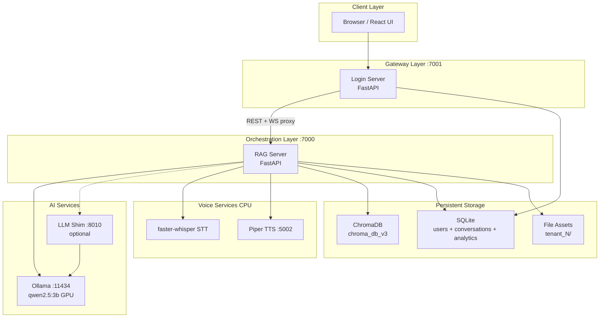

### Component Diagram

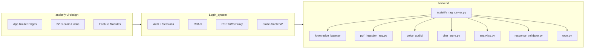

### Deployment Diagram

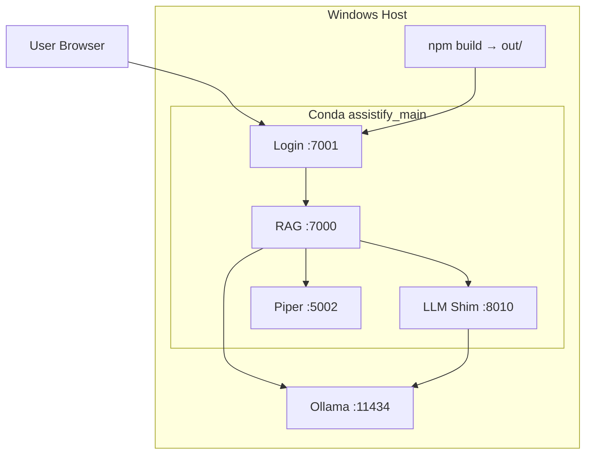

### Request Flow (Text Chat)

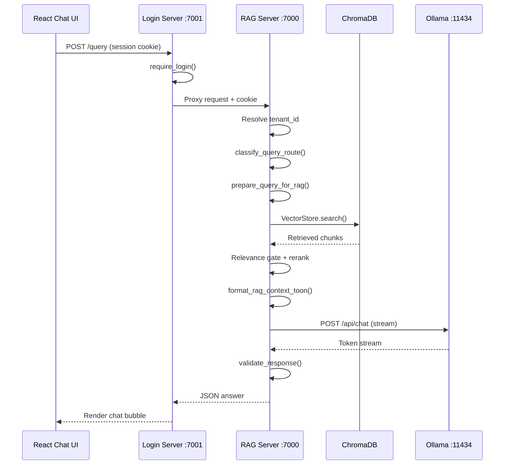

### Data Flow

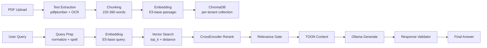

### Authentication Flow

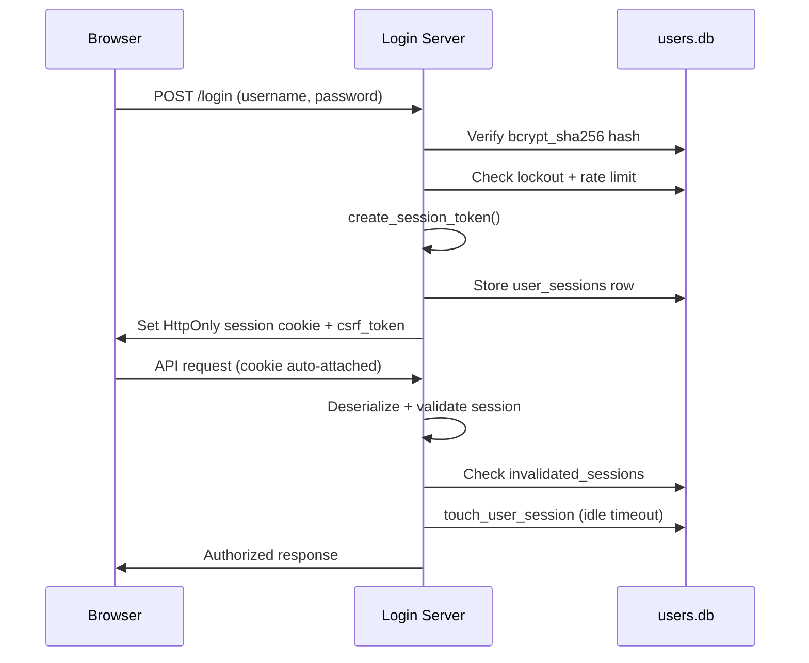

---

## 5. System Components

### Login Server (`Login_system/login_server.py`)

| Attribute | Value |
|-----------|-------|
| **Port** | `7001` |
| **Purpose** | Application gateway: auth, sessions, RBAC, REST/WS proxy, static UI |
| **Inputs** | HTTP requests, WebSocket connections, session cookies |
| **Outputs** | Auth responses, proxied RAG responses, static React files |
| **Dependencies** | `users.db`, RAG server (`:7000`), React build (`assistify-ui-design/out/`) |
| **Startup** | `uvicorn Login_system.login_server:app --host 127.0.0.1 --port 7001` |
| **Failure points** | Missing `users.db`, RAG unreachable (502 on proxy), invalid `SESSION_SECRET` |
| **Recovery** | Run `init_users_db.py`; restart RAG; set `SESSION_SECRET` in `.env` |
| **Security** | CSRF, rate limiting, lockout, security headers, session validation |

### RAG Server (`backend/assistify_rag_server.py`)

| Attribute | Value |
|-----------|-------|
| **Port** | `7000` |
| **Purpose** | Query orchestration, RAG pipeline, conversations, voice, analytics |
| **Inputs** | Proxied HTTP/WS from login, session cookies, guest headers |
| **Outputs** | RAG answers, streaming tokens, TTS audio, conversation CRUD |
| **Dependencies** | Ollama, ChromaDB, Piper TTS, faster-whisper, SQLite DBs |
| **Startup** | `uvicorn backend.assistify_rag_server:app --host 127.0.0.1 --port 7000` |
| **Failure points** | Ollama down, Chroma corruption, Whisper model missing, VRAM exhaustion |
| **Recovery** | `--continue-without-ollama`; reindex KB; download Whisper model; restart |
| **Performance** | LRU caches (rerank 512, query-embed 256, simple-answer TTL 120s) |

Key orchestrators: `call_llm_with_rag()` (HTTP), `call_llm_streaming()` (WebSocket).

### Ollama (External)

| Attribute | Value |
|-----------|-------|
| **Port** | `11434` |
| **Model** | `qwen2.5:3b` (default, configurable via `OLLAMA_MODEL`) |
| **Purpose** | Local GPU LLM inference |
| **GPU** | Primary VRAM consumer; `keep_alive: -1` keeps model loaded |
| **Failure** | Model not pulled, GPU OOM, service not running |
| **Recovery** | `ollama pull qwen2.5:3b`; reduce model size; restart Ollama |

### LLM Shim (`backend/main_llm_server.py`)

| Attribute | Value |
|-----------|-------|
| **Port** | `8010` (config) / `8000` (`__main__`) |
| **Purpose** | OpenAI-compatible proxy to Ollama; used for query-prep normalization |
| **Endpoints** | `/v1/chat/completions`, `/internal/gpu-status` |
| **Note** | Main chat calls Ollama directly; shim is optional |

### Piper TTS (`tts_service/piper_server.py`)

| Attribute | Value |
|-----------|-------|
| **Port** | `5002` |
| **Purpose** | CPU ONNX text-to-speech (English + Arabic voices) |
| **Output** | 24 kHz mono PCM16 WAV |
| **Failure** | Missing ONNX models, port conflict |
| **Recovery** | Download Piper voice models; use `--no-piper` (browser TTS fallback) |

### XTTS v2 (`xtts_service/xtts_server.py`) — Legacy

| Attribute | Value |
|-----------|-------|
| **Port** | `5002` (mutually exclusive with Piper) |
| **Env** | Conda `assistify_xtts` (CUDA 11.8) |
| **Purpose** | GPU-based multilingual TTS alternative |
| **Note** | Not started by default launchers |

### Frontend Build (`assistify-ui-design/`)

| Attribute | Value |
|-----------|-------|
| **Build** | `npm run build` → static export to `out/` |
| **Served at** | `/frontend/*` from Login Server |
| **Framework** | Next.js 16, React 19, Tailwind 4 |

---

## 6. Multi-Tenant Design

### Tenant Model

There is **no separate `companies` table query** — the **`tenants`** table is the company/business model.

| Column | Purpose |
|--------|---------|
| `id` | Primary key (default tenant = 1) |
| `name` | Display name |
| `slug` | URL-safe unique identifier |
| `active` | Enable/disable tenant |
| `plan` | Subscription tier |
| `allow_multiple_admins` | Multi-admin policy flag |

### User ↔ Tenant Binding

| Role | Binding |
|------|---------|
| `admin`, `master_admin`, `employee` | `users.tenant_id` = home tenant |
| `superadmin` | Platform-wide; bypasses tenant SQL filters |
| `customer` | Global user; business access via **`tenant_memberships`** |

### Membership & Access Flow

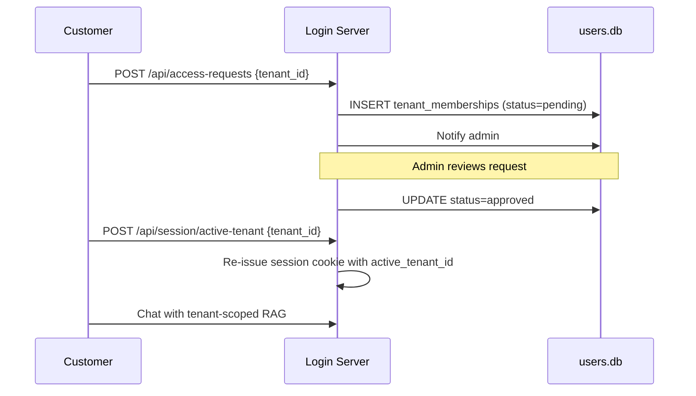

Membership statuses: `pending` → `approved` | `rejected` | `revoked`.

### Isolation Strategy

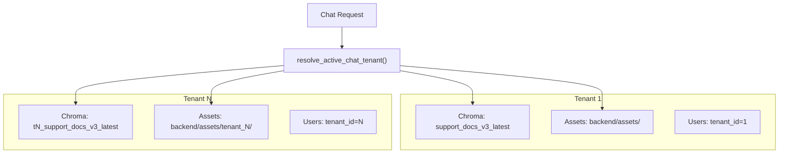

| Layer | Isolation Mechanism |
|-------|---------------------|
| Vector KB | Per-tenant Chroma collection names |
| File assets | `backend/assets/tenant_{id}/` directories |
| Conversations | `tenant_id` column on all chat tables |
| Analytics | `tenant_id` on usage_stats, kb_document_versions |
| Support tickets | `support_tickets.tenant_id` |
| Chat access | `tenant_access.assert_chat_tenant_allowed()` |
| Staff queries | `_tenant_scope_sql()` filters by caller's tenant_id |

### Tenant Lifecycle

| Action | Endpoint | Notes |
|--------|----------|-------|
| Create | `POST /api/tenants/create` | Superadmin only |
| Deactivate | `POST /api/tenants/{id}/deactivate` | Soft disable |
| Activate | `POST /api/tenants/{id}/activate` | Re-enable |
| Delete | `DELETE /api/tenants/{id}` | Permanent; requires inactive + slug confirmation |
| Purge | `tenant_lifecycle.delete_tenant_permanently()` | Removes KB, chat, analytics, staff users |

### Cross-Tenant Security

- Staff cannot manage users outside their tenant (`assert_can_manage_user()`)
- Access request approve/reject scoped to caller's `tenant_id`
- `ENFORCE_CHAT_TENANT_MEMBERSHIP` requires approved membership for customers
- Superadmin bypasses all tenant filters
- Guest chat bypasses membership (public tenant list only)
- Default tenant (id=1) cannot be permanently deleted

### Per-Conversation Tenant Selector

Users select an **active tenant per conversation** via the chat header dropdown. Messages store `tenant_id`; switching tenants mid-thread does not create a new conversation.

APIs: `GET /api/chat-tenants`, `PATCH /conversations/{id}/active-tenant`, per-message `tenant_id` on `POST /conversations/{id}/message` and WebSocket `set_active_tenant`.

See [docs/TENANT_SELECTOR_ARCHITECTURE.md](docs/TENANT_SELECTOR_ARCHITECTURE.md) for full details.

---

## 7. AI Architecture

### Models

| Role | Model | Engine | Device |
|------|-------|--------|--------|
| Chat LLM | `qwen2.5:3b` | Ollama | GPU |
| Embeddings | `intfloat/multilingual-e5-base` | Sentence Transformers | GPU (if `RAG_USE_GPU=1`) |
| Reranker | `cross-encoder/ms-marco-MiniLM-L-6-v2` | Sentence Transformers | GPU (if `RAG_USE_GPU=1`) |
| STT (English) | `small.en` | faster-whisper | CPU (int8) |
| STT (Arabic) | `small` (multilingual) | faster-whisper | CPU (int8) |
| TTS | Piper ONNX voices | Piper | CPU |

### Inference Configuration

**Ollama streaming payload** (WebSocket path):

```python
{
    "model": "qwen2.5:3b",
    "messages": [...],
    "stream": True,
    "keep_alive": -1,
    "options": {
        "num_ctx": 3072,       # dynamic per query type
        "temperature": 0.0-0.6, # dynamic
        "top_p": 0.9,
        "num_predict": 96-900,  # dynamic
        "num_gpu": 99
    }
}
```

**Dynamic limits by query type:**

| Query Type | num_ctx | num_predict | temperature |
|------------|---------|-------------|-------------|
| Default | 3072 | 96–180 | 0.0–0.6 |
| executive_memo | 6144 | 900 | 0.2 |
| quiz_generation | 6144 | 850 | 0.15 |
| extreme_summary | 4096 | 400 | 0.1 |
| multi_source_synthesis | 6144 | 520 | 0.2 |

### Query Routing

`classify_query_route()` returns one of:

| Route | Behavior |
|-------|----------|
| `conversational_ack` | Canned redirect — no RAG |
| `assistant_meta` | Capability answers — no RAG |
| `smalltalk` | Smalltalk — no RAG |
| `unsupported_unclear` | Clarification prompt — no RAG |
| `document_question` | Full RAG + LLM path |

### Prompt Engineering

- **System persona:** `CUSTOMER_SUPPORT_AGENT_SYSTEM_PROMPT` with grounding rules
- **Context format:** TOON encoding (see [RAG Architecture](#8-rag-architecture))
- **History:** Last turn only (latency optimization)
- **Arabic mode:** Separate strict Arabic-only system prompts
- **Refusal rules:** `RAG_GROUNDING_REFUSAL_RULE` prevents hallucination when no docs match

### Streaming Logic

- WebSocket: token-by-token via Ollama stream → `aiResponseChunk` events
- HTTP: full response after stream completes
- Timeout: `STREAM_TOTAL_TIMEOUT_S = 30.0` seconds
- Warmup: `_warmup_llm()` loads model into VRAM on startup

### Fallback Logic

| Scenario | Fallback |
|----------|----------|
| No relevant docs | Friendly "not found" message (no LLM call) |
| MPC11 fast-fail | Skip LLM if doc_count < 1 or max_sim < 0.25 |
| LLM timeout | User-friendly error message |
| Query prep LLM unreachable | Skip normalization silently |
| TTS unavailable | Browser `SpeechSynthesis` fallback |
| STT failure | `stt_failed` event with reason |

### GPU/CPU Policy

| Component | Device | Rationale |
|-----------|--------|-----------|
| Ollama LLM | GPU | Primary inference workload |
| Embeddings + reranker | GPU | Batch efficiency for retrieval |
| Whisper STT | CPU (forced) | Preserve VRAM for LLM |
| Piper TTS | CPU | Lightweight ONNX inference |

Environment: `RAG_USE_GPU=1`, `WHISPER_DEVICE=cpu`, `CUDA_VISIBLE_DEVICES=0`.

---

## 8. RAG Architecture

### Document Upload Flow

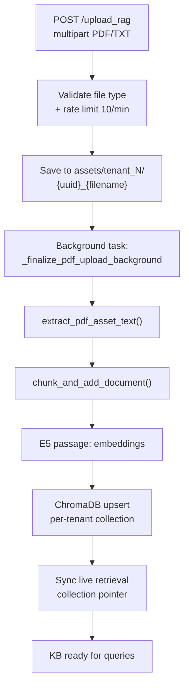

### PDF Processing

| Step | Library | Details |
|------|---------|---------|
| Primary extraction | pdfplumber | `extract_text(layout=False)`, fallback `layout=True` |
| Table extraction | pdfplumber | `extract_tables()` (skipped if > 60 pages) |
| OCR fallback | pytesseract + pdf2image | When page text < 100 chars |
| Secondary fallback | PyPDF2 | `PdfReader` |
| Post-processing | Custom | Hyphenation repair, split-word fixes, OCR merges |
| Page wrapping | Custom | `[PAGE_START: N] ... [PAGE_END: N]` |

### Chunking Strategy

**Production path:** `knowledge_base.chunk_and_add_document()`

| Parameter | Long docs | Short docs (≤ 8000 words) |
|-----------|-----------|---------------------------|
| TARGET_MIN_WORDS | 220 | 80 |
| TARGET_MAX_WORDS | 360 | 160 |
| TARGET_WORDS | 300 | 120 |
| OVERLAP_WORDS | 50 | 25 |
| Min emit words | 60 | 3 (for .txt) |

**Logic highlights:**
- Parses page blocks for page metadata
- Separates prose from `[TABLE DATA]` blocks
- Infers structure: chapter/section/unit headings, TOC detection
- Chunk IDs: `{doc_id}_chunk_{index}`
- Sliding overlap windows via `_split_long_text_to_windows`

### Embeddings

| Setting | Value |
|---------|-------|
| Model | `intfloat/multilingual-e5-base` |
| Index prefix | `passage: {text}` |
| Query prefix | `query: {text}` |
| Device | CUDA if available + `RAG_USE_GPU=1` |
| Singleton | `get_shared_embedder()` shared by ingestion + search |
| Batch size | 64 (embed), 128/100 (upsert GPU/CPU) |

### Vector Storage

| Setting | Value |
|---------|-------|
| Engine | ChromaDB `PersistentClient` |
| Path | `backend/chroma_db_v3` |
| Distance | Cosine (`hnsw:space: cosine`) |
| Collection (tenant 1) | `support_docs_v3_latest` |
| Collection (tenant N) | `t{N}_support_docs_v3_latest` |
| Blue/green (single-doc) | Timestamped collections with GC |

### Retrieval Pipeline

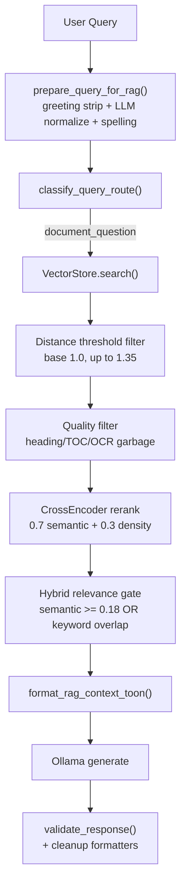

**Search parameters:**

| Parameter | Value |
|-----------|-------|
| top_k | 5–8 default; up to 120 cap; FACT_MAX_TOP_K=20 |
| candidate_pool | max(24, min(120, top_k × 4)) |
| distance_threshold | Dynamic: 0.85–1.35 based on query type |
| rerank skip | Single candidate with sim ≥ 0.92 and top_k ≤ 3 |

### TOON Context Format

`format_rag_context_toon(docs)` in `backend/toon.py`:

```
doc[0]:
  content: Full text of top document
  source: filename.pdf
  _score: 0.87
---
doc[1]:
  content: Truncated to 500 chars...
  source: other.pdf
```

- doc[0] gets full text; later docs truncated to 500 chars
- 40–60% token reduction vs JSON context blocks
- Blocks joined with `\n---\n`

### Caching

| Cache | Size/TTL | Cleared on |
|-------|----------|------------|
| Rerank scores | 512 entries LRU | Collection hot-swap |
| Query embeddings | 256 entries LRU | Collection hot-swap |
| Simple RAG answers | 256 entries, TTL 120s | `POST /rag/clear-cache` |
| Spelling doc vocab | Per collection | Reindex |
| Follow-up memory | Per-connection state | Disconnect |

### Error Handling

- Empty retrieval → friendly not-found (no LLM hallucination)
- VectorStore failure → empty list, proceed to no-match path
- Upload failure → logged, HTTP error returned
- Background indexing failure → logged, file remains in assets for retry
- OCR failure → falls through to PyPDF2 or marks page as empty

---

## 9. Voice Architecture

### System Overview

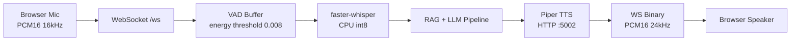

### Speech-to-Text

| Setting | English | Arabic |
|---------|---------|--------|
| Engine | faster-whisper | faster-whisper (multilingual) |
| Model | `small.en` | `small` |
| Device | CPU (int8) | CPU (int8) |
| beam_size | 1 | 5 |
| VAD | min_silence 300ms, threshold 0.3 | same |
| Timeout | 10s async | 10s async |
| Input format | PCM16 mono 16 kHz | same |

### Text-to-Speech

| Setting | Value |
|---------|-------|
| Engine | Piper ONNX (production) |
| Port | 5002 |
| Output | 24 kHz mono PCM16 WAV |
| Voices | `PIPER_EN_VOICE_PATH`, `PIPER_AR_VOICE_PATH` |
| Chunking | First chunk 28–35% of text; rest 210–280 chars |
| Cache | 64 entries LRU, max 2 MB/entry |
| Fallback | Browser `SpeechSynthesis` via `ttsFallback` event |

### WebSocket Voice Sequence

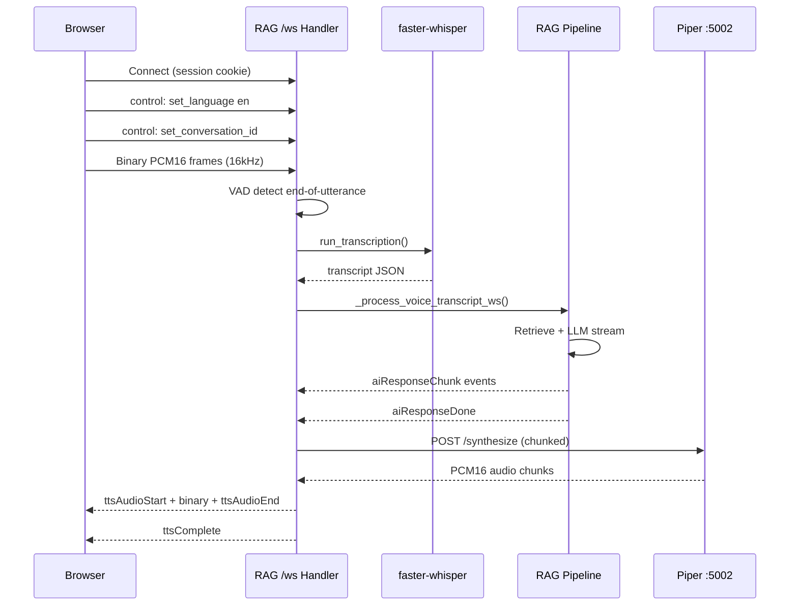

### Control Messages

| Action | Payload | Effect |
|--------|---------|--------|
| `set_language` | `{language: "en"\|"ar"}` | Set STT/TTS language |
| `set_conversation_id` | `{conversation_id}` | Bind conversation |
| `set_active_tenant` | `{tenant_id}` | Switch RAG tenant scope |
| `stop_recording` | — | Manual transcribe trigger |
| `clear_audio_buffer` | — | Discard buffered audio |
| `interrupt` | — | Barge-in: cancel TTS + clear buffer |
| `ping` | — | → `pong` |

### Concurrency & Memory Guard

| Mechanism | Limit |
|-----------|-------|
| `voice_semaphore` | 1 concurrent voice/LLM session |
| `xtts_synth_sem` | 1 concurrent TTS synthesis |
| WS message rate | 30 msg / 60s per connection |
| Memory guard | Blocks after 3 consecutive suspicious GPU/CPU growth runs |
| Safe unblock thresholds | CPU < 2000 MB, GPU < 2000 MB |

### Latency Optimizations

- Progressive TTS chunking (smaller first chunk for faster time-to-first-audio)
- TTS LRU cache (64 entries) + in-flight deduplication
- Frontend TTS prebuffer (0.3s before playback)
- Single shared aiohttp session for TTS HTTP (connector limit 4)
- Optional Arabic PCM warmup (disabled by default)

---

## 10. Security Architecture

### Current Security Controls

| Control | Implementation | Status |
|---------|----------------|--------|
| Authentication | Signed session cookies (itsdangerous) | Active |
| Password hashing | bcrypt_sha256 (passlib, 12 rounds) | Active |
| Authorization | 5-tier RBAC with hierarchy checks | Active |
| CSRF | Cookie + X-CSRF-Token header | Active |
| Rate limiting | SQLite-backed per-IP buckets | Active |
| Account lockout | 5 failures → 15 min | Active |
| Session timeout | 24h absolute, 30min idle | Active |
| Session invalidation | DB-backed invalidation list | Active |
| Security logging | Rotating logs/security.log | Active |
| HTTP headers | CSP, HSTS, X-Frame-Options, nosniff | Active |
| Input validation | Pydantic models, regex patterns | Active |
| Output validation | PII/profanity response filter | Active |
| Tenant isolation | Collection + SQL + access checks | Active |
| File upload validation | Extension whitelist (pdf, txt), rate limit | Active |
| WebSocket auth | Session cookie or guest header | Active |

### Security Strengths

- **Defense in depth:** Gateway (login) + backend (RAG) both enforce auth
- **No JWT in localStorage:** HttpOnly session cookies prevent XSS token theft
- **Session fixation mitigation:** Old session invalidated on login
- **Tenant-scoped everything:** KB, conversations, analytics, tickets all isolated
- **Grounded responses:** RAG gating prevents LLM hallucination on off-topic queries
- **Audit trail:** All admin actions logged with IP, performer, old/new values
- **Local inference:** No data sent to third-party LLM APIs

### Security Weaknesses

| Risk | Severity | Details |
|------|----------|---------|
| No Argon2 | Low | bcrypt_sha256 is adequate but Argon2 is modern best practice |
| Internal routes unauthenticated | Medium | `/health`, `/stats`, `/internal/*` on RAG have no auth |
| LLM shim no auth | Medium | `main_llm_server.py` endpoints have no authentication |
| Piper/XTTS no auth | Medium | TTS microservices accept unauthenticated requests |
| Session in cookie payload | Low | Tenant/role embedded in signed cookie (validated server-side) |
| No refresh token rotation | Low | Absolute 24h timeout only; no sliding refresh |
| Prompt injection | Medium | User queries passed to LLM; mitigated by system prompt constraints |
| File upload size limits | Low | Rate limited but no explicit max file size documented |
| Guest chat public access | Config | `ALLOW_PUBLIC_GUEST_CHAT` exposes RAG without auth |

### Recommended Improvements

1. **Authenticate internal endpoints** — Add API key or mTLS for service-to-service calls
2. **Add Argon2** as primary hash scheme with bcrypt fallback
3. **Implement Content-Security-Policy** nonces for inline scripts
4. **Add file upload size limits** (e.g., 50 MB max) with explicit validation
5. **Rate limit RAG queries** per user/tenant (not just login endpoints)
6. **Add prompt injection detection** layer before LLM call
7. **Implement refresh token rotation** for long-lived sessions
8. **Add SSRF protection** on any URL-fetching code paths
9. **Enable MFA by default** for admin+ roles in production
10. **Add security headers** to RAG server responses (currently login-only)

### Deployment Security Recommendations

- Set `ENVIRONMENT=production` with 64+ byte `SESSION_SECRET`
- Enable `ENFORCE_HTTPS=true` and configure `ALLOWED_HOSTS`
- Use Nginx reverse proxy with TLS termination in production
- Disable `ALLOW_DEV_LOGIN_FALLBACK` and `SKIP_EMAIL_OTP`
- Set `ENFORCE_CHAT_TENANT_MEMBERSHIP=true`
- Run `python scripts/verify_rbac.py` after deployment
- Configure EmailJS for production OTP delivery
- Set up Google OAuth with production redirect URI

---

## 11. Database Design

### Database Files

| File | Path | Purpose |
|------|------|---------|
| users.db | `Login_system/users.db` | Auth, tenants, memberships, tickets, notifications |
| conversations.db | `backend/conversations.db` | Chat history (legacy + normalized) |
| analytics.db | `backend/analytics.db` | Usage stats, satisfaction, KB events |
| chroma_db_v3 | `backend/chroma_db_v3/` | Vector embeddings (ChromaDB) |

### Entity Relationship Diagram

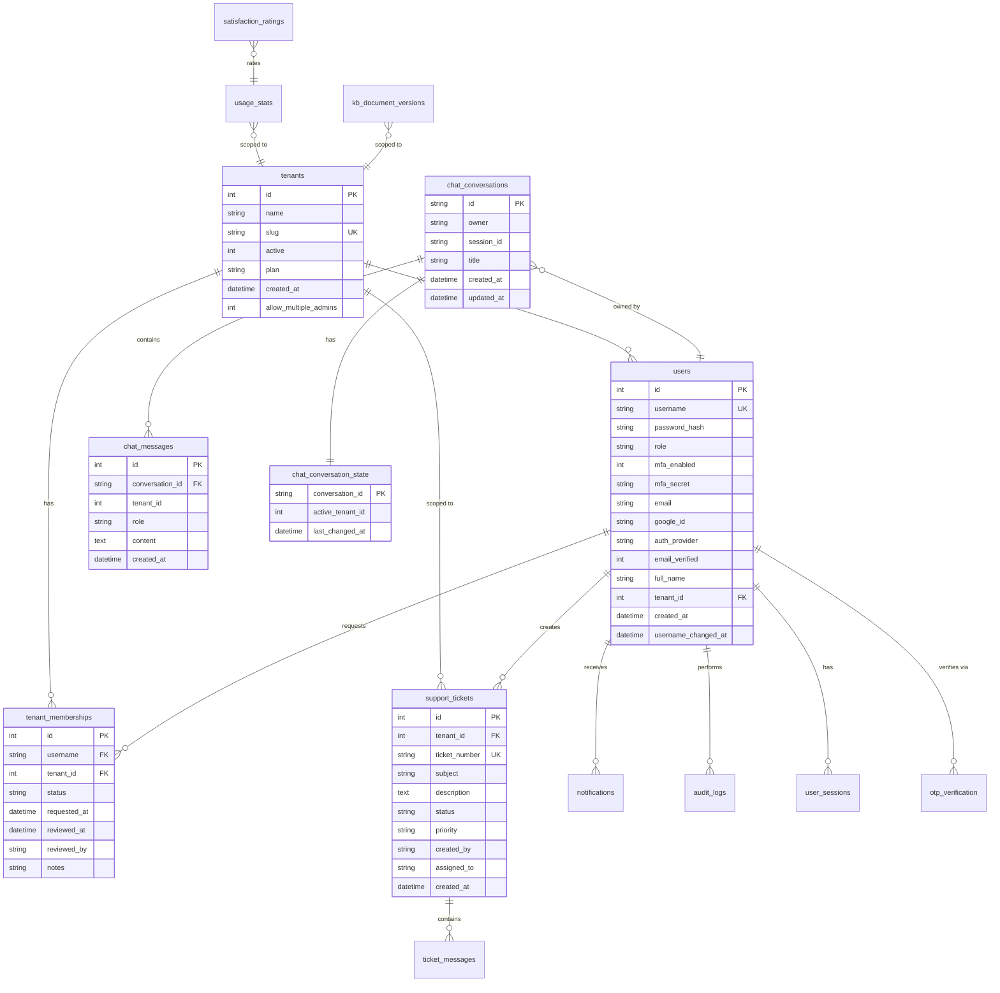

### Key Tables (users.db)

| Table | Purpose |
|-------|---------|
| `tenants` | Business/company entities |
| `users` | All user accounts with role and tenant binding |
| `tenant_memberships` | Customer access requests and approvals |
| `otp_verification` | Hashed OTP codes for registration/reset/change |
| `user_sessions` | Active session tracking (idle timeout) |
| `invalidated_sessions` | Session revocation list |
| `rate_limit_buckets` | Per-IP rate limiting state |
| `failed_login_attempts` | Login failure counter |
| `account_lockouts` | Temporary account locks |
| `audit_logs` | Admin action audit trail |
| `customer_notes` | CRM notes on customers |
| `support_tickets` | Support ticket headers |
| `ticket_messages` | Ticket conversation messages |
| `notifications` | In-app notification queue |
| `query_feedback` | RAG response thumbs up/down |

### Key Tables (conversations.db)

| Table | Purpose |
|-------|---------|
| `conversations` | Legacy WS conversation log |
| `sessions` | Legacy session tracking |
| `ui_conversations` | Legacy UI conversation JSON store |
| `chat_conversations` | Normalized conversation headers |
| `chat_conversation_state` | Active tenant per conversation |
| `chat_messages` | Normalized message rows with tenant_id |

### Key Tables (analytics.db)

| Table | Purpose |
|-------|---------|
| `usage_stats` | Per-query metrics (response time, docs found, tenant_id) |
| `satisfaction_ratings` | 1–5 star ratings linked to usage_stats |
| `model_performance` | Aggregate model performance stats |
| `session_analytics` | Session-level aggregates |
| `kb_document_versions` | Upload/delete/reindex audit trail |

---

## 12. API Documentation

### Authentication Requirements Legend

| Symbol | Meaning |
|--------|---------|
| 🔓 | Public (no auth) |
| 🔒 | `require_login()` — session cookie required |
| 👤 | `require_api_auth()` — session, always JSON response |
| 🛡️ | `require_tenant_staff()` — admin or master_admin |
| 👑 | `require_api_role("superadmin")` |
| 🔑 | CSRF token required (mutating requests) |
| 👥 | Guest cookie + `X-Guest-Owner` header |

### Auth Endpoints (Login :7001)

| Method | Path | Auth | Purpose |
|--------|------|------|---------|
| GET | `/login` | 🔓 | Redirect to React login |
| POST | `/login` | 🔓 | Authenticate, set session cookie |
| GET | `/logout` | 🔓 | Invalidate session |
| GET | `/register` | 🔓 | Redirect to register page |
| POST | `/register` | 🔓 | Create account, send OTP |
| POST | `/verify-otp` | 🔓 | Verify registration OTP |
| GET | `/auth/google/login` | 🔓 | Start Google OAuth |
| GET | `/auth/google/callback` | 🔓 | OAuth callback |
| GET | `/forgot-password` | 🔓 | Redirect |
| POST | `/forgot-password` | 🔓 | Send reset OTP |
| POST | `/reset-password` | 🔓 | Reset with OTP |
| POST | `/change-username` | 🔓 | One-time username change |

### Profile Endpoints

| Method | Path | Auth | Purpose |
|--------|------|------|---------|
| GET | `/api/my-profile` | 🔒 | Current user profile |
| DELETE | `/api/my-account` | 🔒 🔑 | Self-delete account |
| POST | `/profile/change-email` | 🔒 🔑 | Start email change |
| POST | `/profile/verify-email-change` | 🔒 🔑 | Confirm email OTP |
| POST | `/profile/change-password` | 🔒 🔑 | Start password change |
| POST | `/profile/verify-password-change` | 🔒 🔑 | Confirm password OTP |

### User Management

| Method | Path | Auth | Purpose |
|--------|------|------|---------|
| GET | `/api/users` | 🛡️ | List tenant users |
| POST | `/api/users/create` | 🛡️ 🔑 | Create user |
| POST | `/api/users/{id}/deactivate` | 🛡️ 🔑 | Deactivate |
| POST | `/api/users/{id}/activate` | 🛡️ 🔑 | Activate |
| DELETE | `/api/users/{id}/delete` | 🛡️ 🔑 | Hard delete |
| POST | `/api/users/{id}/change-role` | 🛡️ 🔑 | Change role |
| POST | `/users/{id}/mfa-enable` | 🛡️ 🔑 | Enable MFA |

### Tenant & Membership

| Method | Path | Auth | Purpose |
|--------|------|------|---------|
| GET | `/api/tenants` | 👑 | List all tenants |
| POST | `/api/tenants/create` | 👑 🔑 | Create tenant |
| POST | `/api/tenants/{id}/managers` | 👑 🔑 | Create master_admin |
| DELETE | `/api/tenants/{id}` | 👑 🔑 | Permanent delete |
| POST | `/api/tenants/{id}/deactivate` | 👑 🔑 | Soft disable |
| POST | `/api/tenants/{id}/activate` | 👑 🔑 | Re-enable |
| GET | `/api/businesses` | 👤 | Active business list |
| GET | `/api/chat-tenants` | 👤 | Chat tenant selector |
| GET | `/api/my-memberships` | 👤 customer | Customer memberships |
| POST | `/api/session/active-tenant` | 👤 customer 🔑 | Set active business |
| POST | `/api/access-requests` | 👤 customer 🔑 | Request access |
| GET | `/api/access-requests` | 🛡️ | List requests |
| POST | `/api/access-requests/{id}/approve` | 🛡️ 🔑 | Approve |
| POST | `/api/access-requests/{id}/reject` | 🛡️ 🔑 | Reject |

### Conversations / Chat

| Method | Path | Auth | Purpose |
|--------|------|------|---------|
| GET | `/conversations` | 🔒 | List conversations |
| POST | `/conversations` | 🔒 🔑 | Create conversation |
| GET | `/conversations/{id}` | 🔒 | Get conversation |
| PATCH | `/conversations/{id}` | 🔒 🔑 | Rename |
| PATCH | `/conversations/{id}/active-tenant` | 🔒 🔑 | Switch tenant |
| POST | `/conversations/{id}/message` | 🔒 🔑 | Append message |
| DELETE | `/conversations/{id}` | 🔒 🔑 | Delete one |
| DELETE | `/conversations` | 🔒 🔑 | Delete all |
| POST | `/query` | 🔒 | HTTP RAG query |
| WS | `/ws` | 🔒 | Voice + streaming chat |
| GET | `/api/public/chat-tenants` | 🔓 | Public tenant list |
| GET | `/api/guest/conversations` | 👥 | Guest conversations |
| WS | `/ws/guest` | 👥 | Guest voice/chat |

### Knowledge Base

| Method | Path | Auth | Purpose |
|--------|------|------|---------|
| POST | `/proxy/upload_rag` | 🛡️ 🔑 | Upload PDF/TXT |
| GET | `/api/knowledge/files` | 🛡️ | List files |
| GET | `/api/knowledge/files/{name}` | 🛡️ | File content |
| PUT | `/api/knowledge/files/{name}` | 🛡️ 🔑 | Edit .txt |
| DELETE | `/api/knowledge/files/{name}` | 🛡️ 🔑 | Delete file |
| POST | `/api/knowledge/reindex-file` | 🛡️ 🔑 | Reindex one |
| POST | `/api/knowledge/reindex-all` | 🛡️ 🔑 | Reindex all |
| POST | `/api/knowledge/clear-cache` | 🛡️ 🔑 | Clear RAG cache |
| GET | `/api/knowledge/kb_status` | 🛡️ | Pipeline status |
| GET | `/kb_status` | 🔒 | KB status (RAG direct) |
| POST | `/upload_rag` | 🛡️ 🔑 | Upload (RAG direct) |
| POST | `/rag/reindex-all` | 🛡️ 🔑 | Reindex (RAG direct) |
| WS | `/ws/kb-events` | 🛡️ | Live KB event stream |

### Analytics

| Method | Path | Auth | Purpose |
|--------|------|------|---------|
| GET | `/api/analytics/comprehensive` | 🛡️ | Full analytics |
| GET | `/api/analytics/errors` | 🛡️ | Error log |
| GET | `/api/employee/analytics` | staff | Employee stats |
| POST | `/analytics/feedback` | 🔒 | Star rating |
| POST | `/api/feedback/thumbs` | 🔒 🔑 | Thumbs up/down |

### Support Tickets

| Method | Path | Auth | Purpose |
|--------|------|------|---------|
| POST | `/api/support/ticket/create` | 👤 🔑 | Create ticket |
| GET | `/api/support/tickets` | 👤 | List tickets |
| GET | `/api/support/ticket/{id}` | 🔒 | Ticket detail |
| POST | `/api/support/ticket/{id}/message` | 🔒 🔑 | Add message |
| POST | `/api/support/ticket/{id}/assign` | staff 🔑 | Assign |
| POST | `/api/support/ticket/{id}/resolve` | staff 🔑 | Resolve |

### Voice

| Method | Path | Auth | Purpose |
|--------|------|------|---------|
| POST | `/tts` | 🔒 | TTS synthesis (proxied) |
| GET | `/arabic/status` | 🔒 | Arabic model status |
| POST | `/arabic/download` | 🔒 | Download Arabic Whisper |
| GET | `/internal/asr-status` | 🔓 | ASR engine info |

### System / Health

| Method | Path | Auth | Purpose |
|--------|------|------|---------|
| GET | `/health` | 🔓 | RAG service health |
| GET | `/stats` | 🔓 | DB/connection stats |
| GET | `/internal/preflight` | 🔓 | Stability checks |
| GET | `/internal/gpu-status` | 🔓 | LLM GPU status (:8010) |
| GET | `/favicon.ico` | 🔓 | Favicon |

### Piper TTS (:5002)

| Method | Path | Auth | Purpose |
|--------|------|------|---------|
| GET | `/health` | 🔓 | Engine readiness |
| GET | `/voices` | 🔓 | List voices |
| POST | `/synthesize` | 🔓 | Synthesize speech |

> **Full endpoint catalog:** ~102 login routes + ~45 RAG routes + voice + Piper/LLM. See [docs/SYSTEM_ARCHITECTURE.md](docs/SYSTEM_ARCHITECTURE.md) for request/response schemas.

---

## 13. Frontend Documentation

### Framework

| Package | Version |
|---------|---------|
| Next.js | 16.2.x |
| React | 19.0.x |
| TypeScript | 5.7.x |
| Tailwind CSS | 4.0.x |

Built as **static export** (`output: "export"`) with `basePath: "/frontend"` and served from Login Server.

### Route Structure

Route groups `(auth)`, `(app)`, `(guest)` do not appear in URLs.

#### Public Routes `(auth)/`

| Route | URL | Purpose |
|-------|-----|---------|
| login | `/frontend/login/` | Login form + Google OAuth |
| register | `/frontend/register/` | Registration |
| verify-otp | `/frontend/verify-otp/` | OTP verification |
| forgot-password | `/frontend/forgot-password/` | Password reset request |
| reset-password | `/frontend/reset-password/` | Password reset form |
| change-username | `/frontend/change-username/` | One-time username change |

#### Chat (root, outside route groups)

| Route | URL | Purpose |
|-------|-----|---------|
| `/` | `/frontend/` | Authenticated chat (Assistify component) |

#### Guest `(guest)/`

| Route | URL | Purpose |
|-------|-----|---------|
| guest | `/frontend/guest/` | Public chat without login |

#### Authenticated Dashboards `(app)/`

| Route | URL | Roles |
|-------|-----|-------|
| main | `/frontend/main/` | customer |
| select-business | `/frontend/select-business/` | customer |
| my-tickets | `/frontend/my-tickets/` | customer |
| profile | `/frontend/profile/` | all |
| notifications | `/frontend/notifications/` | all |
| superadmin | `/frontend/superadmin/` | superadmin |
| admin/* | `/frontend/admin/*` | admin |
| master_admin/* | `/frontend/master_admin/*` | master_admin |
| employee/* | `/frontend/employee/*` | employee |

### Role-Based Navigation

**Role hierarchy:** `customer` < `employee` < `admin` < `master_admin` < `superadmin`

| Role | Home | Sidebar Links |
|------|------|---------------|
| customer | `/main` | Chat, My Tickets, Profile |
| employee | `/employee` | Chat, Customers, Tickets |
| admin | `/admin` | Chat, Users, Knowledge, Analytics, Audit, Access, Tickets |
| master_admin | `/master_admin` | Chat, Admins, Users, Knowledge, Analytics, Audit, Access, Tickets |
| superadmin | `/superadmin` | Platform tenant management |

Implemented via `useRoleNav()` hook reading `useProfile()` → `navigation.ts` link definitions.
Protected by `RoleGuard` component checking route prefixes.

### Key Components

| Component | Location | Purpose |
|-----------|----------|---------|
| `Assistify` | `components/assistify.tsx` | Authenticated chat shell |
| `GuestAssistify` | `components/guest-assistify.tsx` | Guest chat shell |
| `ChatArea` | `components/chat-area.tsx` | Messages, input, voice, tenant selector |
| `ChatMessage` | `components/chat-message.tsx` | Message bubbles with Markdown |
| `MarkdownContent` | `components/markdown-content.tsx` | react-markdown + GFM renderer |
| `TenantSelector` | `components/tenant-selector.tsx` | Active tenant dropdown |
| `VoiceOverlay` | `components/voice-overlay.tsx` | Full-screen voice UI |
| `Header` | `components/header.tsx` | Top bar with language toggle |
| `Sidebar` | `components/sidebar.tsx` | Conversation list |
| `AppShell` | `src/components/AppShell.tsx` | Dashboard layout wrapper |
| `AuthGuard` | `src/components/AuthGuard.tsx` | Redirect if unauthenticated |
| `RoleGuard` | `src/components/RoleGuard.tsx` | Enforce role-based routes |

### Custom Hooks (22)

| Hook | Purpose |
|------|---------|
| `useChatWebSocket` | WebSocket connection, streaming, reconnect, control messages |
| `useConversations` | Auth conversation CRUD, localStorage last-active |
| `useGuestConversations` | Guest conversation CRUD |
| `useGuestChat` | Public tenant list + active tenant (localStorage) |
| `useChatTenants` | Auth chat tenants from `/api/chat-tenants` |
| `useActiveTenant` | Tenant switch + PATCH active-tenant |
| `useVoiceMode` | Mic capture, PCM resampling, VAD, TTS playback |
| `useKnowledge` | KB file list, upload, delete, reindex, pipeline polling |
| `useTenants` | Superadmin tenant CRUD |
| `useProfile` | Current user from `/api/my-profile` |
| `useRoleNav` | Role-derived navigation links |
| `useAnalytics` | Comprehensive analytics + errors |
| `useTickets` | Support ticket list, detail, filters |
| `useUsers` | User list, create, activate/deactivate |
| `useNotifications` | Notification list + mark read |
| `useAccessRequests` | Access request list + approve/reject |
| `useAuditLogs` | Audit log fetch |
| `useCustomers` | Employee customer list + CRM notes |
| `useDashboardStats` | Aggregated dashboard statistics |
| `useMemberships` | Customer memberships + businesses |
| `useTenantAdmins` | Master admin tenant admin CRUD |
| `useInactivityLogout` | 30-min idle → redirect to logout |

### Feature Modules (`src/features/`)

| Module | Pages |
|--------|-------|
| `AnalyticsPageContent` | admin + master_admin analytics |
| `AuditLogsPageContent` | admin + master_admin audit |
| `AccessRequestsPageContent` | admin + master_admin access |
| `KnowledgePageContent` + `KbPipelineStatusPanel` | knowledge pages |
| `CustomersPageContent` | employee/customers |
| `UsersPageContent` | admin/master_admin users |
| `SuperadminPageContent` | superadmin |
| `TicketsPageContent` | all ticket pages |

---

## 14. Deployment Guide

### Development Quick Start

```powershell
# 1. Create environment
conda env create -f environment_main.yml
conda activate assistify_main
pip install itsdangerous authlib pdfplumber "setuptools<81"

# 2. Configure
copy .env.example .env
# Edit: ENVIRONMENT=development, OLLAMA_MODEL=qwen2.5:3b

# 3. Initialize data
python -m backend.load_documents
python Login_system\init_users_db.py
ollama pull qwen2.5:3b

# 4. Start everything
python start_main_servers.py

# 5. Open http://127.0.0.1:7001/login (superadmin / superadmin)
```

> **Detailed Windows setup:** See [docs/SETUP_WINDOWS.md](docs/SETUP_WINDOWS.md) for prerequisites, troubleshooting, and launcher flags.

### Service Ports

| Service | Port | Health Check |
|---------|------|--------------|
| Login + UI | 7001 | `http://127.0.0.1:7001/` |
| RAG | 7000 | `http://127.0.0.1:7000/health` |
| Ollama | 11434 | TCP open |
| Piper TTS | 5002 | `http://127.0.0.1:5002/health` |
| LLM shim | 8010 | `http://127.0.0.1:8010/internal/gpu-status` |

### Startup Order

1. React UI build (`npm run build` → `out/`)
2. Ollama (11434)
3. Piper TTS (5002)
4. LLM shim (8010)
5. RAG server (7000)
6. Login server (7001)

### Environment Variables

#### Required (Production)

| Variable | Purpose |
|----------|---------|
| `ENVIRONMENT` | `production` |
| `SESSION_SECRET` | 64+ byte signing key |
| `GOOGLE_CLIENT_ID` / `GOOGLE_CLIENT_SECRET` | OAuth |
| `EMAILJS_*` (4 vars) | OTP email delivery |

#### Core Configuration

| Variable | Default | Purpose |
|----------|---------|---------|
| `OLLAMA_MODEL` | `qwen2.5:3b` | Chat model |
| `OLLAMA_HOST` / `OLLAMA_PORT` | `127.0.0.1` / `11434` | Ollama API |
| `EMBEDDING_MODEL` | `intfloat/multilingual-e5-base` | Vector embeddings |
| `RERANKER_MODEL` | `cross-encoder/ms-marco-MiniLM-L-6-v2` | Reranking |
| `RAG_USE_GPU` | `1` | GPU for embeddings/reranker |
| `CHROMA_DB_PATH` | `backend/chroma_db_v3` | Vector DB path |
| `DEFAULT_TENANT_ID` | `1` | Default tenant |
| `BASE_URL` | `http://127.0.0.1:7001` | Login server URL |
| `RAG_SERVER_URL` | `http://127.0.0.1:7000` | RAG server URL |
| `LLM_SERVER_URL` / `LLM_SERVER_PORT` | `8010` | LLM shim |
| `XTTS_SERVICE_URL` | `http://127.0.0.1:5002` | TTS microservice |

#### Security

| Variable | Default | Purpose |
|----------|---------|---------|
| `ENFORCE_HTTPS` | `false` | Secure cookies + HSTS |
| `ALLOWED_HOSTS` | `*` | TrustedHost middleware |
| `RATE_LIMIT_LOGIN` | `5` | Login attempts per minute |
| `BCRYPT_ROUNDS` | `12` | Password hashing cost |
| `ENFORCE_CHAT_TENANT_MEMBERSHIP` | auto-on in prod | Chat access control |
| `ALLOW_PUBLIC_GUEST_CHAT` | `false` | Guest chat feature |

#### Voice

| Variable | Default | Purpose |
|----------|---------|---------|
| `WHISPER_MODEL_SIZE` | `small.en` | STT model |
| `WHISPER_DEVICE` | `cpu` | STT device (forced CPU) |
| `WHISPER_COMPUTE_TYPE` | `int8` | Quantization |
| `PIPER_EN_VOICE_PATH` | `models/piper/en/voice.onnx` | English TTS voice |
| `PIPER_AR_VOICE_PATH` | `models/piper/ar/voice.onnx` | Arabic TTS voice |
| `ASSISTIFY_DISABLE_TTS` | `false` | Disable server TTS |
| `ASSISTIFY_DISABLE_WHISPER` | `false` | Disable STT |

### Production Deployment

1. Set `ENVIRONMENT=production` with all required secrets
2. Place Nginx reverse proxy with TLS in front of `:7001`
3. Configure `ALLOWED_HOSTS` and `ENFORCE_HTTPS=true`
4. Set up EmailJS and Google OAuth with production URLs
5. Run `python scripts/migrate_to_multitenant.py` for existing deployments
6. Run `python scripts/verify_rbac.py` and `python scripts/verify_stack.py`
7. Configure log rotation and monitoring for `logs/` directory
8. Set up backup strategy for SQLite DBs and ChromaDB (see below)

### Public Access (Tunnel)

```powershell
python start_main_servers.py --public
```

Tunnels port 7001 via cloudflared or ngrok. Prints public URL and `.env` hints.

### Backup Strategy

| Asset | Location | Frequency |
|-------|----------|-----------|
| users.db | `Login_system/users.db` | Daily |
| conversations.db | `backend/conversations.db` | Daily |
| analytics.db | `backend/analytics.db` | Weekly |
| ChromaDB | `backend/chroma_db_v3/` | After KB changes |
| File assets | `backend/assets/` | After uploads |
| Session secret | `.env` | Store securely offline |

### Hardware Requirements

| Resource | Minimum | Recommended |
|----------|---------|-------------|
| RAM | 16 GB | 32 GB |
| VRAM | 6 GB (qwen2.5:3b) | 8+ GB |
| CPU cores | 4 | 8+ |
| Disk | 10 GB | 50 GB (with models) |
| GPU | NVIDIA (CUDA 12.1) | RTX 3070+ |

---

## 15. Performance Notes

### Caching Strategy

| Cache | Location | Size/TTL | Impact |
|-------|----------|----------|--------|
| Rerank scores | `_RERANK_CACHE` | 512 LRU | Avoids re-ranking identical query-doc pairs |
| Query embeddings | `_QUERY_EMBED_CACHE` | 256 LRU | Avoids re-embedding identical queries |
| Simple RAG answers | `_SIMPLE_RAG_CACHE` | 256 / 120s TTL | Short-circuits repeat questions |
| TTS audio | `tts/client.py` | 64 LRU / 2 MB max | Avoids re-synthesizing identical text |
| Tenant list | `tenant_access.py` | 60s TTL | Reduces users.db reads |
| Ollama model | `keep_alive: -1` | Persistent VRAM | Eliminates model load latency |

### Known Bottlenecks

| Bottleneck | Impact | Mitigation |
|------------|--------|------------|
| First RAG boot | 2–10 min (Whisper model load) | Pre-download models; `--no-whisper` for text-only |
| Ollama cold start | 5–30s first query | `_warmup_llm()` on startup |
| Cross-encoder rerank | 50–200ms per query | Skip when single high-confidence candidate |
| Chroma vector search | 10–50ms | HNSW index, candidate pool tuning |
| PDF OCR fallback | Seconds per page | Skip OCR for text-rich PDFs |
| Voice pipeline | 2–5s end-to-end | Progressive TTS chunking, prebuffer |
| Monolithic RAG server | ~44k lines in one file | Modularization planned (see Roadmap) |

### Optimization Recommendations

1. **Enable query embedding cache** — Already active; increase `QUERY_EMBED_CACHE_MAX` for high-traffic
2. **Use `qwen2.5:3b` over 7b** — 3x faster inference on 6 GB VRAM
3. **TOON context format** — Already reduces tokens 40–60%; ensure all paths use it
4. **Skip reranker for simple queries** — Set `ASSISTIFY_DISABLE_RERANKER=1` for latency-critical deployments
5. **Pre-warm TTS** — Enable `ASSISTIFY_ENABLE_ENGLISH_TTS_WARMUP` for voice-heavy workloads
6. **Limit conversation history** — Already trimmed to last turn; configurable in orchestrator
7. **Batch embedding during ingestion** — GPU batch 64 already configured
8. **Use `--no-piper`** — Skip TTS service if voice not needed (saves ~200 MB RAM)

### Memory Usage

| Component | Typical RAM | VRAM |
|-----------|-------------|------|
| Ollama (qwen2.5:3b) | 500 MB | 2–3 GB |
| Embeddings (E5-base) | 500 MB | 500 MB |
| faster-whisper (small.en) | 500 MB | 0 (CPU) |
| ChromaDB | 100–500 MB | 0 |
| Piper TTS | 100 MB | 0 |
| FastAPI servers | 200 MB each | 0 |
| **Total** | **~3 GB** | **~3 GB** |

---

## 16. Future Roadmap

### Planned Enhancements

| Priority | Enhancement | Rationale |
|----------|-------------|-----------|
| High | Modularize RAG server | 44k-line monolith → separate router modules |
| High | Authenticate internal endpoints | Security hardening for `/health`, TTS, LLM shim |
| High | PostgreSQL migration option | SQLite limits for multi-instance deployment |
| Medium | BM25 hybrid search | Improve lexical matching alongside dense vectors |
| Medium | Refresh token rotation | Better long-session security |
| Medium | Docker Compose deployment | Containerized multi-service orchestration |
| Medium | Real-time ticket WebSocket | Live ticket updates without polling |
| Low | Kubernetes Helm chart | Cloud-native scaling |
| Low | Multi-model routing | Route simple queries to smaller models |
| Low | Document versioning UI | Visual diff for KB changes |

### Known Inconsistencies

| Issue | Details | Workaround |
|-------|---------|------------|
| LLM port mismatch | `config.LLM_SERVER_PORT=8010` vs `main_llm_server.py __main__` on 8000 | Use launcher default 8010 |
| `retrieval_filter.py` unused | `apply_retrieval_filters()` not wired into live pipeline | Filtering done inline in VectorStore |
| Prefinal TTS disabled | `prefinal_tts_enabled_for_query = False` hardcoded | TTS runs after full LLM response |
| Stale UI duplicates | `assistify-ui-design (1)` and `(2)` folders exist | Use `assistify-ui-design` only |
| `_XTTS_SYNTH_SEM` undefined | Referenced in inline LLM TTS consumer but not imported | Active path uses `xtts_synth_sem` |
| Ticket REST API partial | Ticket pages exist but some REST endpoints only in login_server | Use existing `/api/support/ticket/*` |

---

## 17. Technical Interview Notes

### Why This Architecture?

**Problem:** Build an enterprise AI help-desk that gives grounded answers from uploaded documents, supports multiple businesses on one deployment, and runs locally without cloud API costs.

**Solution:** Multi-service FastAPI stack with gateway pattern (Login → RAG → Ollama), tenant-isolated vector stores, and CPU/GPU workload separation.

### Why FastAPI?

- **Async-native** — WebSocket voice, streaming LLM, background indexing all need async I/O
- **Pydantic validation** — Type-safe request/response models across 150+ endpoints
- **Dependency injection** — Clean `require_login()`, `require_tenant_staff()` patterns
- **Performance** — Starlette-based, faster than Flask for concurrent WS connections
- **Auto OpenAPI** — Self-documenting API (used during development)

**Tradeoff:** Monolithic RAG server grew to 44k lines; would benefit from router modularization.

### Why ChromaDB?

- **Embedded** — No separate database server; persistent local storage
- **Python-native** — Direct integration with Sentence Transformers pipeline
- **Collection-per-tenant** — Simple isolation without complex filtering
- **Cosine HNSW** — Fast approximate nearest neighbor for 768-dim embeddings
- **Zero ops** — No Docker, no cluster, no replication config

**Tradeoff:** Not suitable for >10M vectors or multi-node deployment; PostgreSQL + pgvector would be the upgrade path.

### Why SQLite?

- **Zero configuration** — Single file per database, no server process
- **Sufficient scale** — Help-desk workloads (thousands of users, not millions)
- **Portable** — Easy backup (copy file), easy migration
- **Already integrated** — Session state, rate limiting, audit logs all use SQLite

**Tradeoff:** Write concurrency limited; single-process deployment only. Acceptable for current scale.

### Why multilingual-e5-base?

- **Multilingual** — Supports English and Arabic queries/documents
- **E5 prefix convention** — `passage:`/`query:` prefixes improve retrieval quality
- **768 dimensions** — Good balance of quality vs speed
- **Well-benchmarked** — Strong MTEB scores for retrieval tasks
- **Local inference** — Runs on GPU via Sentence Transformers

**Tradeoff:** Larger than MiniLM models; slower than OpenAI embeddings but free and private.

### Why qwen2.5:3b?

- **Small enough for 6 GB VRAM** — Runs on consumer GPUs (RTX 3070)
- **Strong instruction following** — Good at grounded QA with RAG context
- **Fast inference** — ~30 tokens/sec on GPU vs ~10 for 7b
- **Ollama-managed** — Easy model switching, keep_alive, GPU allocation
- **Multilingual** — Handles Arabic prompts when configured

**Tradeoff:** Less capable than GPT-4 or 70b models; mitigated by RAG grounding and response validation.

### Why Piper TTS (not XTTS/Cloud)?

- **CPU-only** — Preserves GPU VRAM for LLM and embeddings
- **Low latency** — ONNX inference, ~200ms for short phrases
- **Offline** — No API costs, no network dependency
- **Arabic support** — Separate ONNX voice models
- **Simple HTTP API** — Drop-in microservice on port 5002

**Tradeoff:** Less natural than XTTS v2 or cloud TTS; acceptable for support use case.

### Why Multi-Tenancy This Way?

- **Membership-based customer access** — Customers are global; businesses grant access via approvals (real-world SaaS pattern)
- **Staff bound to tenant** — Admins/employees belong to one tenant (simple RBAC)
- **Collection-level KB isolation** — Chroma collections per tenant (strongest isolation layer)
- **Session active_tenant_id** — Customer selects business per session/conversation
- **Superadmin platform layer** — Manages tenants without being bound to one

**Tradeoff:** Customers need approval flow to access businesses; more complex than subdomain routing but more flexible.

### Key Tradeoffs Summary

| Decision | Benefit | Cost |
|----------|---------|------|
| Local inference | Privacy, no API costs | GPU required, model quality ceiling |
| Gateway pattern | Single entry point, auth centralization | Extra network hop (localhost) |
| Static UI export | Simple deployment, no Node.js in prod | No SSR, no API routes in Next.js |
| Monolithic RAG server | Fast iteration, shared state | Hard to test, deploy, scale independently |
| CPU voice | VRAM preservation | Higher voice latency vs GPU TTS |
| TOON context format | 40–60% token savings | Custom format, not standard |

### Elevator Pitch (30 seconds)

> "I built Assistify — a multi-tenant AI help-desk platform with RAG-powered answers from uploaded documents, voice interaction in English and Arabic, and five-tier role-based access control. It runs entirely locally using Ollama for LLM inference, ChromaDB for vector search, and a FastAPI microservice architecture with 150+ API endpoints."

### For Recruiters

- Full-stack AI platform with React frontend and Python backend
- Multi-tenant SaaS architecture with RBAC
- RAG pipeline with document upload, chunking, embedding, retrieval, and grounded generation
- Voice interaction (speech-to-text and text-to-speech)
- Complete auth system (OAuth, OTP, MFA, CSRF, rate limiting)
- 150+ API endpoints across 5 services
- Production-ready security controls (OWASP-aligned)

### For Engineering Managers

- **Architecture:** Gateway pattern with Login Server proxying to RAG Server; clear separation of auth vs orchestration vs inference
- **Multi-tenancy:** Collection-level vector isolation, membership-based customer access, tenant lifecycle management
- **Security:** Defense in depth — CSRF, rate limiting, session management, audit logging, response validation
- **Operational:** One-command launcher, health checks, service inventory, log viewer, preflight checks
- **Testing:** Unit tests for TOON, routing, security, multitenant, edge cases
- **Documentation:** Architecture docs, security reports, API specs, deployment guides

### For Senior Engineers

- Query routing bypasses RAG for greetings/smalltalk (saves 2–3s per message)
- Hybrid relevance gating: semantic score OR lexical overlap (prevents false negatives)
- TOON context encoding reduces LLM input tokens by 40–60%
- Blue/green collection swapping for zero-downtime KB updates
- Memory guard detects GPU/CPU leaks across voice sessions
- Progressive TTS chunking for sub-second time-to-first-audio
- Deterministic extractors bypass LLM for list/definition/fact queries

### For AI Engineers

- **Embedding model:** E5-base with asymmetric prefixes (passage vs query)
- **Reranking:** CrossEncoder with semantic + content density scoring
- **Chunking:** Structure-aware (headings, TOC, tables) with adaptive word targets
- **Retrieval:** Dense vector search → rerank → hybrid gate → MPC11 fast-fail
- **Prompt engineering:** Minimal system prompt + TOON context + grounding refusal rules
- **Response validation:** PII/profanity detection, uncertainty disclaimers
- **Query prep:** LLM normalization for multi-clause messages, spelling correction against KB vocab

---

## 18. Portfolio Showcase

### Business Value

Assistify transforms static knowledge-base documents into an interactive AI support agent that:

- Answers customer questions 24/7 with grounded, accurate responses
- Reduces support ticket volume by handling repetitive KB queries
- Supports multiple businesses on a single deployment (multi-tenant SaaS)
- Provides audit trails and analytics for compliance and quality monitoring
- Offers voice interaction for accessibility and mobile use cases

### Technical Complexity

| Dimension | Complexity |
|-----------|------------|
| Services | 5 microservices (Login, RAG, Ollama, Piper, LLM shim) |
| API endpoints | 150+ across HTTP and WebSocket |
| Database tables | 20+ across 3 SQLite DBs + ChromaDB |
| Frontend hooks | 22 custom React hooks |
| RAG pipeline stages | 14 (upload → extract → chunk → embed → store → search → rerank → gate → TOON → prompt → LLM → validate → cache) |
| Auth methods | 4 (local, Google OAuth, OTP, MFA) |
| Roles | 5-tier RBAC hierarchy |
| Languages | 2 (English + Arabic) for STT, TTS, and LLM |

### Resume Highlights

- Architected and built a **multi-tenant RAG-powered AI help-desk platform** with 5 microservices, 150+ API endpoints, and 5-tier RBAC
- Implemented **end-to-end RAG pipeline** — PDF ingestion, adaptive chunking, E5 embeddings, ChromaDB retrieval, cross-encoder reranking, and TOON context optimization (40–60% token reduction)
- Designed **multi-tenant isolation** — per-tenant vector collections, membership-based access control, and tenant lifecycle management
- Built **multimodal voice interaction** — WebSocket audio streaming, faster-whisper STT, Piper TTS, with barge-in and memory guard
- Implemented **production security controls** — CSRF, rate limiting, session management, audit logging, response validation, OWASP-aligned headers

### LinkedIn Highlights

- Built an enterprise AI help-desk platform combining RAG, local LLM inference, and voice interaction
- Multi-tenant SaaS architecture with tenant-isolated knowledge bases and role-based access control
- Full-stack: Next.js 16 + FastAPI + Ollama + ChromaDB + faster-whisper + Piper TTS
- 150+ API endpoints, 22 custom React hooks, 5-tier RBAC, English + Arabic support
- Open-source RAG pipeline with adaptive chunking, hybrid relevance gating, and TOON context encoding

### Interview Talking Points

1. **"Tell me about a complex system you built"** — Walk through the 5-service architecture, gateway pattern, and how Login Server proxies to RAG Server while serving the React UI

2. **"How does your RAG pipeline work?"** — Upload → pdfplumber extraction → adaptive chunking → E5 embeddings → ChromaDB → cross-encoder rerank → hybrid relevance gate → TOON context → Ollama → response validation

3. **"How did you handle multi-tenancy?"** — Collection-level vector isolation, membership-based customer access, session active_tenant_id, tenant lifecycle with permanent delete and purge

4. **"What security measures did you implement?"** — CSRF, rate limiting, bcrypt_sha256, session invalidation, audit logging, response validation, tenant isolation enforcement, OWASP headers

5. **"What was the hardest technical challenge?"** — Voice pipeline latency (progressive TTS chunking, memory guard for GPU leaks, CPU/GPU workload separation) or RAG relevance (hybrid gating, query routing, deterministic extractors)

6. **"Why local inference instead of OpenAI?"** — Privacy (documents stay local), cost control (no per-token fees), offline capability, predictable latency

7. **"How would you scale this?"** — PostgreSQL + pgvector, Redis sessions, Kubernetes deployment, model routing (small model for simple queries), horizontal RAG server replicas with shared ChromaDB

---

## Additional Documentation

| Document | Description |
|----------|-------------|
| [docs/SETUP_WINDOWS.md](docs/SETUP_WINDOWS.md) | Detailed Windows setup and troubleshooting |
| [docs/SYSTEM_ARCHITECTURE.md](docs/SYSTEM_ARCHITECTURE.md) | Full technical architecture (1022 lines) |
| [docs/TENANT_SELECTOR_ARCHITECTURE.md](docs/TENANT_SELECTOR_ARCHITECTURE.md) | Multi-tenant chat selector design |
| [docs/SECURITY_IMPLEMENTATION.md](docs/SECURITY_IMPLEMENTATION.md) | OWASP security controls |
| [docs/RAG_RETRIEVAL.md](docs/RAG_RETRIEVAL.md) | RAG retrieval pipeline details |
| [docs/TOON_IMPLEMENTATION.md](docs/TOON_IMPLEMENTATION.md) | TOON context format specification |
| [docs/PROJECT_BRIEFING.md](docs/PROJECT_BRIEFING.md) | Project briefing and goals |
| [docs/ENV_SETUP_COMPLETE.md](docs/ENV_SETUP_COMPLETE.md) | Environment setup reference |

---

## License

This project is provided as-is for evaluation and development purposes.
