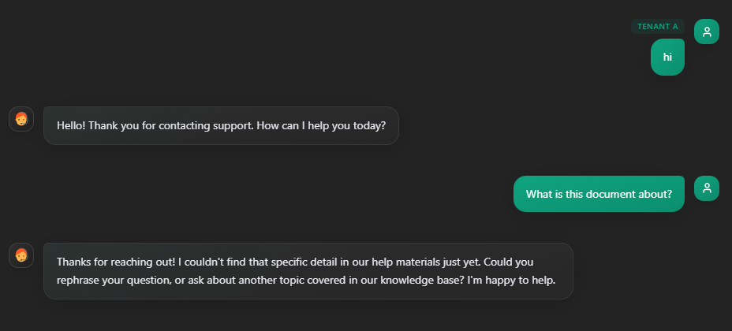
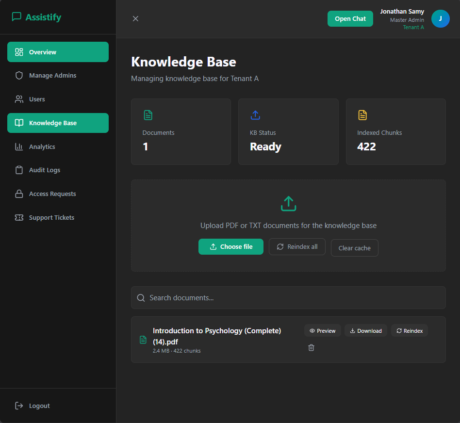

# Assistify v1.0


<div align="center">

### AI-Powered Enterprise Help Desk Platform

Retrieval-Augmented Generation (RAG) • Multi-Tenant Architecture • Voice Intelligence • Knowledge Base Management • Analytics & Monitoring

</div>

---

## Overview

Assistify is an AI-powered enterprise help desk platform that enables organizations to build intelligent customer support systems using Retrieval-Augmented Generation (RAG).

The platform allows administrators to upload company knowledge bases, manage users and permissions, monitor analytics, and provide employees and customers with accurate AI-generated answers grounded in organizational documents.

Built with a modular architecture, Assistify combines local LLM inference, vector search, voice capabilities, and multi-tenant management into a single platform.

---

## Key Features


### AI-Powered Support
- Retrieval-Augmented Generation (RAG)
- Context-aware document retrieval
- Hallucination reduction through grounded responses
- Tenant-isolated knowledge bases

### Knowledge Base Management
- PDF document ingestion
- Automatic chunking and embeddings
- Vector search with ChromaDB
- Re-indexing and document management

### Multi-Tenant Architecture
- Complete tenant isolation
- Independent knowledge bases
- Role-based administration
- Tenant-specific analytics

### User Management
- SuperAdmin management
- Master Admin management
- Admin accounts
- Employee accounts
- Customer accounts

### Voice Intelligence
- Speech-to-text integration
- Voice-based interaction
- Text-to-speech responses
- Real-time voice workflow

### Analytics & Monitoring
- Query tracking
- Response performance metrics
- Usage analytics
- RAG hit-rate monitoring

---

# Screenshots

## AI Chat Interface



Real-time AI support assistant powered by Retrieval-Augmented Generation.

---

## Admin Dashboard


Centralized management portal for users, tenants, documents, and system operations.

---

## Knowledge Base Management



Upload, index, manage, and search enterprise knowledge base documents.

---

## Analytics Dashboard


Monitor system usage, performance, RAG effectiveness, and user activity.

---

# System Architecture


Assistify follows a modular service-oriented architecture:

```text
Browser
    │
    ▼
Login Server (FastAPI)
    │
    ├── Authentication
    ├── Session Management
    └── Frontend Delivery
    │
    ▼
RAG Server (FastAPI)
    │
    ├── Retrieval Engine
    ├── Vector Search
    ├── Response Validation
    └── Analytics
    │
    ├───────────────┐
    ▼               ▼
ChromaDB        LLM Service
(Vector DB)     (Qwen/Ollama)
    │
    ▼
Knowledge Base
```

---

# Technology Stack

## Backend

- Python
- FastAPI
- SQLite
- ChromaDB
- Sentence Transformers
- Ollama
- Qwen Models

## Frontend

- React
- Next.js
- TypeScript
- Tailwind CSS

## AI & Retrieval

- Retrieval-Augmented Generation (RAG)
- Vector Embeddings
- Semantic Search
- Document Chunking

## Voice

- Faster-Whisper
- Piper TTS

---

# User Roles

| Role | Permissions |
|--------|-------------|
| SuperAdmin | Create tenants and manage the entire platform |
| Master Admin | Manage tenant administrators |
| Admin | Manage users and knowledge bases |
| Employee | Internal AI assistant access |
| Customer | Customer-facing AI support access |

---

# Installation

## 1. Clone Repository

```bash
git clone https://github.com/Jonathan980JO/assistify-rag-project.git
cd assistify-rag-project
```

## 2. Create Environment

```bash
conda env create -f environment_main.yml
conda activate assistify_main
```

## 3. Configure Environment

```bash
copy .env.example .env
```

Update any required environment variables.

## 4. Initialize Database

```bash
python Login_system/init_users_db.py
```

## 5. Start Platform

```bash
python start_main_servers.py
```

---

# Default Bootstrap Account

A fresh installation creates a single bootstrap account:

```text
Username: superadmin
Password: superadmin
```

Use this account to create tenants, administrators, employees, and customers.

---

# Project Structure

```text
Assistify-v1.0
│
├── Login_system/
├── backend/
├── assistify-ui-design/
├── docs/
├── assets/
│   ├── banner.png
│   ├── architecture.png
│   ├── features.png
│   └── screenshots/
│
├── start_main_servers.py
├── environment_main.yml
└── README.md
```

---

# Security

- Environment-based configuration
- Session management
- Tenant isolation
- Role-based access control
- Knowledge base separation
- Local deployment support

---

# Future Enhancements

- Additional LLM providers
- Advanced analytics
- Ticket workflow automation
- Extended voice capabilities
- Enhanced tenant customization

---

# License

This repository is provided for educational, research, and portfolio purposes.

---

<div align="center">

### Assistify v1.0

AI-Powered Enterprise Help Desk Platform

</div>
