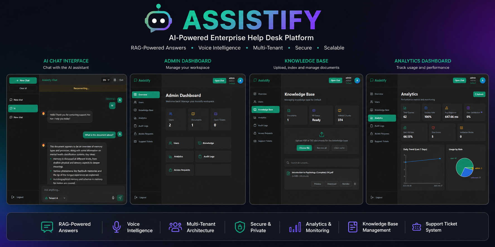
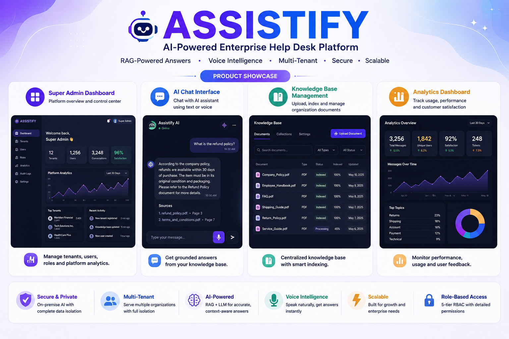
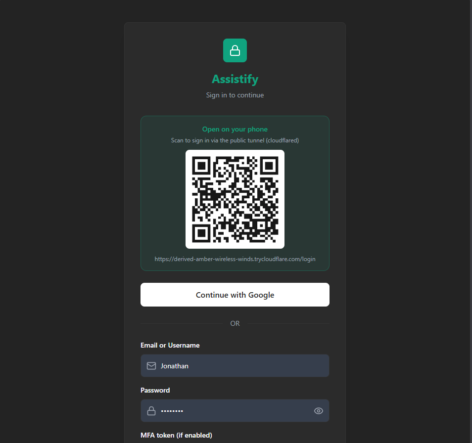
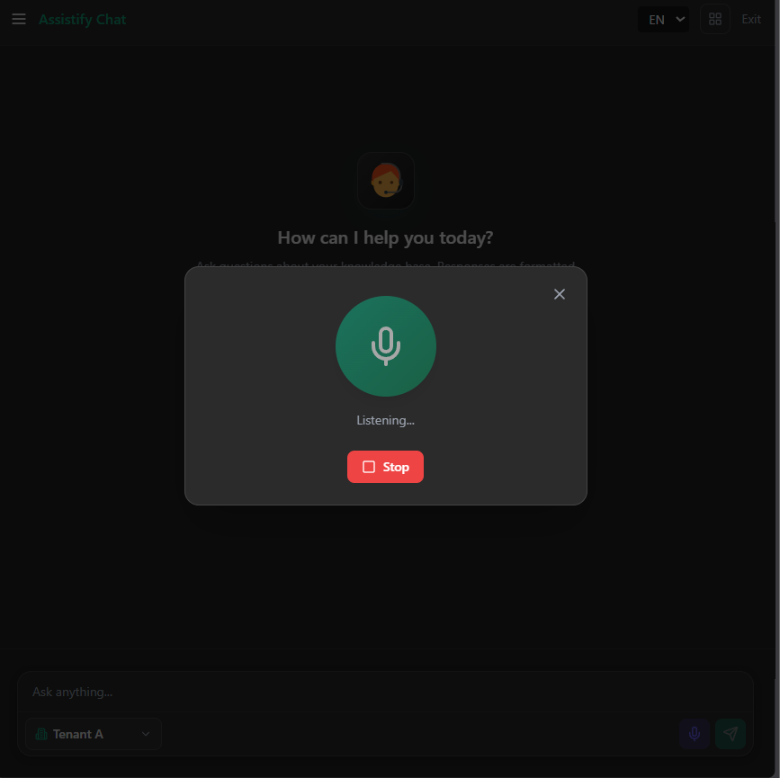
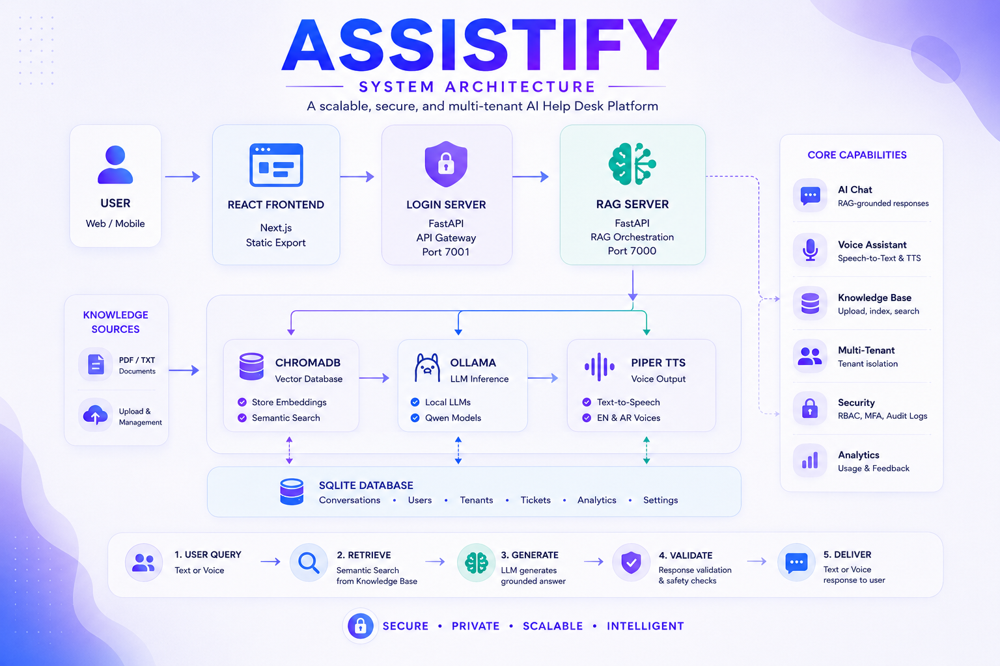

# Assistify v1.0

<p align="center">
  
</p>

<p align="center">
  <strong>Enterprise AI Help Desk Platform</strong>
</p>

<p align="center">
  Multi-Tenant • RAG Powered • Voice Enabled • Local LLM Inference
</p>

---

## Overview

Assistify is an enterprise AI help-desk platform that transforms company knowledge bases into intelligent support assistants.

Organizations can upload documents, create isolated business environments, manage users and permissions, and provide customers and employees with accurate AI-generated answers grounded in company data.

The platform combines Retrieval-Augmented Generation (RAG), local Large Language Models, voice interaction, analytics, and multi-tenant architecture into a single solution.

---

## Key Features

<p align="center">
  
</p>

### AI-Powered Support

- Retrieval-Augmented Generation (RAG)
- Grounded responses from company documents
- Hallucination reduction through evidence retrieval
- Multi-language support

### Knowledge Base Management

- PDF document ingestion
- Automatic chunking and embeddings
- ChromaDB vector search
- Reindexing and document lifecycle management

### Multi-Tenant Architecture

- Tenant-isolated knowledge bases
- Independent user management
- Role-based access control
- Tenant-specific analytics

### Voice Intelligence

- Speech-to-text
- Text-to-speech
- Real-time voice conversations
- English and Arabic support

### Security & Administration

- RBAC (5 user roles)
- Google OAuth
- OTP verification
- MFA support
- Audit logging
- Session management

---

# Product Screenshots

## Login Experience

<p align="center">
  
</p>

---

## AI Chat Assistant

<p align="center">
  
</p>

---

## Voice Interaction

<p align="center">
  
</p>

---

## Knowledge Base Management

<p align="center">
  
</p>

---

# System Architecture

<p align="center">
  
</p>

### Architecture Flow

```text
Browser
   │
   ▼
Login Server (FastAPI)
   │
   ├── Authentication
   ├── Session Management
   └── API Gateway
   │
   ▼
RAG Server (FastAPI)
   │
   ├── Retrieval Engine
   ├── Response Validation
   ├── Analytics
   └── Voice Services
   │
   ├──────────────┐
   ▼              ▼
ChromaDB       Ollama
(Vector DB)    (LLM)
```

---

# Technology Stack

## Frontend

- React 19
- Next.js 16
- TypeScript
- Tailwind CSS

## Backend

- Python
- FastAPI
- SQLite
- WebSockets

## AI & Retrieval

- Ollama
- Qwen Models
- ChromaDB
- Sentence Transformers
- Cross Encoder Re-ranking

## Voice

- Faster Whisper
- Piper TTS

---

# User Roles

| Role | Description |
|--------|------------|
| SuperAdmin | Platform owner |
| Master Admin | Tenant manager |
| Admin | User and knowledge-base management |
| Employee | Internal AI assistant access |
| Customer | Customer-facing support access |

---

# Quick Start

### Clone Repository

```bash
git clone https://github.com/Jonathan980JO/assistify-rag-project.git
cd assistify-rag-project
```

### Create Environment

```bash
conda env create -f environment_main.yml
conda activate assistify_main
```

### Configure Environment

```bash
copy .env.example .env
```

### Initialize Database

```bash
python Login_system/init_users_db.py
```

### Start Platform

```bash
python start_main_servers.py
```

### Open

```text
http://127.0.0.1:7001
```

---

# Default Bootstrap Account

```text
Username: superadmin
Password: superadmin
```

Use this account to create tenants, administrators, employees, and customers.

---

# Project Structure

```text
Assistify
│
├── assistify-ui-design/
├── backend/
├── Login_system/
├── docs/
├── assets/
│   └── screenshots/
│
├── start_main_servers.py
├── environment_main.yml
└── README.md
```

---

# Documentation

| Document | Description |
|-----------|------------|
| docs/SYSTEM_ARCHITECTURE.md | Full architecture documentation |
| docs/SECURITY_IMPLEMENTATION.md | Security controls |
| docs/RAG_RETRIEVAL.md | RAG pipeline details |
| docs/SETUP_WINDOWS.md | Installation guide |
| docs/PROJECT_BRIEFING.md | Project overview |
| docs/README.md | Documentation index |

---

# Resume Highlights

- Built a multi-tenant AI help-desk platform using RAG and local LLM inference.
- Designed and implemented a complete document ingestion and retrieval pipeline.
- Integrated voice interaction using Faster-Whisper and Piper TTS.
- Developed role-based access control with five permission levels.
- Implemented analytics, audit logging, and tenant isolation.
- Built with React, Next.js, FastAPI, ChromaDB, and Ollama.

---

# Future Roadmap

- PostgreSQL support
- Advanced analytics
- Ticket workflow automation
- Docker deployment
- Multi-model routing
- Enhanced voice capabilities

---

# License

This project is provided for educational, research, and portfolio purposes.

---

<p align="center">
  <strong>Assistify v1.0</strong><br>
  Enterprise AI Help Desk Platform
</p>
