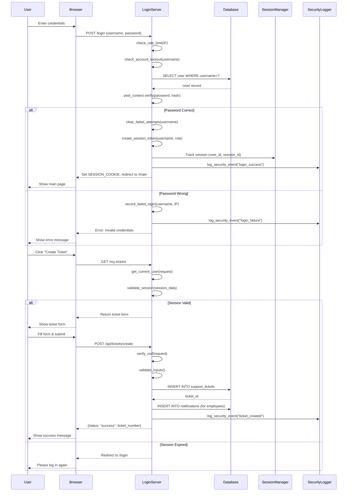

# Sequence Diagram - User Login and Ticket Creation Flow

This diagram shows the **step-by-step interaction** between components when a user logs in and creates a support ticket.

## Mermaid Diagram (Copy this to render)



## How to Use This Diagram:

### Option 1: Render in VS Code
1. Install extension: **Markdown Preview Mermaid Support**
2. Open this file in VS Code
3. Press `Ctrl+Shift+V` (Preview)

### Option 2: Render Online
1. Go to: https://mermaid.live/
2. Copy the code between ` ```mermaid ` and ` ``` `
3. Paste and see the diagram

### Option 3: Export as Image
1. Use mermaid.live
2. Click "Actions" → "PNG" or "SVG"
3. Download the image

## What This Shows:

- **Login Security**: Rate limiting, account lockout, password verification
- **Session Management**: Token creation, validation
- **Security Logging**: All events tracked
- **CSRF Protection**: Token verification on ticket creation
- **Database Interactions**: Parameterized queries (safe from SQL injection)

## Components Explained:

- **LoginServer**: `Login_system/login_server.py` (your FastAPI app)
- **Database**: SQLite database with users, tickets, notifications
- **SessionManager**: Session timeout and concurrent session tracking
- **SecurityLogger**: JSON logs to `logs/security.log`
