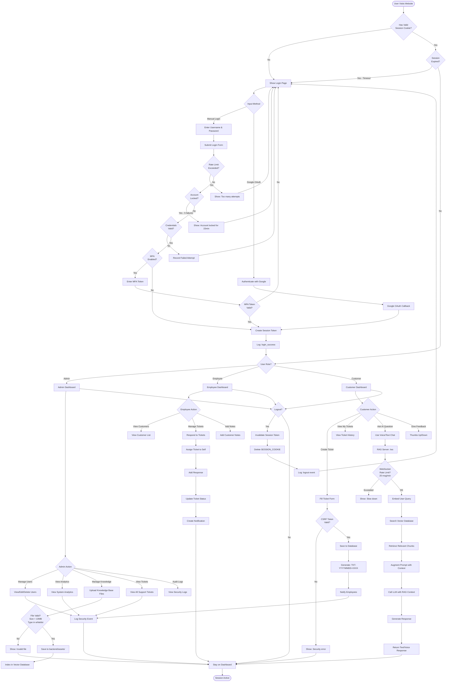

# Activity Flowchart - Complete User Journey

This diagram shows the **decision-making flow** and different paths for Customer, Employee, and Admin users.

## Mermaid Diagram (Copy this to render)

## How to Use This Diagram:

Same as Sequence Diagram:
1. Install **Markdown Preview Mermaid Support** in VS Code
2. Press `Ctrl+Shift+V` to preview
3. Or paste at https://mermaid.live/

## Decision Points Explained:

| Decision | What It Checks |
|----------|----------------|
| **Has Valid Session Cookie?** | Checks if user is already logged in |
| **Rate Limit Exceeded?** | Max 5 login attempts per minute per IP |
| **Account Locked?** | 5 failed attempts = 15min lockout |
| **Credentials Valid?** | bcrypt_sha256 password verification |
| **MFA Enabled?** | User has 2FA turned on |
| **Session Expired?** | 24h absolute OR 30min idle timeout |
| **User Role?** | Admin, Employee, or Customer |
| **CSRF Token Valid?** | Prevents cross-site request forgery |
| **File Valid?** | Max 10MB, allowed extensions only |
| **WebSocket Rate Limit?** | Max 20 messages per minute |

## User Flows:

### Customer Flow:
1. Login → Customer Dashboard → Create Ticket → Get Help from AI → Logout

### Employee Flow:
1. Login → Employee Dashboard → View Tickets → Respond to Ticket → Add Customer Notes

### Admin Flow:
1. Login → Admin Dashboard → Manage Users → Upload Knowledge Base → View Analytics

## Security Features Shown:

- ✅ Rate limiting (login, WebSocket)
- ✅ Account lockout (brute force protection)
- ✅ Session validation (timeout checks)
- ✅ CSRF protection (ticket creation)
- ✅ File upload validation (size, type)
- ✅ Role-based access control (RBAC)
- ✅ Security logging (all actions tracked)
