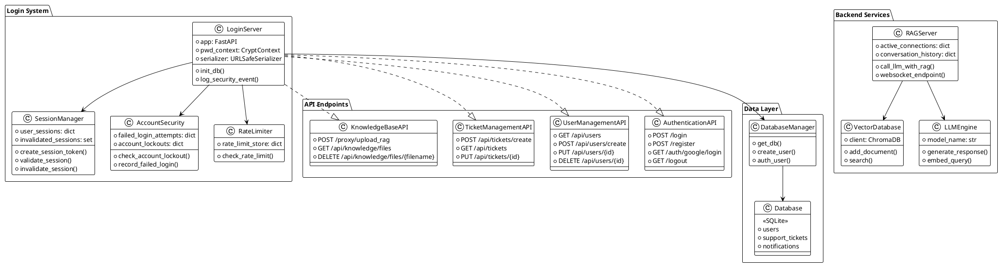

# Class Diagram - System Architecture

This diagram shows the **structure of your code** - classes, functions, and how they relate.

## Mermaid Diagram (Copy this to render)

```mermaid
classDiagram
    %% Main Application Classes
    class LoginServer {
        +FastAPI app
        +CryptContext pwd_context
        +URLSafeSerializer serializer
        +Logger security_logger
        +init_db()
        +log_security_event(type, details, severity)
        +global_exception_handler(request, exc)
    }
    
    class SessionManager {
        +dict user_sessions
        +set invalidated_sessions
        +int SESSION_ABSOLUTE_TIMEOUT
        +int SESSION_IDLE_TIMEOUT
        +int MAX_CONCURRENT_SESSIONS
        +create_session_token(username, role) str
        +validate_session(session_data) tuple
        +invalidate_session(session_id)
    }
    
    class AccountSecurity {
        +dict failed_login_attempts
        +dict account_lockouts
        +int MAX_FAILED_ATTEMPTS
        +int LOCKOUT_DURATION
        +check_account_lockout(username) tuple
        +record_failed_login(username, ip)
        +clear_failed_attempts(username)
    }
    
    class RateLimiter {
        +dict rate_limit_store
        +int MAX_RATE_LIMIT_ENTRIES
        +check_rate_limit(identifier, limit, window) bool
    }
    
    class WebSocketRateLimiter {
        +int max_messages
        +int window_seconds
        +list messages
        +is_allowed() bool
        +get_remaining_time() int
    }
    
    class AuthenticationAPI {
        +post_login(username, password)
        +post_register(user_data)
        +post_verify_otp(otp_code)
        +get_google_login()
        +get_google_callback()
        +get_logout()
    }
    
    class UserManagementAPI {
        +get_users()
        +post_users_create(user_data)
        +put_users_update(user_id, data)
        +delete_users(user_id)
        +post_deactivate(user_id)
        +post_activate(user_id)
        +post_change_role(user_id, new_role)
    }
    
    class TicketManagementAPI {
        +post_create_ticket(ticket_data)
        +get_tickets(filters)
        +put_update_ticket(ticket_id, data)
        +post_assign_ticket(ticket_id, employee)
        +get_ticket_messages(ticket_id)
        +post_ticket_message(ticket_id, message)
    }
    
    class KnowledgeBaseAPI {
        +post_upload_rag(file)
        +get_knowledge_files()
        +get_file_content(filename)
        +put_update_file(filename, content)
        +delete_file(filename)
    }
    
    class NotificationAPI {
        +get_notifications(user)
        +post_create_notification(data)
        +put_mark_read(notification_id)
        +delete_notification(notification_id)
    }
    
    class PydanticModels {
        <<validation>>
        +UserCreate
        +UserUpdate
        +TicketCreate
        +validate_username(username)
        +validate_password(password)
        +validate_email(email)
    }
    
    class DatabaseManager {
        +get_db() Connection
        +init_db()
        +create_user(username, password, role)
        +auth_user(username, password) tuple
        +get_current_user(request) dict
    }
    
    class SecurityMiddleware {
        +security_headers_middleware()
        +TrustedHostMiddleware
        +CORSMiddleware
        +add_headers(response)
        +verify_csrf(request)
    }
    
    class RAGServer {
        +FastAPI app
        +dict active_connections
        +dict conversation_history
        +call_llm_with_rag(text, connection_id, user)
        +websocket_endpoint(websocket)
        +cleanup_old_conversations()
    }
    
    class VectorDatabase {
        +ChromaDB client
        +Collection collection
        +add_document(doc_id, text, metadata)
        +search(query, n_results)
        +delete_document(doc_id)
    }
    
    class LLMEngine {
        +str model_name
        +Pipeline llm_pipeline
        +generate_response(prompt, context)
        +embed_query(text)
    }
    
    class AnalyticsModule {
        +init_analytics_db()
        +log_satisfaction(username, rating)
        +get_comprehensive_analytics(days)
        +get_summary(limit)
        +get_recent_errors(limit)
    }
    
    class TOONEncoder {
        +encode(data) str
        +decode(toon_str) dict
        +compress_tokens(json_str)
    }
    
    %% Relationships
    LoginServer --> SessionManager : uses
    LoginServer --> AccountSecurity : uses
    LoginServer --> RateLimiter : uses
    LoginServer --> DatabaseManager : uses
    LoginServer --> SecurityMiddleware : uses
    LoginServer --> PydanticModels : validates with
    
    LoginServer ..> AuthenticationAPI : implements
    LoginServer ..> UserManagementAPI : implements
    LoginServer ..> TicketManagementAPI : implements
    LoginServer ..> KnowledgeBaseAPI : implements
    LoginServer ..> NotificationAPI : implements
    
    AuthenticationAPI --> SessionManager : creates sessions
    AuthenticationAPI --> AccountSecurity : checks lockout
    
    UserManagementAPI --> DatabaseManager : queries
    TicketManagementAPI --> DatabaseManager : queries
    NotificationAPI --> DatabaseManager : queries
    
    KnowledgeBaseAPI --> VectorDatabase : indexes documents
    
    LoginServer --> RAGServer : websocket proxy
    RAGServer --> VectorDatabase : searches
    RAGServer --> LLMEngine : generates responses
    RAGServer --> AnalyticsModule : logs interactions
    RAGServer --> TOONEncoder : compresses data
    
    RAGServer --> WebSocketRateLimiter : uses
    
    %% Database Tables
    class Database {
        <<SQLite>>
        +users table
        +support_tickets table
        +ticket_messages table
        +notifications table
        +customer_notes table
        +query_feedback table
        +otp_verification table
    }
    
    DatabaseManager --> Database : connects to
```

## PlantUML Version (for professional tools)

## How to Use This Diagram:

### Mermaid (Easy):
1. Install **Markdown Preview Mermaid Support** in VS Code
2. Preview this file
3. Or paste at https://mermaid.live/

### PlantUML (Professional):
1. Go to https://www.plantuml.com/plantuml/
2. Paste the PlantUML code
3. Download PNG/SVG

## Components Explained:

| Component | File Location | Purpose |
|-----------|---------------|---------|
| **LoginServer** | `Login_system/login_server.py` | Main FastAPI application |
| **SessionManager** | `Login_system/login_server.py` (lines 136-290) | Session timeout & limits |
| **AccountSecurity** | `Login_system/login_server.py` (lines 210-245) | Lockout & failed attempts |
| **RateLimiter** | `Login_system/login_server.py` (lines 178-208) | Rate limiting |
| **WebSocketRateLimiter** | `Login_system/login_server.py` (lines 292-318) | WebSocket throttling |
| **DatabaseManager** | `Login_system/login_server.py` (database functions) | SQLite operations |
| **RAGServer** | `backend/assistify_rag_server.py` | RAG AI server |
| **VectorDatabase** | `backend/knowledge_base.py` | ChromaDB vector store |
| **LLMEngine** | `backend/assistify_rag_server.py` (LLM functions) | AI response generation |
| **AnalyticsModule** | `backend/analytics.py` | Usage analytics |
| **TOONEncoder** | `backend/toon.py` | Token compression |

## Key Relationships:

- **LoginServer uses SessionManager**: Session creation and validation
- **LoginServer uses AccountSecurity**: Brute force protection
- **LoginServer uses RateLimiter**: Prevent DoS attacks
- **LoginServer implements APIs**: RESTful endpoints
- **RAGServer uses VectorDatabase**: Knowledge retrieval
- **RAGServer uses LLMEngine**: AI response generation
