# Process Flow Diagram - Business Logic

This diagram shows the **high-level business process** from user request to completion.

## Mermaid Diagram (Copy this to render)

```mermaid
flowchart LR
    %% Input Stage
    Start([User Initiates Request]) --> InputMethod{Input<br/>Method?}
    InputMethod -->|Voice| ConvertSpeech[Convert Speech to Text<br/>Vosk ASR]
    InputMethod -->|Text| ValidateText[Validate Text Input<br/>Sanitize & Length Check]
    InputMethod -->|Image/OCR| ExtractText[Extract Text via OCR<br/>Tesseract]
    
    ConvertSpeech --> ValidateInput
    ValidateText --> ValidateInput
    ExtractText --> ValidateInput
    
    %% Validation Stage
    ValidateInput[Validate Input<br/>CSRF Token Check] --> DetectIntent[Detect Query Intent<br/>Classification]
    
    %% Intent Routing
    DetectIntent --> QueryType{Query<br/>Type?}
    
    %% Simple FAQ Path
    QueryType -->|Simple FAQ| DirectLLM[Generate Direct LLM Response<br/>No RAG Context]
    DirectLLM --> FormatResponse
    
    %% Complex Query Path
    QueryType -->|Complex/Contextual| InitRAG[Initiate RAG Pipeline]
    InitRAG --> EmbedQuery[Embed User Query<br/>Vector Embedding]
    EmbedQuery --> SearchVector[Search Vector Database<br/>ChromaDB Similarity Search]
    SearchVector --> RetrieveChunks[Retrieve Relevant Chunks<br/>Top-K Results]
    RetrieveChunks --> AugmentPrompt[Augment Prompt with Context<br/>Add Retrieved Documents]
    AugmentPrompt --> RAGGeneration[RAG LLM Generation<br/>Context-Aware Response]
    RAGGeneration --> FormatResponse
    
    %% Output Stage
    FormatResponse[Format Response] --> OutputFormat{Output<br/>Format?}
    
    OutputFormat -->|Text Only| DeliverText[Deliver Text Response]
    OutputFormat -->|Voice| ConvertTTS[Convert Text to Speech<br/>TTS Engine]
    
    ConvertTTS --> DeliverVoice[Deliver Voice Response]
    
    %% Feedback Stage
    DeliverText --> CollectFeedback[Collect User Feedback<br/>Thumbs Up/Down]
    DeliverVoice --> CollectFeedback
    
    %% Analytics Stage
    CollectFeedback --> LogInteraction[Log Interaction & Analytics<br/>Store in analytics.db]
    LogInteraction --> UpdateModel[Update Model Training Data<br/>Feedback Loop]
    
    %% Escalation Decision
    UpdateModel --> NeedHuman{Need Human<br/>Escalation?}
    
    NeedHuman -->|Yes - Low Confidence| CreateTicket[Create Support Ticket<br/>Assign to Employee]
    NeedHuman -->|Yes - User Request| CreateTicket
    NeedHuman -->|No| Complete([Process Complete])
    
    CreateTicket --> NotifyEmployee[Notify Employee<br/>Email/In-App Notification]
    NotifyEmployee --> Complete
    
    %% Security Logging (parallel)
    ValidateInput -.Log.-> SecurityLog[(Security Log<br/>logs/security.log)]
    DirectLLM -.Log.-> SecurityLog
    RAGGeneration -.Log.-> SecurityLog
    CreateTicket -.Log.-> SecurityLog
    
    %% Error Handling
    DetectIntent -->|Error| ErrorHandler[Global Exception Handler]
    SearchVector -->|Error| ErrorHandler
    RAGGeneration -->|Error| ErrorHandler
    ErrorHandler --> LogError[Log Error<br/>Hide Stack Trace in Production]
    LogError --> ReturnGeneric[Return Generic Error Message]
    ReturnGeneric --> Complete
    
    style Start fill:#90EE90
    style Complete fill:#FFB6C1
    style SecurityLog fill:#FFE4B5
    style CreateTicket fill:#87CEEB
    style ErrorHandler fill:#FF6347
```



## Simplified Linear Version (for presentations)

```mermaid
graph LR
    A[User Request] --> B[Validate Input]
    B --> C[Detect Intent]
    C --> D{Simple or Complex?}
    D -->|Simple| E[Direct LLM]
    D -->|Complex| F[RAG Pipeline]
    F --> G[Search Knowledge Base]
    G --> H[Retrieve Context]
    H --> I[Generate Response]
    E --> J[Format Output]
    I --> J
    J --> K{Text or Voice?}
    K -->|Text| L[Deliver Text]
    K -->|Voice| M[Text-to-Speech]
    M --> N[Deliver Voice]
    L --> O[Collect Feedback]
    N --> O
    O --> P[Log Analytics]
    P --> Q{Escalate?}
    Q -->|Yes| R[Create Ticket]
    Q -->|No| S[Complete]
    R --> S
    
    style A fill:#90EE90
    style S fill:#FFB6C1
```



## Process Steps Explained:

### 1. Input Processing
| Step | What Happens | Code Location |
|------|--------------|---------------|
| **Voice Input** | Vosk ASR converts speech to text | `backend/assistify_rag_server.py` (transcribe_and_respond) |
| **Text Input** | Sanitize and validate length | `Login_system/login_server.py` (sanitize_input) |
| **Image OCR** | Extract text from images | (if implemented) |

### 2. Validation & Intent Detection
| Step | What Happens | Code Location |
|------|--------------|---------------|
| **CSRF Check** | Verify CSRF token | `Login_system/login_server.py` (verify_csrf) |
| **Input Sanitization** | Remove malicious content | `Login_system/login_server.py` (sanitize_input) |
| **Intent Classification** | Determine query complexity | `backend/assistify_rag_server.py` (call_llm_with_rag) |

### 3. Query Processing
| Path | When Used | Code Location |
|------|-----------|---------------|
| **Direct LLM** | Simple FAQs, greetings | `backend/assistify_rag_server.py` |
| **RAG Pipeline** | Complex questions needing context | `backend/assistify_rag_server.py` (call_llm_with_rag) |

### 4. RAG Pipeline Details
| Step | What Happens | Code Location |
|------|--------------|---------------|
| **Embed Query** | Convert text to vector | `backend/assistify_rag_server.py` (embeddings) |
| **Search Vector DB** | Similarity search in ChromaDB | `backend/knowledge_base.py` (search_documents) |
| **Retrieve Chunks** | Get top-K relevant documents | `backend/knowledge_base.py` |
| **Augment Prompt** | Add context to LLM prompt | `backend/assistify_rag_server.py` |
| **Generate Response** | LLM generates answer | `backend/assistify_rag_server.py` |

### 5. Output Formatting
| Format | What Happens | Code Location |
|--------|--------------|---------------|
| **Text** | Return plain text response | `backend/assistify_rag_server.py` |
| **Voice** | Convert to speech with TTS | `backend/assistify_rag_server.py` (Output Processor) |

### 6. Feedback & Analytics
| Step | What Happens | Code Location |
|------|--------------|---------------|
| **Collect Feedback** | Thumbs up/down rating | `backend/assistify_rag_server.py` (/submit-feedback) |
| **Log Analytics** | Store interaction data | `backend/analytics.py` (log_satisfaction) |
| **Update Training** | Use feedback for model improvement | (future enhancement) |

### 7. Human Escalation
| Trigger | Action | Code Location |
|---------|--------|---------------|
| **Low Confidence** | AI not confident in response | (future enhancement) |
| **User Request** | User clicks "Talk to Human" | `Login_system/login_server.py` (ticket creation) |
| **Create Ticket** | Generate support ticket | `Login_system/login_server.py` (/api/tickets/create) |
| **Notify Employee** | Send notification to staff | `Login_system/login_server.py` (notifications) |

## Business Value Chain:

```
User Query → AI Processing → Quick Response → Satisfied Customer
     ↓              ↓              ↓                ↓
 Save Time    Reduce Costs    Fast Support    Higher Retention
```

## Performance Metrics:

| Stage | Target Time | Actual Implementation |
|-------|-------------|----------------------|
| **Voice to Text** | < 2 seconds | Vosk real-time ASR |
| **Vector Search** | < 500ms | ChromaDB optimized |
| **LLM Generation** | < 5 seconds | Local Qwen2.5-7B model |
| **Text to Speech** | < 3 seconds | TTS engine |
| **Total Response** | < 10 seconds | End-to-end |

## Error Handling:

- **Global Exception Handler**: Catches all errors
- **Production Mode**: Hides stack traces, shows generic messages
- **Development Mode**: Shows detailed error information
- **Security Logging**: All errors logged to `logs/security.log`

## Security Checkpoints:

1. ✅ **Input Validation** - CSRF token, sanitization
2. ✅ **Rate Limiting** - WebSocket: 20 msg/min
3. ✅ **Session Validation** - 24h absolute, 30min idle timeout
4. ✅ **Authorization** - Role-based access control
5. ✅ **Output Sanitization** - Prevent XSS in responses
6. ✅ **Error Masking** - Hide sensitive information
