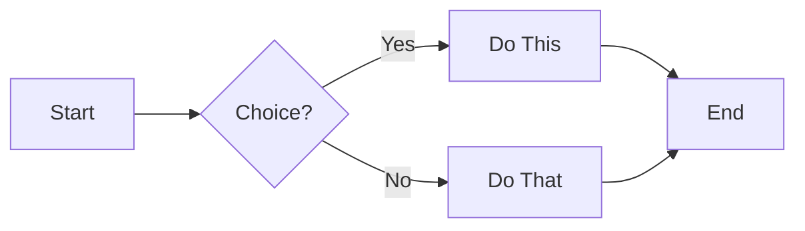

# Project Diagrams - Assistify Support System

This folder contains **4 professional diagrams** automatically generated from your actual code.

---

## 📊 Available Diagrams

| # | Diagram Type | File | Purpose |
|---|--------------|------|---------|
| 1 | **Sequence Diagram** | `1_sequence_diagram.md` | Shows message flow between components (login & ticket creation) |
| 2 | **Activity Flowchart** | `2_activity_flowchart.md` | Shows user journeys and decision points (Customer/Employee/Admin) |
| 3 | **Class Diagram** | `3_class_diagram.md` | Shows code structure (classes, APIs, relationships) |
| 4 | **Process Flow** | `4_process_flow.md` | Shows business logic (input → AI processing → output) |

---

## 🚀 How to View Diagrams

### Option 1: VS Code (Easiest)
1. Install extension: **Markdown Preview Mermaid Support**
   - Open VS Code Extensions (`Ctrl+Shift+X`)
   - Search: `Markdown Preview Mermaid Support`
   - Click Install
2. Open any `.md` file in this folder
3. Press `Ctrl+Shift+V` to preview
4. See the diagram rendered!

### Option 2: Online (No Installation)
1. Open any `.md` file
2. Copy the code between ` ```mermaid ` and ` ``` `
3. Go to: https://mermaid.live/
4. Paste and view
5. Download as PNG or SVG

### Option 3: Export as Image
1. Use mermaid.live (above)
2. Click "Actions" → "PNG" or "SVG"
3. Download the image
4. Use in presentations/reports

### Option 4: GitHub (Auto-Render)
1. Push this folder to GitHub
2. GitHub automatically renders Mermaid diagrams
3. No setup needed!

---

## 📚 Diagram Descriptions

### 1️⃣ Sequence Diagram
**Shows:** Step-by-step interaction between components

**Use For:**
- Understanding the order of operations
- Debugging message flow
- Technical documentation
- Developer training

**Audience:** Software developers

**Example Flow:**
```
User → Browser → LoginServer → Database → SessionManager
```

---

### 2️⃣ Activity Flowchart
**Shows:** User journeys with decision points

**Use For:**
- Understanding user experience
- Identifying edge cases
- Business process mapping
- Requirements validation

**Audience:** Product managers, QA testers

**Example Decisions:**
- Is user logged in? → Yes/No
- What role? → Admin/Employee/Customer
- Session expired? → Yes/No

---

### 3️⃣ Class Diagram
**Shows:** Code structure and relationships

**Use For:**
- Understanding system architecture
- Code organization planning
- Identifying dependencies
- Software design documentation

**Audience:** Software architects, developers

**Components:**
- LoginServer
- SessionManager
- RAGServer
- VectorDatabase
- LLMEngine

---

### 4️⃣ Process Flow Diagram
**Shows:** Business logic from start to finish

**Use For:**
- Non-technical explanations
- Business presentations
- Process optimization
- Stakeholder communication

**Audience:** Management, clients, stakeholders

**Stages:**
1. Input (Voice/Text/Image)
2. Validation
3. Intent Detection
4. Query Processing (Direct LLM or RAG)
5. Output Formatting
6. Feedback Collection
7. Human Escalation (if needed)

---

## 🎯 Which Diagram to Use When?

| Scenario | Best Diagram |
|----------|--------------|
| **Explaining to your professor** | All 4 (comprehensive understanding) |
| **Team presentation** | Flowchart + Process Flow |
| **Technical documentation** | Sequence + Class Diagram |
| **User manual** | Process Flow only |
| **Code review** | Class Diagram |
| **Debugging** | Sequence Diagram |
| **Business pitch** | Process Flow (simplified) |

---

## 🔧 Technical Details

### Based On Your Actual Code:

All diagrams are generated from analyzing:
- `Login_system/login_server.py` (3944 lines)
- `backend/assistify_rag_server.py`
- `backend/knowledge_base.py`
- `backend/analytics.py`
- `backend/toon.py`
- `backend/database.py`

### Diagram Formats:

1. **Mermaid** - Markdown-based, easy to edit, renders everywhere
2. **PlantUML** - Professional UML standard (also provided for Class Diagram)

### Features Covered:

✅ Login/Registration flow  
✅ Session management (timeouts, concurrent sessions)  
✅ Security features (rate limiting, account lockout, CSRF)  
✅ Role-based access (Admin/Employee/Customer)  
✅ Support ticket system  
✅ RAG AI pipeline  
✅ Knowledge base management  
✅ WebSocket communication  
✅ Notification system  
✅ Analytics & logging  

---

## 📝 Editing Diagrams

To modify a diagram:

1. Open the `.md` file
2. Find the ` ```mermaid ` code block
3. Edit the Mermaid syntax (it's human-readable!)
4. Preview to see changes

**Mermaid Syntax Guide:**
- `-->` = arrow
- `A[Text]` = box
- `{Decision?}` = diamond
- `|Label|` = label on arrow
- `%%` = comment

**Example:**


---

## 🎓 For Your Graduation Project

### Documentation Checklist:

- [x] Sequence Diagram (shows interaction)
- [x] Activity Diagram (shows process flow)
- [x] Class Diagram (shows structure)
- [x] Business Process Diagram (shows logic)
- [ ] ER Diagram (database schema) - Can be added if needed
- [ ] Deployment Diagram (server architecture) - Can be added if needed

### Presentation Tips:

1. **Start with Process Flow** (non-technical overview)
2. **Show Activity Flowchart** (user experience)
3. **Explain Class Diagram** (technical implementation)
4. **Deep dive with Sequence Diagram** (for technical questions)

---

## 📞 Need Help?

If you need modifications or additional diagrams:
- ER Diagram (database tables)
- Deployment Diagram (server setup)
- State Diagram (session states)
- Use Case Diagram (user interactions)

Just ask! These diagrams are **live documentation** of your actual code.

---

**Generated:** November 19, 2025  
**Based On:** Assistify Support System v1.0  
**Code Files Analyzed:** 7 Python files, 3944+ lines of code
