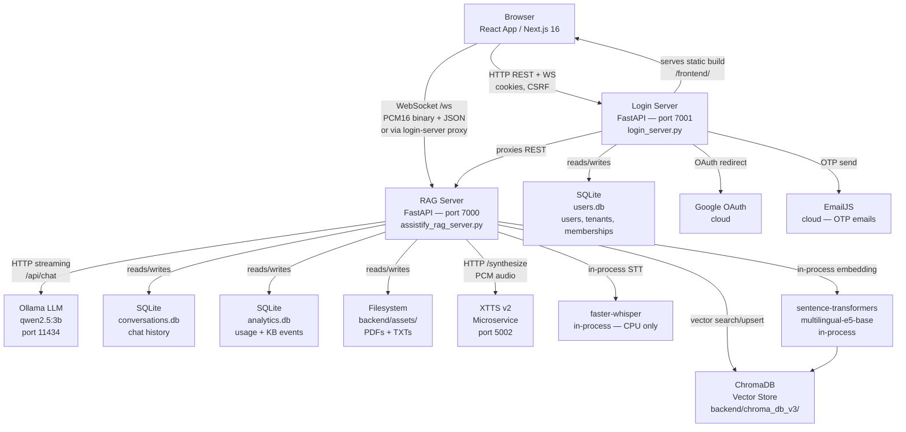

# Assistify RAG System — Architecture Discovery

*Last updated: 2026-06-25. Generated by automated codebase analysis.*

> **Coverage note:**
> - Thoroughly read: `config.py`, `backend/assistify_rag_server.py` (all route handlers, auth deps, tenant resolution, prompt templates), `backend/knowledge_base.py` (complete), `backend/pdf_ingestion_rag.py` (partial — VectorStore class and chunking config), `Login_system/login_server.py` (complete routes + auth), `Login_system/rbac.py`, `Login_system/memberships.py`, `Login_system/guest_session.py`, `backend/tenant_access.py`, `backend/database.py`, `backend/analytics.py`, `backend/response_validator.py`, `backend/voice_audio/ws/handler.py`, all frontend hooks (useChatWebSocket, useVoiceMode, useConversations, useProfile, useRoleNav), `start_main_servers.py`, `assistify-ui-design/package.json`, all route lists via grep.
> - Skimmed or not read: `backend/chat_store.py`, `backend/rag_query_prep.py`, `backend/toon.py`, `assistify-ui-design/components/*.tsx` detail, `src/lib/navigation.ts`.

---

## Section 1: System Inventory

### 1.1 Directory Tree

```
assistify-rag-project-main/
├── config.py                    # Central config — env vars, tenant helpers
├── .env.example                 # Example env file
├── start_main_servers.py        # Top-level launcher script
├── backend/                     # RAG + voice server
│   ├── assistify_rag_server.py  # FastAPI entry — wires routers and services
│   ├── app_factory.py           # Application factory
│   ├── routers/                 # HTTP/WS route modules
│   ├── services/                # RAG, conversation, KB, analytics services
│   ├── knowledge_base.py        # ChromaDB wrapper — ingest, search, delete
│   ├── pdf_ingestion_rag.py     # PDF pipeline — VectorStore, cross-encoder reranker
│   ├── response_validator.py    # PII/profanity/relevance post-filter
│   ├── database.py              # SQLite conv/session DB
│   ├── analytics.py             # SQLite analytics DB
│   ├── tenant_access.py         # Chat tenant validation + membership checks
│   ├── chat_store.py            # In-memory + SQLite conversation store
│   ├── toon.py                  # Token-efficient RAG context formatter
│   ├── voice_audio/             # Voice pipeline sub-package
│   ├── Models/                  # Downloaded ML model binaries
│   ├── chroma_db_v3/            # ChromaDB persistent store (gitignored data)
│   └── assets/                  # Uploaded PDFs/TXTs (per-tenant subdirs)
├── Login_system/                # Auth + user management server
│   ├── login_server.py          # FastAPI auth app (port 7001), serves React /frontend/
│   ├── rbac.py                  # Role hierarchy definitions
│   ├── memberships.py           # Customer to tenant membership logic
│   ├── guest_session.py         # Anonymous guest cookie handling
│   ├── init_users_db.py         # DB schema init
│   └── users.db                 # SQLite user/tenant/membership DB
├── assistify-ui-design/         # Next.js 16 React frontend (canonical UI)
│   ├── app/                     # App Router pages
│   ├── components/              # Shared UI components
│   └── src/                     # hooks, features, lib
├── scripts/                     # Launch helpers, build scripts
├── docs/                        # Project documentation
├── tests/                       # pytest suite
├── tts_service/ xtts_service/   # TTS microservices
└── logs/                        # Rotating log files
```

### 1.2 Services / Apps

| Service | Language/Framework | Entry Point | Port | Key Runtime Deps |
|---|---|---|---|---|
| Login + UI server | Python 3, FastAPI | `Login_system/login_server.py` | 7001 | fastapi, uvicorn, passlib[bcrypt], itsdangerous, authlib, aiohttp, sqlite3 |
| RAG + Voice server | Python 3, FastAPI | `backend/assistify_rag_server.py` | 7000 | fastapi, uvicorn, chromadb, sentence-transformers, faster-whisper, torch, aiohttp, pydantic |
| Ollama LLM | External binary | `ollama serve` | 11434 | Ollama binary, `qwen2.5:3b` default model |
| XTTS TTS microservice | Python 3 | `tts_service/` or `xtts_service/` | 5002 | TTS 0.22.0, transformers 4.40.x (separate conda env `assistify_xtts`) |
| React Frontend | TypeScript, Next.js 16 | `assistify-ui-design/` | served at `/frontend/` by Login server | next 16, react 19, recharts, react-markdown, tailwindcss 4, lucide-react |

**Note:** `main_llm_server.py` and port 8010 appear in launch scripts, but comments in `config.py` (line 172) and `config_head.py` confirm this is a "redundant middleman" — all LLM calls go directly to Ollama at port 11434.

### 1.3 Datastores

| Datastore | Type | Library | What it holds | Connection Config |
|---|---|---|---|---|
| ChromaDB | Vector DB (persistent, disk) | `chromadb.PersistentClient` | Document chunks + embeddings, per-tenant collections | `CHROMA_DB_PATH` env → `backend/chroma_db_v3/` |
| SQLite — users.db | Relational | `sqlite3` | Users, roles, tenants, memberships, OTP tokens, sessions, rate limits | Hardcoded: `Login_system/users.db` |
| SQLite — conversations.db | Relational | `sqlite3` | Chat sessions, WS messages, `ui_conversations` table | `DB_PATH` env → `backend/conversations.db` |
| SQLite — analytics.db | Relational | `sqlite3` | Usage stats, KB events, satisfaction ratings, TTS performance | `ANALYTICS_DB` env → `backend/analytics.db` |
| JSON file — conversations.json | File store | stdlib `json` | Overflow/backup conversation store | `backend/conversations.json` (appears superseded by SQLite) |
| Filesystem — assets/ | Object store (disk) | `pathlib.Path` | Uploaded PDF/TXT files, per-tenant sub-directories | `ASSETS_DIR` env → `backend/assets/` |

### 1.4 Third-Party Integrations

| Integration | What it does | Where called |
|---|---|---|
| **Ollama** (local) | LLM inference (`qwen2.5:3b` default) | `backend/assistify_rag_server.py` — `OLLAMA_CHAT_URL = http://{host}:{port}/api/chat` |
| **faster-whisper** (local) | Speech-to-text — Systran models | `backend/voice_audio/ws/audio_pipeline.py`, loaded at startup |
| **XTTS v2 microservice** (local) | Text-to-speech, streamed PCM audio | Proxied to `http://127.0.0.1:5002` from RAG server |
| **sentence-transformers** (`intfloat/multilingual-e5-base`) | 768-dim document/query embedding | `backend/knowledge_base.py` singleton `embedder` |
| **cross-encoder/ms-marco-MiniLM-L-6-v2** | Re-ranking retrieved chunks | `backend/pdf_ingestion_rag.py` `VectorStore` |
| **Google OAuth** | Optional social login | `Login_system/login_server.py` — authlib Starlette client |
| **EmailJS** | OTP email delivery on registration | `Login_system/login_server.py` — `EMAILJS_*` env vars |
| **pytesseract / pdf2image** (optional) | OCR for scanned/image-only PDFs | `backend/pdf_ingestion_rag.py` — graceful no-op if not installed |
| **PyPDF2 + pdfplumber** | PDF text extraction | `backend/pdf_ingestion_rag.py`, `Login_system/login_server.py` |
| **Google Translate API** (inferred) | Arabic to English translation for RAG queries | `backend/assistify_rag_server.py` — `_AR_EN_CACHE` OrderedDict present; exact call site not read |

---

## Section 2: Architecture by Layer

### 2.1 Multitenancy & Identity Model

**Tenant data model** (confirmed from `Login_system/memberships.py`, `backend/database.py`):

```sql
-- users.db
CREATE TABLE tenants (
    id INTEGER PRIMARY KEY,
    name TEXT NOT NULL,
    slug TEXT UNIQUE,
    active INTEGER DEFAULT 1,
    allow_multiple_admins INTEGER DEFAULT 0   -- added via ALTER TABLE migration
);

CREATE TABLE users (
    id INTEGER PRIMARY KEY AUTOINCREMENT,
    username TEXT UNIQUE,
    password_hash TEXT,
    role TEXT,
    mfa_enabled INTEGER DEFAULT 0,
    mfa_secret TEXT,
    tenant_id INTEGER   -- FK to tenants
);

CREATE TABLE tenant_memberships (
    id INTEGER PRIMARY KEY AUTOINCREMENT,
    username TEXT NOT NULL,
    tenant_id INTEGER NOT NULL,
    status TEXT NOT NULL DEFAULT 'pending',   -- pending | approved | rejected | revoked
    requested_at TIMESTAMP,
    reviewed_at TIMESTAMP,
    reviewed_by TEXT,
    notes TEXT,
    UNIQUE(username, tenant_id),
    FOREIGN KEY (tenant_id) REFERENCES tenants(id)
);

-- conversations.db
CREATE TABLE ui_conversations (
    id TEXT PRIMARY KEY,
    tenant_id INTEGER NOT NULL,
    username TEXT NOT NULL,
    title TEXT NOT NULL DEFAULT 'New chat',
    messages_json TEXT NOT NULL DEFAULT '[]',
    created_at TEXT NOT NULL,
    updated_at TEXT NOT NULL
);
-- Index: (tenant_id, username)
```

**Tenant isolation mechanism** — collection-per-tenant in ChromaDB:

- `config.py:tenant_collection_name(tenant_id)` returns `support_docs_v3_latest` for tenant 1, `t{id}_support_docs_v3_latest` for others.
- `knowledge_base.py:_collection_owned_by_tenant()` (line 438) enforces this at every delete/search call.
- `knowledge_base.py:search_documents()` (lines 1427-1439): non-default tenants get their own `get_or_create_collection(tenant_id=scoped_tenant)`.
- `backend/assistify_rag_server.py` (lines 440-533): a `ContextVar` (`_request_tenant_id`) carries the resolved tenant through the async call chain, set per-request via the `_TenantScope` context manager.

**Roles** (defined in `Login_system/rbac.py`):

```python
ROLE_RANK = {
    "customer": 0,
    "employee": 1,
    "admin": 2,
    "master_admin": 3,
    "superadmin": 4,
}
```

- `customer` — end user; must have an approved tenant membership to chat (when `ENFORCE_CHAT_TENANT_MEMBERSHIP=true`).
- `employee` — tenant staff, limited management rights.
- `admin` / `master_admin` — tenant-level admin; can manage users, upload KB documents.
- `superadmin` — platform-level; cross-tenant visibility, tenant lifecycle management.

**Role-checking locations (confirmed):**
- `Login_system/rbac.py:assert_can_manage_user()` — enforces `tenant_id` match for non-superadmin.
- `Login_system/rbac.py:assert_can_assign_role()` — hierarchical role assignment guard.
- `backend/assistify_rag_server.py:require_login()` (line 8298) — session cookie parse + role check.
- `backend/assistify_rag_server.py:require_tenant_staff()` (line 8365) — restricts to `admin | master_admin`.
- `backend/assistify_rag_server.py:require_chat_access()` (line 8331) — allows logged-in users OR anonymous guests with valid `X-Guest-Owner` header.

**Super-admin capabilities** (from `login_server.py` routes, confirmed):
- Create/deactivate/activate tenants (`POST /api/tenants/create`, `POST /api/tenants/{id}/deactivate|activate`)
- Assign/remove/update tenant managers
- View all users across all tenants, all analytics, all audit logs
- Change any user's role (`POST /api/users/{id}/change-role`)
- Cross-tenant analytics (`analytics_scope_tenant()` returns `None` → no filter when called by superadmin)

**Tenant-admin (admin/master_admin) capabilities:**
- Upload KB documents (`POST /upload_rag`) — scoped to their own tenant
- Delete/update/reindex KB documents
- Manage employees and customers within their tenant
- View tenant-scoped analytics, audit logs, access requests
- Approve/reject customer access requests (`POST /api/access-requests/{id}/approve|reject`)

**Authentication mechanism:**
- Cookie-based session using `itsdangerous.URLSafeSerializer` with `SESSION_SECRET`.
- Cookie name: `SESSION_COOKIE` env var (default `"session"`).
- Session absolute timeout: 24 hours. Idle timeout: 30 minutes. Max concurrent sessions: 3 (oldest evicted).
- Google OAuth supported as alternate `auth_provider`.
- OTP email verification on registration via EmailJS — can be bypassed in dev with `SKIP_EMAIL_OTP=true`.
- bcrypt_sha256 (passlib) for password hashing; configurable rounds via `BCRYPT_ROUNDS`.

**Token structure** (from `create_session_token()` in `login_server.py` lines 444-527):
```json
{
  "username": "alice",
  "role": "customer",
  "auth_provider": "local",
  "session_id": "<32-byte urlsafe token>",
  "created_at": 1719000000.0,
  "last_activity": 1719000000.0,
  "tenant_id": 2,
  "tenant_slug": "acme",
  "active_tenant_id": 2
}
```

**Cross-tenant protection (confirmed in code):**
- `_collection_owned_by_tenant()` in `knowledge_base.py` line 438: tenant 1 collections must NOT match the `t{n}_` prefix; other tenants only match their own `t{id}_` prefix.
- `require_request_tenant()` in `assistify_rag_server.py` line 489: raises HTTP 403 if role is customer/admin/master_admin/employee and no explicit tenant is set.
- `_TenantScope` context manager binds the `ContextVar` for each request so concurrent async requests cannot bleed into each other.

### 2.2 Knowledge Base & Document Ingestion

**Upload endpoint:** `POST /upload_rag` (RAG server port 7000). Requires `require_tenant_staff()` (admin or master_admin only). Requires CSRF token.

**Upload flow:**
1. Verify CSRF; resolve `tenant_id` from session via `require_request_tenant(user)`.
2. Generate UUID prefix (`upload_id = uuid4().hex[:8]`), stored filename: `{upload_id}_{original_name}`.
3. Build canonical source metadata via `build_canonical_source_metadata()` in `knowledge_base.py`.
4. For non-default tenants: save to `backend/assets/tenant_{id}/`, dispatch `_finalize_tenant_pdf_upload_background()` async task, return immediately.
5. For default tenant: handle blue/green or multi-doc mode, save to `backend/assets/`, dispatch `_finalize_pdf_upload_background()` async task, return immediately.
6. Progress observable via `GET /kb_status` (polls `_kb_pipeline_state` dict).

**PDF parsing libraries** (confirmed in `pdf_ingestion_rag.py` and `login_server.py`):
- Primary: `pdfplumber` for structured text extraction.
- Fallback per-page: `PyPDF2.PdfReader`.
- Optional OCR: `pytesseract` + `pdf2image` for scanned/image-only PDFs.

**Chunking strategy** (confirmed from `knowledge_base.py:chunk_and_add_document()` lines 631-1397):
- Page blocks identified by `[PAGE_START:N]...[PAGE_END:N]` markers injected by PDF extractor.
- TOC pages detected and tagged separately.
- Short documents (total word count <= 8000): TARGET_MIN=80, TARGET_MAX=160, TARGET=120, OVERLAP=25 words.
- Longer documents: TARGET_MIN=220, TARGET_MAX=360, TARGET=300, OVERLAP=50 words.
- Section/chapter/heading boundaries flush the current chunk buffer.
- `[TABLE DATA]` blocks are never merged with prose chunks.
- Noise filtering: TOC lines, reference sections, short header-only lines, DOI/ISBN lines are dropped.
- Chunk metadata fields: `chunk_index`, `chunk_total`, `page`, `section`, `chapter`, `title`, `chunk_role`, `source_doc_id`, `original_filename`, `stored_filename`, `normalized_filename`, `kb_version`, `updated_at`.

**Embedding model:**
- `intfloat/multilingual-e5-base` (768-dim) via `sentence-transformers`.
- Singleton loaded at module import in `knowledge_base.py` line 73.
- E5 prefixes: `"passage: {text}"` for indexing, `"query: {text}"` for retrieval.
- GPU if `RAG_USE_GPU=1` and CUDA available; CPU otherwise.

**Vector storage:**
- ChromaDB PersistentClient at `CHROMA_DB_PATH` (default `backend/chroma_db_v3/`).
- `hnsw:space = cosine` distance metric.
- Per-tenant collection: `t{id}_support_docs_v3_latest` (non-default) or `support_docs_v3_latest` (tenant 1).
- Batch upsert: 100 chunks per batch on CPU, 128 on GPU.
- **Confirmed**: `tenant_id` is NOT stored as metadata on individual chunks. Isolation is at collection level only.

**Re-indexing / delete flow:**
- `POST /rag/delete` — calls `delete_documents_by_source_identity()` across tenant-owned collections.
- `POST /rag/update` — delete prefix + re-chunk + re-embed.
- `POST /rag/reindex-all` — rebuild entire KB for the tenant.
- `delete_documents_by_source_identity()` iterates all chunks, matching by `source_doc_id`, `original_filename`, `stored_filename`, `normalized_filename`, `upload_id` — multiple fallback keys.

### 2.3 RAG Pipeline (Query Time)

**End-to-end trace of one user question (text via WebSocket):**

1. WebSocket message arrives at `@app.websocket("/ws")` → `_rag_ws_handler` (created by `create_rag_ws_handler()` in `backend/voice_audio/ws/handler.py`).
2. Session cookie parsed → `load_and_validate_session_token()` → user dict resolved.
3. Guest path: if no session and `ALLOW_PUBLIC_GUEST_CHAT=true`, `X-Guest-Owner` header accepted.
4. `_activate_conversation()` binds conversation ID and active_tenant_id.
5. Text message parsed → `process_voice_transcript()` in `VoiceWebSocketDeps`.
6. Inside `call_llm_with_rag(query, connection_id, user)`:
   a. `_request_tenant_id` ContextVar set to resolved tenant via `_TenantScope`.
   b. Query preprocessed: greeting detection, Arabic small-talk short-circuit, optional LLM query normalization.
   c. `search_documents(query, top_k=N, tenant_id=current_tenant_id())` called.
   d. Results filtered by cosine distance threshold (`RAG_STRICT_DISTANCE_THRESHOLD`, default 1.0).
   e. Optional cross-encoder reranking via `VectorStore` in `pdf_ingestion_rag.py`.
   f. Retrieved context formatted via `format_rag_context_toon()` from `backend/toon.py`.
   g. Prompt assembled using `build_english_stream_context_block()` (template quoted below).
   h. Ollama streaming API called at `OLLAMA_CHAT_URL`.
   i. Each streamed token sent as `{"type": "aiResponseChunk", "text": "<token>"}` over WS.
   j. On completion: `{"type": "aiResponseDone", "fullText": "...", "server_tts_pending": bool}` sent.
   k. Optionally: full text sent to XTTS → PCM audio streamed as binary WS frames, bookended by `ttsAudioStart` / `ttsAudioEnd`.
7. Response validated by `validate_response()` — profanity/PII/relevance checks.
8. Conversation message persisted.

**Retrieval filtering — tenant_id at query level** (confirmed `knowledge_base.py` lines 1424-1439):
```python
scoped_tenant = None
if tenant_id is not None:
    if _tid != _DEF_T and _tid > 0:
        scoped_tenant = _tid
collection = get_or_create_collection(tenant_id=scoped_tenant)
```
Non-default tenants always get their own collection object. Default tenant uses `get_or_create_collection(tenant_id=None)` which auto-resolves to the first non-empty `support_docs_v3_*` collection filtered by `_collection_owned_by_tenant(c, 1)`.

**Prompt templates (verbatim from source):**

System prompt (built by `build_english_support_system_prompt()`):
```
You are Assistify, a friendly customer support agent for this business.
Answer using ONLY the provided context from our help materials.
Use clear, professional, conversational language.
If the answer is not in the context, say warmly that the detail is not in the uploaded materials.
Never invent formulas, coefficient weights, diagnostic codes, quotes, or historical links not present in context.
If the retrieved documents do not contain the requested formula, coefficient weights, diagnostic code, or historical connection, say so clearly and do not invent one.
Never use outside knowledge. Respond in clear, friendly English.
If the answer is NOT in the provided context, respond warmly that the detail is not in the uploaded help materials. Do NOT use robotic internal placeholder phrases.
[LIST EXTRACTION RULES block appended]
```

WebSocket context block (verbatim from `build_english_stream_context_block()`):
```
===== KNOWLEDGE BASE CONTEXT =====
{toon_context}
==================================

CORE RULES:
1. You are Assistify, a friendly customer support agent for this business.
2. You MUST answer ONLY using the provided KNOWLEDGE BASE CONTEXT.
3. If the answer is NOT in the provided context, respond warmly that the detail is not in the uploaded help materials. Do NOT use robotic internal placeholder phrases.
4. If the retrieved documents do not contain the requested formula, ..., say so clearly and do not invent one.
5. NEVER use outside knowledge or fabricate statistics, quotes, or codes.
6. Keep answers clear, conversational, and helpful—like a real support agent.
{doc_router_context_rules}
{format_rules}

LIST HANDLING (VERY IMPORTANT):
[ENGLISH_LIST_EXTRACTION_RULES inserted here]
- Return clean lists, one item per line, when the context supports them.

DEFINITION / PERSON QUESTIONS:
For "what is" or "who is": return 1-2 short, friendly sentences ONLY.

If the question is a greeting, respond naturally and warmly.
```

No-match responses (verbatim from `config_head.py`):
- Internal sentinel: `"Not found in the document."`
- User-visible English: `"Thanks for reaching out! I couldn't find that specific detail in our help materials just yet. I'm happy to help with topics covered in your knowledge base—things like returns, shipping, password reset, or account questions. What would you like to know more about?"`
- User-visible Arabic: `"شكراً لتواصلك! لم أجد هذا التفصيل المحدد في مواد المساعدة لدينا بعد. ..."`

**Conversation history handling:**
- `defaultdict(list)` in-memory `conversation_history` per connection_id, capped at 1000 conversations / 3600s TTL.
- Also persisted to SQLite `ui_conversations` table via `chat_store.py`.
- History threaded into Ollama messages array as `[{"role": "user"/"assistant", "content": "..."}]`.

**Fallback behavior:**
- Empty retrieval: `CS_NO_MATCH_RESPONSE_EN` / Arabic equivalent returned directly without an LLM call.
- LLM connection failure: error WS message.
- Voice (Whisper) disabled: `{"type": "stt_failed"}`.

**Guardrails / output filtering (`backend/response_validator.py`):**
- Profanity blocklist (word boundary regex) → CRITICAL, blocks response, returns generic apology.
- PII: SSN regex, credit card regex, generic email + phone with company allowlist → CRITICAL, blocks.
- Relevance: keyword overlap check → MAJOR, logs only, does not block.
- Uncertainty phrases → MINOR, appends soft disclaimer.

### 2.4 Voice / Whisper Integration

**Whisper: local (not API).**
- Model: `faster-whisper` (Systran/faster-whisper-small or tiny.en), configurable via `WHISPER_MODEL_SIZE`.
- Device: always CPU — `WHISPER_DEVICE = "cpu"` is forced in `config.py` line 244 even if GPU is requested.
- Compute type: `int8`.
- Beam size: `WHISPER_BEAM_SIZE=5` (from `config.py`); the preflight check warns if not 1 — a confirmed inconsistency.
- VAD filter: enabled by default (`WHISPER_VAD_FILTER=true`).
- Model resolution: `backend/Models/faster-whisper-small/` plain directory, then HuggingFace cache layout at `backend/Models/models--Systran--faster-whisper-*/snapshots/`.

**Audio transport:**
- Raw PCM16 binary frames over the `/ws` WebSocket.
- Client captures microphone at 16 kHz, resamples, converts to PCM16, sends every 50ms as binary frames.
- Server buffers binary frames into `audio_buffer: bytearray` in `handler.py`.
- Silence detection: energy threshold 0.008, 12 silence chunks needed.
- `"stop_recording"` control message also triggers transcription.
- `"clear_audio_buffer"` discards buffered audio (used for barge-in).

**Post-transcription flow:**
1. Whisper produces transcript text.
2. `{"type": "transcript", "text": "...", "final": true}` sent to client.
3. Same RAG pipeline as text messages runs on the transcript.
4. TTS response streamed back as binary PCM16 WS frames.

**Error handling:**
- Whisper unavailable: `EFFECTIVE_DISABLE_WHISPER` flag → `{"type": "stt_failed", "message": "..."}`.
- STT watchdog in client (`useVoiceMode.ts` line 210): 3 second timeout → error state + retry UI.
- Voice semaphore (limit 1) prevents concurrent transcriptions per session.

### 2.5 Real-Time Layer (WebSockets)

**Library:** FastAPI/Starlette native WebSocket. **Server:** uvicorn (asyncio).

**Endpoints:**
- `ws://host:7000/ws` — main user-facing WS (chat + voice). Auth is optional when guest mode enabled.
- `ws://host:7000/ws/kb-events` — admin-only KB event feed; requires `role in {admin, master_admin, superadmin}`.

**Message/event types (confirmed from `useChatWebSocket.ts` and `config_head.py`):**

Client to server:
- Binary frame: raw PCM16 audio chunk
- `{"type": "control", "action": "set_language", "language": "en|ar"}`
- `{"type": "control", "action": "set_conversation_id", "conversation_id": "..."}`
- `{"type": "control", "action": "set_active_tenant", ...}`
- `{"type": "control", "action": "stop_recording"}`
- `{"type": "control", "action": "clear_audio_buffer"}`
- `{"type": "control", "action": "interrupt"}`
- `{"text": "...", "language": "...", "conversation_id": "...", "tenant_id": N, "tts_enabled": bool}`

Server to client:
- `{"type": "thinking"}` — LLM is processing
- `{"type": "transcript", "text": "...", "final": bool}` — STT result
- `{"type": "aiResponseChunk", "text": "..."}` — streaming LLM token
- `{"type": "aiResponseDone", "fullText": "...", "server_tts_pending": bool}` — response complete
- `{"type": "ttsAudioStart"}` — TTS stream starting
- Binary frame — PCM16 audio chunk (TTS)
- `{"type": "ttsAudioEnd"}` — TTS stream done
- `{"type": "ttsFallback", "text": "..."}` — use browser SpeechSynthesis
- `{"type": "stt_failed", "message": "..."}` — Whisper failure
- `{"type": "error", "message": "..."}` — generic error
- `{"type": "system_busy", "message": "..."}` — voice semaphore blocked
- `{"type": "kb_updated", "message": "..."}` — KB mutation broadcast
- `{"type": "tenant_switched", ...}` — active tenant changed
- `{"type": "conversation", "conversation_id": "..."}` — new conversation created

**Auth and tenant scoping:**
- Session cookie parsed at WS handshake in `handler.py` lines 42-46.
- If no cookie and `ALLOW_PUBLIC_GUEST_CHAT=true`: `X-Guest-Owner` header accepted if it matches `guest_{32-hex}` pattern.
- `session_tenant_ref = [int(default_tenant_id)]` — mutable list holding per-connection tenant, updated on `set_active_tenant` control message.
- KB events WS: closes with code 4003 if role is not admin/master_admin/superadmin.

**Streaming token delivery:**
- Ollama `/api/chat` called with `"stream": true`.
- Each chunk decoded, text sent immediately as `{"type": "aiResponseChunk", "text": token}`.
- `aiResponseDone` sent after Ollama signals `"done": true`.

### 2.6 Frontend Architecture

**Framework:** Next.js 16 (App Router), React 19, TypeScript 5.7. **Styling:** Tailwind CSS 4.

**Routing structure (confirmed from `app/` glob):**

```
app/
├── page.tsx                          — root redirect
├── (auth)/                           — public, no guard
│   ├── login/page.tsx
│   ├── register/page.tsx
│   ├── verify-otp/page.tsx
│   ├── forgot-password/page.tsx
│   ├── reset-password/page.tsx
│   └── change-username/page.tsx
├── (guest)/                          — public guest chat (GuestLayout, no AuthGuard)
│   └── guest/page.tsx
└── (app)/                            — AuthGuard + RoleGuard + AppShell
    ├── main/page.tsx                 — primary chat UI
    ├── select-business/page.tsx      — tenant selector for customers
    ├── profile/page.tsx
    ├── my-tickets/page.tsx
    ├── notifications/page.tsx
    ├── admin/
    │   ├── page.tsx
    │   ├── knowledge/page.tsx        — KB management (admin)
    │   ├── analytics/page.tsx
    │   ├── users/page.tsx
    │   ├── tickets/page.tsx
    │   ├── access-requests/page.tsx
    │   └── audit-logs/page.tsx
    ├── employee/
    │   ├── page.tsx, customers/, tickets/
    ├── master_admin/
    │   ├── page.tsx, analytics/, users/, knowledge/, admins/, access-requests/, audit-logs/, tickets/
    └── superadmin/page.tsx
```

**Role-based routing:**
- `(app)/layout.tsx` wraps all authenticated pages with `AuthGuard` + `RoleGuard` + `AppShell`.
- `(guest)/layout.tsx` is a bare passthrough — no guards.
- `AuthGuard`: calls `GET /api/my-profile`, redirects to `/login` if 401.
- `RoleGuard`: reads role from profile, redirects to role-appropriate home.
- `useRoleNav` hook computes nav links from role.

**State management:** React `useState` + refs only. No Redux or Zustand observed.

**WebSocket hook (`useChatWebSocket.ts`):**
- Connects to `ws[s]://host/ws` (relative to current host/protocol, no hardcoded host).
- Reconnect: exponential backoff, delay = `min(1000ms * attempts, 5000ms)`, max 12 attempts.
- Pending text queue flushed on reconnect.
- On open: sends `set_language` and `set_conversation_id` control messages.

**PDF upload UI:** Inferred from `KnowledgePageContent.tsx` and `admin/knowledge/page.tsx` route (files not read in detail). Upload calls `POST /upload_rag` on RAG server.

**Component library:** Custom components in `src/components/ui/` (Card, Toast). Shared layout in `components/` (assistify.tsx, chat-area.tsx, voice-overlay.tsx, header.tsx). Recharts for analytics charts.

### 2.7 Backend API Layer

**Framework:** FastAPI. **Two independent apps** (Login server port 7001, RAG server port 7000).

**Middleware stack (Login server, confirmed in code):**
1. Optional `TrustedHostMiddleware` (only when `ALLOWED_HOSTS` is not wildcard).
2. `CORSMiddleware` — `[localhost:7001, 127.0.0.1:7001]` in dev; `ALLOWED_HOSTS` in prod.
3. `security_headers_middleware` — `X-Content-Type-Options`, `X-Frame-Options`, `X-XSS-Protection`, `Referrer-Policy`, CSP on HTML responses, HSTS if `ENFORCE_HTTPS`. Sets CSRF cookie and guest cookie.
4. `SessionMiddleware` (Starlette) — signed cookie sessions.
5. Global exception handler — hides stack traces in production.

**Input validation:**
- Pydantic `BaseModel` for request bodies.
- `validate_username()`, `validate_email()`, `validate_password()` in `login_server.py`.
- `sanitize_input()` strips and truncates to 500 chars.
- Password requirements relaxed in development.

**Error handling:** `HTTPException` → FastAPI JSON `{"detail": "..."}`. Global handler catches unhandled → 500 generic in production.

**Background jobs:** `asyncio.create_task()` for PDF indexing — fire-and-forget, deduplicated by filename. No external task queue.

**CSRF:** Token set as non-httpOnly cookie (`csrf_token`). Verified on mutations via `verify_csrf()` — checks `X-CSRF-Token` header or form field against cookie value.

### 2.8 Admin Layers

**Super-admin routes (Login server, confirmed):**
- Tenant lifecycle: `POST /api/tenants/create`, `POST /api/tenants/{id}/deactivate|activate`
- Manager assignment: `POST /api/tenants/{id}/managers`, `PATCH`, `DELETE`
- Cross-tenant user management: `GET /api/users`, user deactivate/activate/delete/role-change
- `GET /api/audit-logs` — platform-wide
- `GET /api/analytics/comprehensive` — platform-wide

**Tenant-admin routes (Login + RAG servers, confirmed):**
- `POST /upload_rag`, `POST /rag/delete`, `POST /rag/update`, `POST /rag/reindex-all`
- `GET /admin/analytics`, `GET /api/kb-stats`, `GET /api/kb-events`
- `WS /ws/kb-events` — live KB mutation feed
- `GET/POST /api/access-requests` — customer membership approval flow
- `GET /api/users`, `POST /api/users/create`, `POST /api/users/{id}/deactivate|activate`

**New tenant provisioning flow (confirmed from code + routes):**
1. Superadmin calls `POST /api/tenants/create {name, slug}` → row in `tenants` table.
2. Superadmin optionally calls `POST /api/tenants/{id}/managers` → assigns a user as admin.
3. Tenant's ChromaDB collection is created lazily on first document upload via `get_or_create_collection(tenant_id=N)`.
4. Tenant's assets directory created by `tenant_assets_dir(N)` on first upload.

### 2.9 Configuration & Deployment

**Configuration:** All settings in `config.py` from env vars. `.env` file loaded via `python-dotenv`. Both servers import from same `config.py`. Dev: auto-generated `SESSION_SECRET` persisted to `._assistify_session_secret`. Production: `assert_production_config()` fails fast on missing vars.

**Deployment:**
- No Docker or docker-compose files found in the repository.
- Launcher: `start_main_servers.py` → `scripts/project_start_split.py` (multi-terminal on Windows) or `scripts/project_start_server.py` (single console/CI).
- Conda environment `assistify_main` for backend; separate `assistify_xtts` env for TTS microservice.
- React UI built with `next build` (output: `assistify-ui-design/out/`) and served as static files by login server at `/frontend/`.

**CI/CD:** No CI configuration files found (no `.github/workflows/`, Dockerfile, etc.).

**Secrets management:** Environment variables only. Manual env injection expected in production.

### 2.10 Cross-Cutting Concerns

**Logging:**
- `logs/security.log` — `RotatingFileHandler` 10MB/5 backups, structured JSON per security event.
- `logs/login.log` — `RotatingFileHandler` 5MB/3 backups.
- Module-level `logging.basicConfig(level=INFO)` across backend modules.
- ChromaDB telemetry suppressed (`ANONYMIZED_TELEMETRY=False`).
- No centralized log aggregation.

**Rate limiting:**
- Per-IP in-memory + SQLite-backed counters in `Login_system/persistent_state.py`.
- Login: 5 req/min; Registration: 3 req/min; OTP: 3 req/min.
- Account lockout: 5 failed logins → 15 minute lockout.
- WS: `WebSocketRateLimiter` (20 messages/60s per connection) in `login_server.py`.
- **No rate limiting on RAG server endpoints** (only login server is protected).

**Existing tests (`tests/` directory — 17 test files):**
- `test_multitenant.py` — membership flow, conversation tenant scoping (in-memory SQLite).
- `test_owasp_security.py`, `test_owasp_final.py` — OWASP-style security checks.
- `test_validation.py` — response validator unit tests.
- `test_rag_chunk_retrieval_fixes.py` — chunking regression tests.
- `test_rag_query_prep.py` — query preprocessing unit tests.
- `test_arabic_tts.py`, `test_toon.py`, `test_toon_integration.py` — TTS and token formatter.
- `test_conversational_router.py`, `test_short_txt_chunking.py`, `test_edge_cases.py`.
- `test_system_integrity.py`, `test_voice_audio_imports.py`.
- **No integration tests** that spin up both servers and make real HTTP calls. No end-to-end tests.

---

## Section 3: Integration Map



**Protocols summary:**
- Browser → Login server: HTTP REST (port 7001), signed cookies, CSRF header.
- Browser → RAG server: WebSocket (port 7000 or via proxy through 7001), binary PCM16 + JSON frames.
- RAG server → Ollama: HTTP streaming POST `/api/chat` (port 11434).
- RAG server → XTTS: HTTP POST `/synthesize` (port 5002), streaming PCM audio response.
- Login server → RAG server: HTTP REST proxy for KB management endpoints.

---

## Section 4: Gaps, Risks & Assumptions

### 4.1 Inferences (not confirmed from code)

- `backend/chat_store.py` assumed to hold `get_conversation()`, `create_conversation()`, `append_conversation_message()` etc. — imported in `assistify_rag_server.py` but file not read.
- `backend/rag_query_prep.py` handles query normalisation and optional LLM-based query rewriting — referenced in env vars but not read.
- `backend/toon.py:format_rag_context_toon()` formats retrieved chunks into a token-efficient string — only import confirmed.
- The Login server proxies uploads to the RAG server — inferred from `RAG_HTTP_BASE` constant and `_rag_proxy_headers()` helper; exact proxy route not confirmed.
- `src/lib/navigation.ts` defines `sideLinksForRole()` / `topLinksForRole()` for role-based nav — not read.
- Google Translate API used for Arabic→English query translation — inferred from `_AR_EN_CACHE` variable name; actual API call not read.
- `assistify-ui-design/components/assistify.tsx` is the main authenticated chat component — not read in detail.

### 4.2 Undocumented Areas

- No API documentation beyond auto-generated FastAPI `/docs` (whether auth is enforced on Swagger UI is not confirmed).
- No database migration system — schema changes use `ALTER TABLE` via migration functions called at startup.
- No documented backup/restore procedure for ChromaDB or SQLite files.
- XTTS v2 microservice startup, health check, and failover behavior not documented in code.
- `main_llm_server.py` (port 8010) appears to be dead code but scripts still reference it.
- `backend/toon.py` TOON context format is undocumented.
- Legacy UI drafts (if present) live under `legacy/ui-drafts/` and are not served in production.

### 4.3 Tenant Isolation Risks (explicit and blunt)

**Risk 1 — Default tenant uses a divergent code path.**
`search_documents()` in `knowledge_base.py` lines 1427-1439 only applies strict per-tenant collection isolation for non-default tenants. For tenant 1, `get_or_create_collection(tenant_id=None)` runs a scan of all collections whose name passes `_collection_owned_by_tenant(c, 1)`. While this check is present, it is more complex logic than the non-default path and has more surface area for bugs. A collection with a naming bug (no `t{n}_` prefix) created for a non-default tenant would pass the check and be served to tenant 1 queries.

**Risk 2 — `require_tenant_staff()` does not include `superadmin`.**
`require_tenant_staff()` in `assistify_rag_server.py` line 8365-8366 is `require_roles("admin", "master_admin")`. `superadmin` is not included. This means a superadmin cannot call `POST /upload_rag` or `POST /rag/delete` directly — they would get a 403. Whether this is intentional or a bug requires clarification. If intentional, it forces superadmin to use tenant-admin accounts for KB operations.

**Risk 3 — Analytics for superadmin intentionally cross-tenant.**
`analytics_scope_tenant(user, None)` returns `None` for superadmin, which means no `tenant_id` filter is applied to analytics queries. This is designed behavior for platform-wide visibility. Ensure the analytics endpoints clearly document this scope.

**Risk 4 — Session without active_tenant_id falls to default tenant.**
`resolve_request_tenant()` falls back to `DEFAULT_TENANT_ID` if neither `active_tenant_id` nor `tenant_id` is set. An authenticated customer whose session was created before the `active_tenant_id` field was added would silently query tenant 1's knowledge base instead of their assigned business.

**Risk 5 — `/ws/kb-events` broadcast filtering not confirmed.**
The KB events WebSocket stores `_kb_event_subscribers[websocket] = int(sub_tenant_id)` on connect. Whether the broadcast path (not read) correctly filters events to only the subscribing admin's tenant is not confirmed. If filtering is missing, all admins on the monitoring page would see KB events from all tenants.

**Risk 6 — No chunk-level tenant_id in ChromaDB metadata.**
Isolation relies entirely on collection-level separation. If a collection is accidentally deleted and recreated under the wrong name, or if a bug routes an upload to the wrong collection, there is no chunk-level tenant tag to detect or correct the leak.

**Risk 7 — `DELETE /rag/delete` with no explicit tenant on default tenant path.**
When `doc_prefix` is provided to `delete_documents_by_source_identity()` with `tenant_id=None`, it calls `_effective_tenant_id(None)` which returns `DEFAULT_TENANT_ID`. This means a default-tenant admin can only delete from tenant 1 collections. However, if a non-staff user somehow calls this endpoint, the absence of `require_tenant_staff()` enforcement would need to be confirmed.

### 4.4 Code Inconsistencies

- **`WHISPER_BEAM_SIZE` mismatch**: `config.py` sets it to 5; `_system_preflight()` warns if it is not 1. This triggers a warning on every startup with default config.
- **Dead LLM shim**: `main_llm_server.py` and port 8010 remain in launch scripts and env vars but are confirmed unused for actual LLM inference.
- **Three conversation stores**: `conversations.json` (JSON file), `conversations.db / ui_conversations` (SQLite), and an in-memory `defaultdict` all coexist. Precedence and consistency between them is not obvious.
- **Legacy UI drafts**: Optional copies under `legacy/ui-drafts/` are not referenced by launchers.
- **`config_head.py` god-module pattern**: imports and re-exports from multiple backend modules at the top level, making import order fragile.
- **`chroma_db_reindex/` vs `chroma_db_v3/`**: two ChromaDB data directories exist; relationship is unclear.

### 4.5 Missing Error Handling / Failure Modes

- **ChromaDB unavailable at startup**: `chromadb.PersistentClient(...)` called at module import in `knowledge_base.py`. If the directory is locked or corrupt, the RAG server fails to start with no graceful degradation.
- **Ollama unavailable**: 30-second timeout (`LLM_REQUEST_TIMEOUT`). Error propagation to WS client depends on exception handling in the streaming loop — not fully confirmed.
- **XTTS microservice down**: `XTTS_AVAILABLE = True` is hardcoded. Actual availability checked at request time. The system falls back to `{"type": "ttsFallback"}` which triggers browser `SpeechSynthesis`. This degraded path is intentional.
- **Embedder GPU OOM**: Per-batch exception is caught and logged, but partially indexed documents may appear in KB with no user notification. No partial-indexing rollback mechanism.
- **Session secret rotation**: No mechanism to rotate `SESSION_SECRET` without immediately invalidating all user sessions.
- **Concurrent uploads from different tenants**: `_collection_mutation_lock` (asyncio.Lock) is only held for default-tenant uploads. Non-default tenant uploads run without a shared mutation lock, which could cause ChromaDB write contention if two admins of different tenants upload simultaneously.
- **No health check on login server**: Only `GET /health` confirmed on RAG server (line 42267). Login server has no confirmed `/health` endpoint.
- **`/api/docs` protection**: FastAPI auto-generates Swagger UI. Whether auth is enforced on the interactive docs is not confirmed from code.
