# Assistify Diagram Index

Single-source index of every architecture and flow diagram in the project.
**35** mermaid diagrams consolidated from **12** source files.

## Table of Contents

- [README.md](#source-readmemd)
  - [High-Level Architecture](#readmemd-high-level-architecture-1)
  - [Component Diagram](#readmemd-component-diagram-2)
  - [Deployment Diagram](#readmemd-deployment-diagram-3)
  - [Request Flow (Text Chat)](#readmemd-request-flow-text-chat-4)
  - [Data Flow](#readmemd-data-flow-5)
  - [Authentication Flow](#readmemd-authentication-flow-6)
  - [Membership & Access Flow](#readmemd-membership-access-flow-7)
  - [Isolation Strategy](#readmemd-isolation-strategy-8)
  - [Document Upload Flow](#readmemd-document-upload-flow-9)
  - [Retrieval Pipeline](#readmemd-retrieval-pipeline-10)
  - [System Overview](#readmemd-system-overview-11)
  - [WebSocket Voice Sequence](#readmemd-websocket-voice-sequence-12)
  - [Entity Relationship Diagram](#readmemd-entity-relationship-diagram-13)

- [docs/SYSTEM_ARCHITECTURE.md](#source-docssystem_architecturemd)
  - [4.1 High-Level Architecture](#docssystem_architecturemd-41-high-level-architecture-1)
  - [4.2 Request Lifecycle (Sequence)](#docssystem_architecturemd-42-request-lifecycle-sequence-2)
  - [4.3 RAG Pipeline](#docssystem_architecturemd-43-rag-pipeline-3)
  - [4.4 Document Ingestion Pipeline](#docssystem_architecturemd-44-document-ingestion-pipeline-4)
  - [4.5 Vector Search Workflow](#docssystem_architecturemd-45-vector-search-workflow-5)
  - [4.6 LLM Generation Workflow](#docssystem_architecturemd-46-llm-generation-workflow-6)
  - [Diagram](#docssystem_architecturemd-diagram-7)
  - [Production-Scale Target](#docssystem_architecturemd-production-scale-target-8)
  - [13.2 Development Deployment](#docssystem_architecturemd-132-development-deployment-9)
  - [13.3 Production Deployment](#docssystem_architecturemd-133-production-deployment-10)

- [docs/FRONTEND_TECHNICAL_SPEC.md](#source-docsfrontend_technical_specmd)
  - [2.1 Architecture overview](#docsfrontend_technical_specmd-21-architecture-overview-1)
  - [10.1 Authentication flow](#docsfrontend_technical_specmd-101-authentication-flow-2)

- [docs/diagrams/4_process_flow.md](#source-docsdiagrams4_process_flowmd)
  - [Mermaid Diagram (Copy this to render)](#docsdiagrams4_process_flowmd-mermaid-diagram-copy-this-to-render-1)
  - [Simplified Linear Version (for presentations)](#docsdiagrams4_process_flowmd-simplified-linear-version-for-presentations-2)

- [docs/ARCHITECTURE_DISCOVERY.md](#source-docsarchitecture_discoverymd)
  - [Section 3: Integration Map](#docsarchitecture_discoverymd-section-3-integration-map-1)

- [docs/TENANT_SELECTOR_ARCHITECTURE.md](#source-docstenant_selector_architecturemd)
  - [Request Flow](#docstenant_selector_architecturemd-request-flow-1)

- [docs/SYSTEM_CHECK_REPORT.md](#source-docssystem_check_reportmd)
  - [1. Architecture and integration map](#docssystem_check_reportmd-1-architecture-and-integration-map-1)

- [docs/SYSTEM_HEALTH_INTEGRITY_REPORT.md](#source-docssystem_health_integrity_reportmd)
  - [Architecture (Post-Fix Auth Flow)](#docssystem_health_integrity_reportmd-architecture-post-fix-auth-flow-1)

- [docs/diagrams/1_sequence_diagram.md](#source-docsdiagrams1_sequence_diagrammd)
  - [Mermaid Diagram (Copy this to render)](#docsdiagrams1_sequence_diagrammd-mermaid-diagram-copy-this-to-render-1)

- [docs/diagrams/2_activity_flowchart.md](#source-docsdiagrams2_activity_flowchartmd)
  - [Mermaid Diagram (Copy this to render)](#docsdiagrams2_activity_flowchartmd-mermaid-diagram-copy-this-to-render-1)

- [docs/diagrams/3_class_diagram.md](#source-docsdiagrams3_class_diagrammd)
  - [Mermaid Diagram (Copy this to render)](#docsdiagrams3_class_diagrammd-mermaid-diagram-copy-this-to-render-1)

- [docs/diagrams/README.md](#source-docsdiagramsreadmemd)
  - [📝 Editing Diagrams](#docsdiagramsreadmemd-editing-diagrams-1)

---

## Source: `README.md` {#source-readmemd}

### High-Level Architecture {#readmemd-high-level-architecture-1}

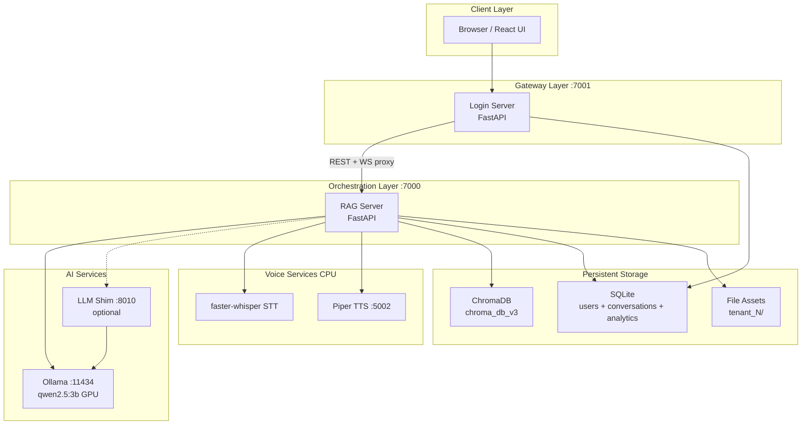

*Source: `README.md:248`*

### Component Diagram {#readmemd-component-diagram-2}

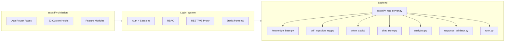

*Source: `README.md:293`*

### Deployment Diagram {#readmemd-deployment-diagram-3}

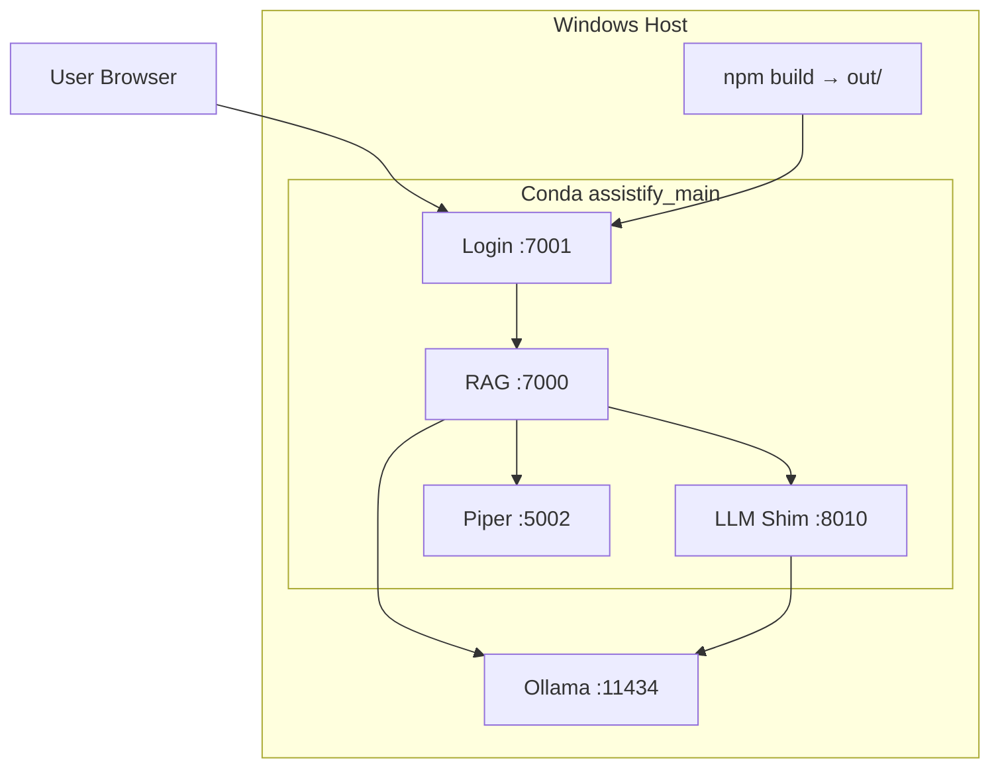

*Source: `README.md:332`*

### Request Flow (Text Chat) {#readmemd-request-flow-text-chat-4}

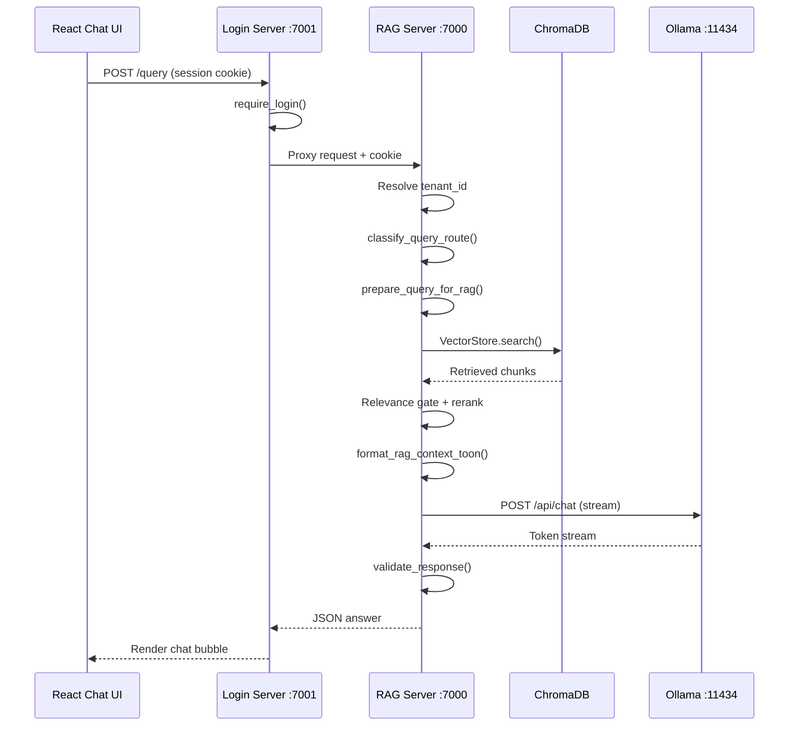

*Source: `README.md:356`*

### Data Flow {#readmemd-data-flow-5}

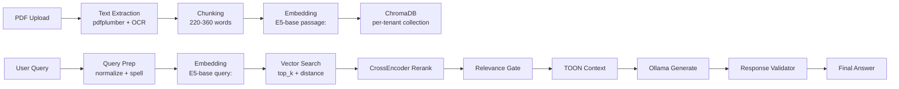

*Source: `README.md:383`*

### Authentication Flow {#readmemd-authentication-flow-6}

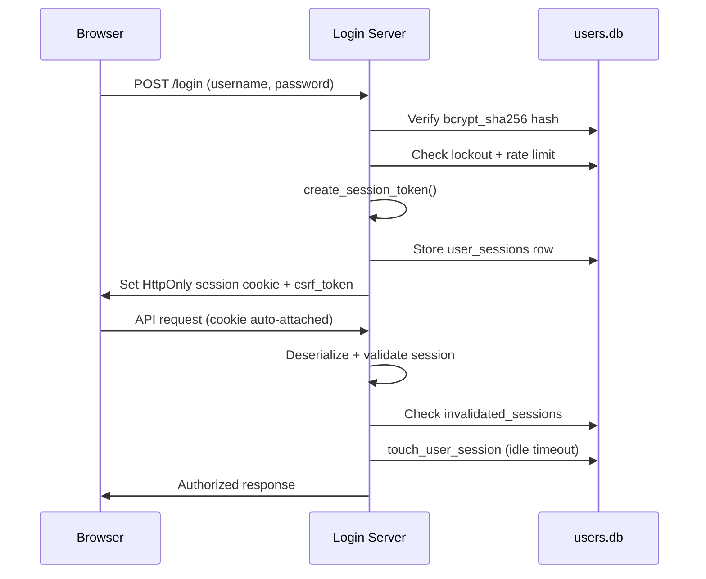

*Source: `README.md:402`*

### Membership & Access Flow {#readmemd-membership-access-flow-7}

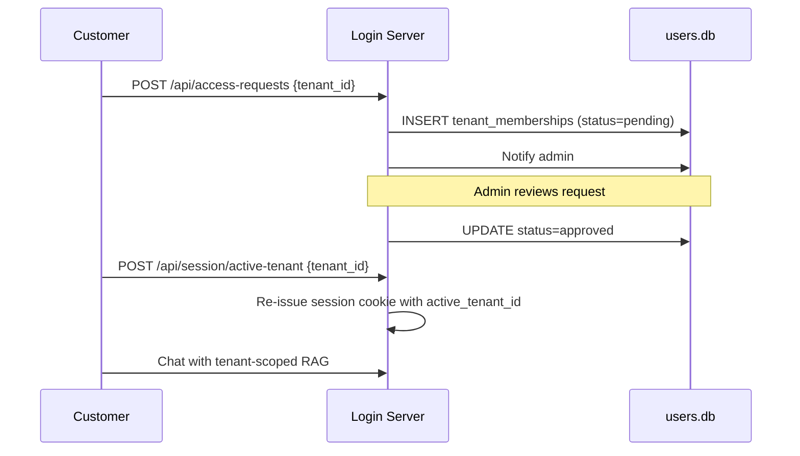

*Source: `README.md:529`*

### Isolation Strategy {#readmemd-isolation-strategy-8}

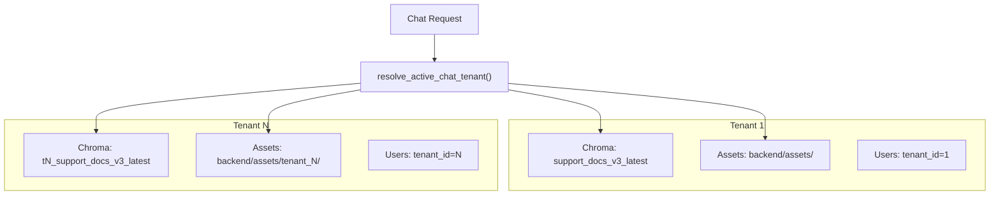

*Source: `README.md:549`*

### Document Upload Flow {#readmemd-document-upload-flow-9}

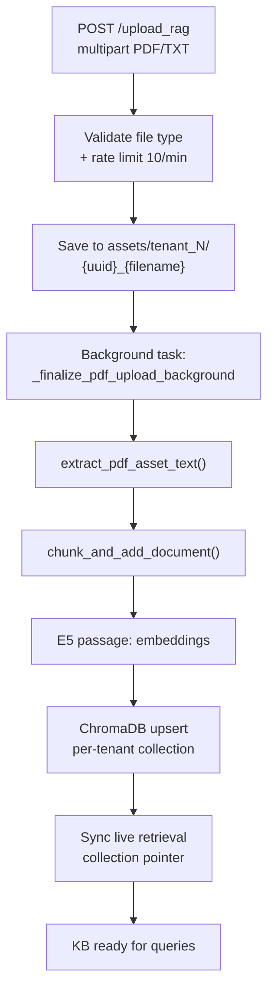

*Source: `README.md:707`*

### Retrieval Pipeline {#readmemd-retrieval-pipeline-10}

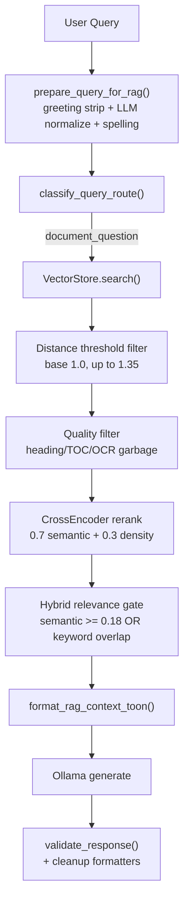

*Source: `README.md:774`*

### System Overview {#readmemd-system-overview-11}

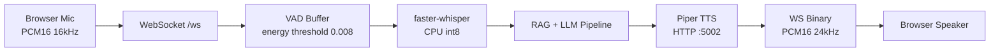

*Source: `README.md:840`*

### WebSocket Voice Sequence {#readmemd-websocket-voice-sequence-12}

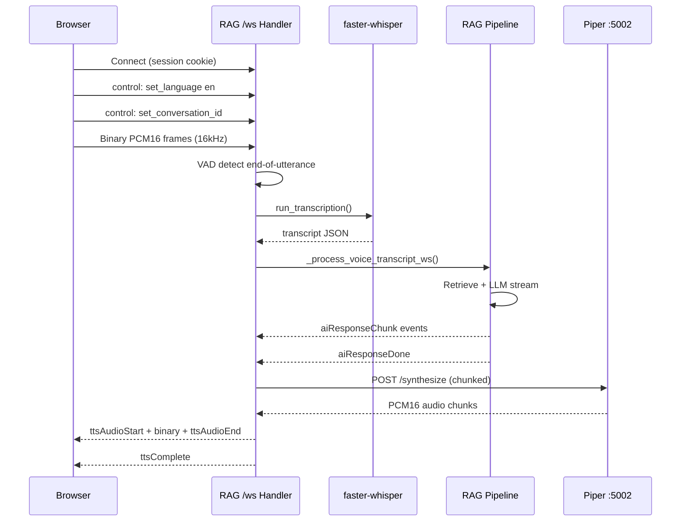

*Source: `README.md:877`*

### Entity Relationship Diagram {#readmemd-entity-relationship-diagram-13}

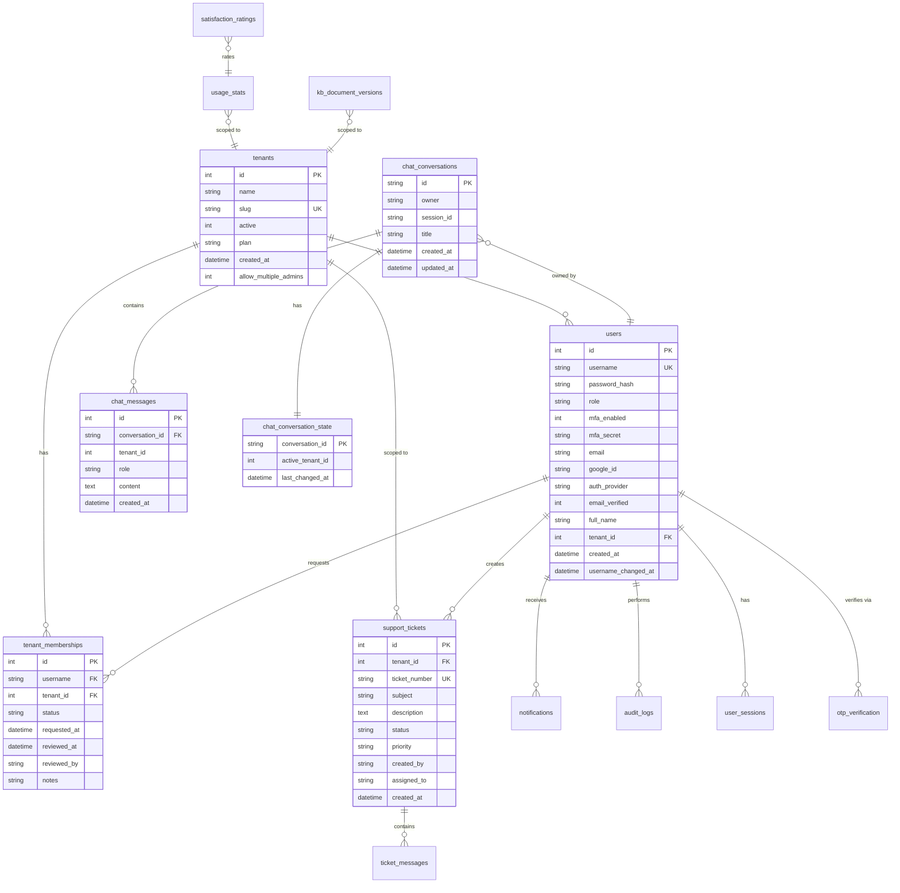

*Source: `README.md:1019`*

## Source: `docs/SYSTEM_ARCHITECTURE.md` {#source-docssystem_architecturemd}

### 4.1 High-Level Architecture {#docssystem_architecturemd-41-high-level-architecture-1}

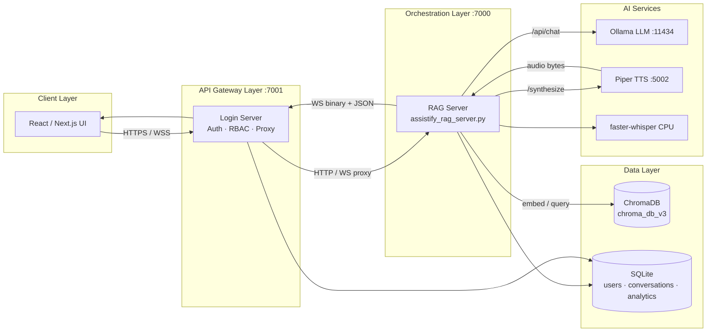

*Source: `docs/SYSTEM_ARCHITECTURE.md:449`*

### 4.2 Request Lifecycle (Sequence) {#docssystem_architecturemd-42-request-lifecycle-sequence-2}

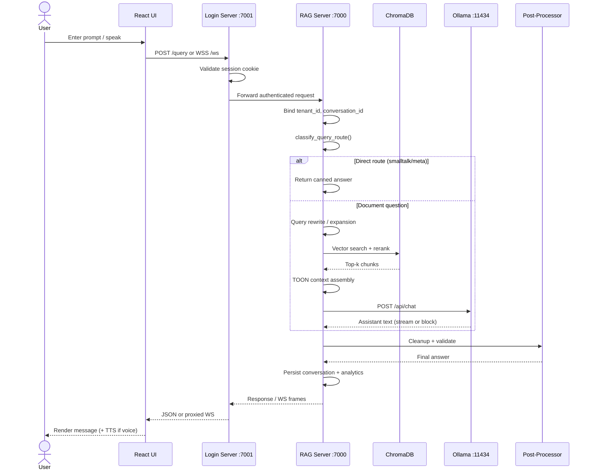

*Source: `docs/SYSTEM_ARCHITECTURE.md:489`*

### 4.3 RAG Pipeline {#docssystem_architecturemd-43-rag-pipeline-3}

```mermaid
flowchart TD
    Q[User Query] --> RWR[Rewrite / Expand]
    RWR --> ROUTE{classify_query_route}
    ROUTE -->|non-document| DIRECT[Direct Response]
    ROUTE -->|document_question| EMB[E5 query: embedding]
    EMB --> VS[Chroma ANN Search]
    VS --> THR{distance ≤ threshold?}
    THR -->|no| EMPTY[Empty candidates]
    THR -->|yes| BOOST[Structural + numeric boosts]
    BOOST --> RF[Reranker Cross-Encoder]
    RF --> GATE[Hybrid Relevance Gate]
    GATE -->|fail| NOMATCH[No-match path]
    GATE -->|pass| TOON[format_rag_context_toon]
    TOON --> PROMPT[Build messages[]]
    PROMPT --> LLM[Ollama Inference]
    LLM --> POST[Post-process + Validate]
    DIRECT --> OUT[User Response]
    NOMATCH --> OUT
    POST --> OUT
    EMPTY --> NOMATCH
```

*Source: `docs/SYSTEM_ARCHITECTURE.md:525`*

### 4.4 Document Ingestion Pipeline {#docssystem_architecturemd-44-document-ingestion-pipeline-4}

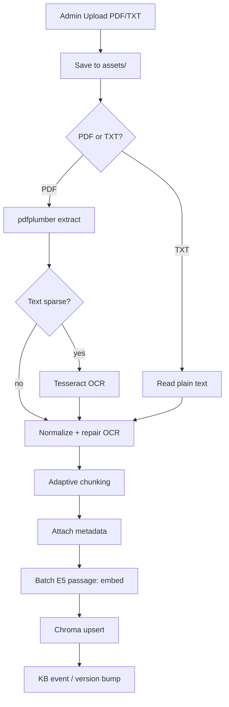

*Source: `docs/SYSTEM_ARCHITECTURE.md:550`*

### 4.5 Vector Search Workflow {#docssystem_architecturemd-45-vector-search-workflow-5}

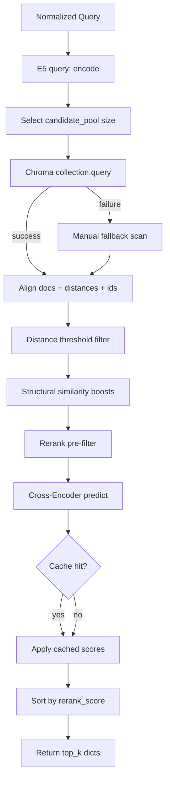

*Source: `docs/SYSTEM_ARCHITECTURE.md:570`*

### 4.6 LLM Generation Workflow {#docssystem_architecturemd-46-llm-generation-workflow-6}

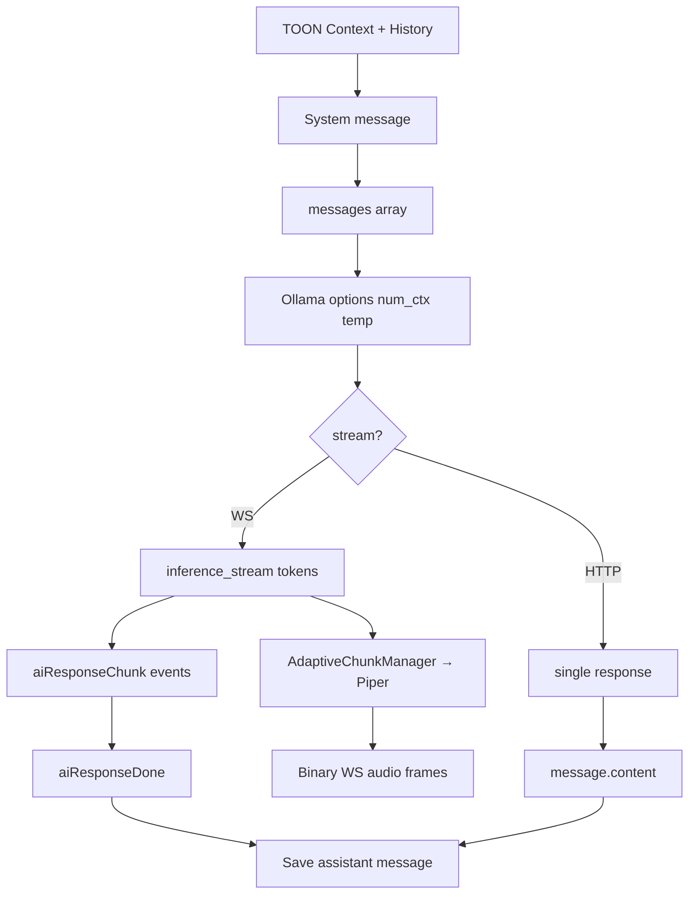

*Source: `docs/SYSTEM_ARCHITECTURE.md:591`*

### Diagram {#docssystem_architecturemd-diagram-7}

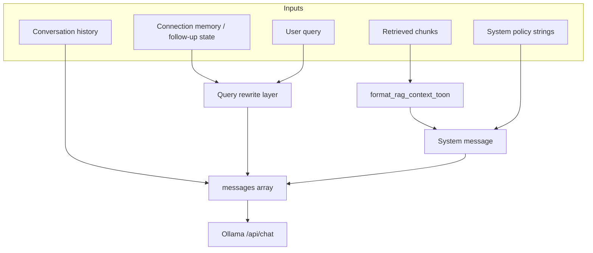

*Source: `docs/SYSTEM_ARCHITECTURE.md:719`*

### Production-Scale Target {#docssystem_architecturemd-production-scale-target-8}

```mermaid
flowchart TB
    LB[Load Balancer TLS]
    LB --> L1[Login Pod 1]
    LB --> L2[Login Pod N]
    L1 --> RAGS[RAG Service Pool]
    L2 --> RAGS
    RAGS --> VDB[(Distributed Vector DB)]
    RAGS --> REDIS[(Redis)]
    RAGS --> LLMPOOL[LLM Inference Pool]
    INGEST[Ingestion Workers] --> VDB
    INGEST --> OBJ[(Object Storage)]
```

*Source: `docs/SYSTEM_ARCHITECTURE.md:811`*

### 13.2 Development Deployment {#docssystem_architecturemd-132-development-deployment-9}

```mermaid
flowchart LR
    DEV[Developer Laptop]
    DEV --> OLLAMA[Ollama :11434]
    DEV --> LAUNCH[start_main_servers.py]
    LAUNCH --> LOGIN[:7001 Login]
    LAUNCH --> RAG[:7000 RAG]
    LAUNCH --> PIPER[:5002 Piper]
    DEV --> CHROMA[(chroma_db_v3 local)]
    RAG --> CHROMA
    RAG --> OLLAMA
```

*Source: `docs/SYSTEM_ARCHITECTURE.md:913`*

### 13.3 Production Deployment {#docssystem_architecturemd-133-production-deployment-10}

```mermaid
flowchart TB
    USERS[Users] --> CDN[CDN Static Assets]
    USERS --> NGINX[Nginx TLS Reverse Proxy]
    NGINX --> LOGINP[Login Server Pool]
    LOGINP --> RAGP[RAG Server Pool]
    RAGP --> OLLAMAP[Ollama / GPU Nodes]
    RAGP --> PIPER[Piper TTS Pool]
    RAGP --> VDB[(Qdrant / Pinecone / Chroma HA)]
    RAGP --> PG[(PostgreSQL)]
    LOGINP --> PG
    RAGP --> REDIS[(Redis Sessions + Cache)]
    ADMIN[Admin Upload] --> S3[(Object Storage)]
    S3 --> WORKERS[Ingestion Workers]
    WORKERS --> VDB
```

*Source: `docs/SYSTEM_ARCHITECTURE.md:928`*

## Source: `docs/FRONTEND_TECHNICAL_SPEC.md` {#source-docsfrontend_technical_specmd}

### 2.1 Architecture overview {#docsfrontend_technical_specmd-21-architecture-overview-1}

```mermaid
flowchart TB
    subgraph login7001 [Login Server :7001]
        Jinja[Jinja templates]
        StaticChat["/frontend/index.html"]
        StaticJS["/static/security.js navigation.js"]
    end
    subgraph rag7000 [RAG Server :7000]
        WS["WebSocket /ws"]
        REST["/conversations /tts /arabic/*"]
        RagAdmin[backend/templates admin pages]
    end
    Jinja --> StaticJS
    StaticChat --> WS
    StaticChat --> REST
```

*Source: `docs/FRONTEND_TECHNICAL_SPEC.md:54`*

### 10.1 Authentication flow {#docsfrontend_technical_specmd-101-authentication-flow-2}

```mermaid
sequenceDiagram
    participant Browser
    participant Login as LoginServer_7001
    participant RAG as RAG_7000

    Browser->>Login: POST /login
    Login-->>Browser: Set session cookie
    Browser->>Login: GET /frontend/
    Login-->>Browser: index.html
    Browser->>Login: WebSocket /ws
    Login->>RAG: Proxy WS to RAG voice+chat
    Browser->>Login: GET /conversations
    Login->>RAG: Proxy or local DB
```

*Source: `docs/FRONTEND_TECHNICAL_SPEC.md:370`*

## Source: `docs/diagrams/4_process_flow.md` {#source-docsdiagrams4_process_flowmd}

### Mermaid Diagram (Copy this to render) {#docsdiagrams4_process_flowmd-mermaid-diagram-copy-this-to-render-1}

```mermaid
flowchart LR
    %% Input Stage
    Start([User Initiates Request]) --> InputMethod{Input<br/>Method?}
    InputMethod -->|Voice| ConvertSpeech[Convert Speech to Text<br/>Vosk ASR]
    InputMethod -->|Text| ValidateText[Validate Text Input<br/>Sanitize & Length Check]
    InputMethod -->|Image/OCR| ExtractText[Extract Text via OCR<br/>Tesseract]
    
    ConvertSpeech --> ValidateInput
    ValidateText --> ValidateInput
    ExtractText --> ValidateInput
    
    %% Validation Stage
    ValidateInput[Validate Input<br/>CSRF Token Check] --> DetectIntent[Detect Query Intent<br/>Classification]
    
    %% Intent Routing
    DetectIntent --> QueryType{Query<br/>Type?}
    
    %% Simple FAQ Path
    QueryType -->|Simple FAQ| DirectLLM[Generate Direct LLM Response<br/>No RAG Context]
    DirectLLM --> FormatResponse
    
    %% Complex Query Path
    QueryType -->|Complex/Contextual| InitRAG[Initiate RAG Pipeline]
    InitRAG --> EmbedQuery[Embed User Query<br/>Vector Embedding]
    EmbedQuery --> SearchVector[Search Vector Database<br/>ChromaDB Similarity Search]
    SearchVector --> RetrieveChunks[Retrieve Relevant Chunks<br/>Top-K Results]
    RetrieveChunks --> AugmentPrompt[Augment Prompt with Context<br/>Add Retrieved Documents]
    AugmentPrompt --> RAGGeneration[RAG LLM Generation<br/>Context-Aware Response]
    RAGGeneration --> FormatResponse
    
    %% Output Stage
    FormatResponse[Format Response] --> OutputFormat{Output<br/>Format?}
    
    OutputFormat -->|Text Only| DeliverText[Deliver Text Response]
    OutputFormat -->|Voice| ConvertTTS[Convert Text to Speech<br/>TTS Engine]
    
    ConvertTTS --> DeliverVoice[Deliver Voice Response]
    
    %% Feedback Stage
    DeliverText --> CollectFeedback[Collect User Feedback<br/>Thumbs Up/Down]
    DeliverVoice --> CollectFeedback
    
    %% Analytics Stage
    CollectFeedback --> LogInteraction[Log Interaction & Analytics<br/>Store in analytics.db]
    LogInteraction --> UpdateModel[Update Model Training Data<br/>Feedback Loop]
    
    %% Escalation Decision
    UpdateModel --> NeedHuman{Need Human<br/>Escalation?}
    
    NeedHuman -->|Yes - Low Confidence| CreateTicket[Create Support Ticket<br/>Assign to Employee]
    NeedHuman -->|Yes - User Request| CreateTicket
    NeedHuman -->|No| Complete([Process Complete])
    
    CreateTicket --> NotifyEmployee[Notify Employee<br/>Email/In-App Notification]
    NotifyEmployee --> Complete
    
    %% Security Logging (parallel)
    ValidateInput -.Log.-> SecurityLog[(Security Log<br/>logs/security.log)]
    DirectLLM -.Log.-> SecurityLog
    RAGGeneration -.Log.-> SecurityLog
    CreateTicket -.Log.-> SecurityLog
    
    %% Error Handling
    DetectIntent -->|Error| ErrorHandler[Global Exception Handler]
    SearchVector -->|Error| ErrorHandler
    RAGGeneration -->|Error| ErrorHandler
    ErrorHandler --> LogError[Log Error<br/>Hide Stack Trace in Production]
    LogError --> ReturnGeneric[Return Generic Error Message]
    ReturnGeneric --> Complete
    
    style Start fill:#90EE90
    style Complete fill:#FFB6C1
    style SecurityLog fill:#FFE4B5
    style CreateTicket fill:#87CEEB
    style ErrorHandler fill:#FF6347
```

*Source: `docs/diagrams/4_process_flow.md:7`*

### Simplified Linear Version (for presentations) {#docsdiagrams4_process_flowmd-simplified-linear-version-for-presentations-2}

```mermaid
graph LR
    A[User Request] --> B[Validate Input]
    B --> C[Detect Intent]
    C --> D{Simple or Complex?}
    D -->|Simple| E[Direct LLM]
    D -->|Complex| F[RAG Pipeline]
    F --> G[Search Knowledge Base]
    G --> H[Retrieve Context]
    H --> I[Generate Response]
    E --> J[Format Output]
    I --> J
    J --> K{Text or Voice?}
    K -->|Text| L[Deliver Text]
    K -->|Voice| M[Text-to-Speech]
    M --> N[Deliver Voice]
    L --> O[Collect Feedback]
    N --> O
    O --> P[Log Analytics]
    P --> Q{Escalate?}
    Q -->|Yes| R[Create Ticket]
    Q -->|No| S[Complete]
    R --> S
    
    style A fill:#90EE90
    style S fill:#FFB6C1
```

*Source: `docs/diagrams/4_process_flow.md:87`*

## Source: `docs/ARCHITECTURE_DISCOVERY.md` {#source-docsarchitecture_discoverymd}

### Section 3: Integration Map {#docsarchitecture_discoverymd-section-3-integration-map-1}

```mermaid
graph TD
    Browser["Browser\nReact App / Next.js 16"]
    LoginSrv["Login Server\nFastAPI — port 7001\nlogin_server.py"]
    RagSrv["RAG Server\nFastAPI — port 7000\nassistify_rag_server.py"]
    Ollama["Ollama LLM\nqwen2.5:3b\nport 11434"]
    ChromaDB["ChromaDB\nVector Store\nbackend/chroma_db_v3/"]
    UsersDB["SQLite\nusers.db\nusers, tenants, memberships"]
    ConvDB["SQLite\nconversations.db\nchat history"]
    AnalyticsDB["SQLite\nanalytics.db\nusage + KB events"]
    Assets["Filesystem\nbackend/assets/\nPDFs + TXTs"]
    XTTS["XTTS v2\nMicroservice\nport 5002"]
    Whisper["faster-whisper\nin-process — CPU only"]
    Embedder["sentence-transformers\nmultilingual-e5-base\nin-process"]
    GoogleOAuth["Google OAuth\ncloud"]
    EmailJS["EmailJS\ncloud — OTP emails"]

    Browser -- "HTTP REST + WS\ncookies, CSRF" --> LoginSrv
    Browser -- "WebSocket /ws\nPCM16 binary + JSON\nor via login-server proxy" --> RagSrv

    LoginSrv -- "reads/writes" --> UsersDB
    LoginSrv -- "proxies REST" --> RagSrv
    LoginSrv -- "serves static build\n/frontend/" --> Browser
    LoginSrv -- "OAuth redirect" --> GoogleOAuth
    LoginSrv -- "OTP send" --> EmailJS

    RagSrv -- "HTTP streaming\n/api/chat" --> Ollama
    RagSrv -- "vector search/upsert" --> ChromaDB
    RagSrv -- "reads/writes" --> ConvDB
    RagSrv -- "reads/writes" --> AnalyticsDB
    RagSrv -- "reads/writes" --> Assets
    RagSrv -- "HTTP /synthesize\nPCM audio" --> XTTS
    RagSrv -- "in-process STT" --> Whisper
    RagSrv -- "in-process embedding" --> Embedder

    Embedder --> ChromaDB
```

*Source: `docs/ARCHITECTURE_DISCOVERY.md:612`*

## Source: `docs/TENANT_SELECTOR_ARCHITECTURE.md` {#source-docstenant_selector_architecturemd}

### Request Flow {#docstenant_selector_architecturemd-request-flow-1}

```mermaid
sequenceDiagram
    participant UI as ChatUI
    participant Login as LoginServer
    participant RAG as RAGServer
    participant DB as ChatStore
    participant Chroma as ChromaDB

    UI->>Login: PATCH /conversations/{id}/active-tenant
    Login->>RAG: proxy
    RAG->>DB: UPDATE conversation_state + system message
    RAG-->>UI: tenant_switched

    UI->>Login: WS text + tenant_id
    Login->>RAG: proxy
    RAG->>DB: INSERT user message (tenant_id)
    RAG->>Chroma: search tenant collection ONLY
    RAG->>DB: INSERT assistant message (tenant_id)
    RAG-->>UI: aiResponseDone
```

*Source: `docs/TENANT_SELECTOR_ARCHITECTURE.md:19`*

## Source: `docs/SYSTEM_CHECK_REPORT.md` {#source-docssystem_check_reportmd}

### 1. Architecture and integration map {#docssystem_check_reportmd-1-architecture-and-integration-map-1}

```mermaid
flowchart LR
    Browser["Browser (React UI / legacy chat)"]
    Login["Login server :7001"]
    RAG["RAG server :7000"]
    Ollama["Ollama :11434 (qwen2.5:3b, GPU)"]
    Piper["Piper TTS :5002 (CPU)"]
    LLMshim["LLM shim :8010 (optional)"]
    Chroma[("ChromaDB chroma_db_v3")]
    Whisper["faster-whisper STT (CPU)"]
    UsersDB[("users.db")]
    ConvDB[("conversations.db")]
    AnalyticsDB[("analytics.db")]

    Browser -->|"session cookie + CSRF"| Login
    Browser -->|"WebSocket /ws"| Login
    Login -->|"WS proxy ws_connect"| RAG
    Login -->|"REST proxy (conversations, tts, arabic, KB upload)"| RAG
    Login --- UsersDB
    RAG -->|"/api/chat"| Ollama
    RAG -->|"/synthesize"| Piper
    RAG --> Chroma
    RAG --> Whisper
    RAG --- ConvDB
    RAG --- AnalyticsDB
    LLMshim -.optional.-> Ollama
```

*Source: `docs/SYSTEM_CHECK_REPORT.md:12`*

## Source: `docs/SYSTEM_HEALTH_INTEGRITY_REPORT.md` {#source-docssystem_health_integrity_reportmd}

### Architecture (Post-Fix Auth Flow) {#docssystem_health_integrity_reportmd-architecture-post-fix-auth-flow-1}

```mermaid
flowchart LR
    Browser["Browser"]
    Login["Login :7001"]
    RAG["RAG :7000"]
    UsersDB[("users.db invalidated_sessions")]
    ConvJSON[("conversations.json")]

    Browser -->|"session cookie"| Login
    Browser -->|"WS /ws proxy"| Login
    Login -->|"forwards cookie"| RAG
    RAG -->|"load_and_validate_session_token"| UsersDB
    RAG --> ConvJSON
```

*Source: `docs/SYSTEM_HEALTH_INTEGRITY_REPORT.md:235`*

## Source: `docs/diagrams/1_sequence_diagram.md` {#source-docsdiagrams1_sequence_diagrammd}

### Mermaid Diagram (Copy this to render) {#docsdiagrams1_sequence_diagrammd-mermaid-diagram-copy-this-to-render-1}

```mermaid
sequenceDiagram
    participant User
    participant Browser
    participant LoginServer
    participant Database
    participant SessionManager
    participant SecurityLogger
    
    %% Login Flow
    User->>Browser: Enter credentials
    Browser->>LoginServer: POST /login (username, password)
    LoginServer->>LoginServer: check_rate_limit(IP)
    LoginServer->>LoginServer: check_account_lockout(username)
    LoginServer->>Database: SELECT user WHERE username=?
    Database-->>LoginServer: User record
    LoginServer->>LoginServer: pwd_context.verify(password, hash)
    
    alt Password Correct
        LoginServer->>LoginServer: clear_failed_attempts(username)
        LoginServer->>LoginServer: create_session_token(username, role)
        LoginServer->>SessionManager: Track session (user_id, session_id)
        LoginServer->>SecurityLogger: log_security_event("login_success")
        LoginServer-->>Browser: Set SESSION_COOKIE, redirect to /main
        Browser-->>User: Show main page
    else Password Wrong
        LoginServer->>LoginServer: record_failed_login(username, IP)
        LoginServer->>SecurityLogger: log_security_event("login_failure")
        LoginServer-->>Browser: Error: Invalid credentials
        Browser-->>User: Show error message
    end
    
    %% Ticket Creation Flow
    User->>Browser: Click "Create Ticket"
    Browser->>LoginServer: GET /my-tickets
    LoginServer->>LoginServer: get_current_user(request)
    LoginServer->>LoginServer: validate_session(session_data)
    
    alt Session Valid
        LoginServer-->>Browser: Return ticket form
        Browser-->>User: Show ticket form
        
        User->>Browser: Fill form & submit
        Browser->>LoginServer: POST /api/tickets/create
        LoginServer->>LoginServer: verify_csrf(request)
        LoginServer->>LoginServer: validate_inputs()
        LoginServer->>Database: INSERT INTO support_tickets
        Database-->>LoginServer: ticket_id
        LoginServer->>Database: INSERT INTO notifications (for employees)
        LoginServer->>SecurityLogger: log_security_event("ticket_created")
        LoginServer-->>Browser: {status: "success", ticket_number}
        Browser-->>User: Show success message
    else Session Expired
        LoginServer-->>Browser: Redirect to /login
        Browser-->>User: Please log in again
    end
```

*Source: `docs/diagrams/1_sequence_diagram.md:7`*

## Source: `docs/diagrams/2_activity_flowchart.md` {#source-docsdiagrams2_activity_flowchartmd}

### Mermaid Diagram (Copy this to render) {#docsdiagrams2_activity_flowchartmd-mermaid-diagram-copy-this-to-render-1}

```mermaid
flowchart TD
    Start([User Visits Website]) --> CheckSession{Has Valid<br/>Session Cookie?}
    
    %% Not Logged In
    CheckSession -->|No| LoginPage[Show Login Page]
    LoginPage --> InputMethod{Input Method}
    InputMethod -->|Manual Login| EnterCreds[Enter Username & Password]
    InputMethod -->|Google OAuth| GoogleAuth[Authenticate with Google]
    
    EnterCreds --> SubmitLogin[Submit Login Form]
    GoogleAuth --> OAuth[Google OAuth Callback]
    OAuth --> CreateSession
    
    SubmitLogin --> RateLimit{Rate Limit<br/>Exceeded?}
    RateLimit -->|Yes| ShowError[Show: Too many attempts]
    ShowError --> LoginPage
    
    RateLimit -->|No| AccountLocked{Account<br/>Locked?}
    AccountLocked -->|Yes - 5 failures| ShowLockout[Show: Account locked for 15min]
    ShowLockout --> LoginPage
    
    AccountLocked -->|No| ValidateCreds{Credentials<br/>Valid?}
    ValidateCreds -->|No| RecordFailure[Record Failed Attempt]
    RecordFailure --> LoginPage
    
    ValidateCreds -->|Yes| MFAEnabled{MFA<br/>Enabled?}
    MFAEnabled -->|Yes| EnterMFA[Enter MFA Token]
    EnterMFA --> ValidateMFA{MFA Token<br/>Valid?}
    ValidateMFA -->|No| LoginPage
    ValidateMFA -->|Yes| CreateSession
    
    MFAEnabled -->|No| CreateSession[Create Session Token]
    CreateSession --> LogSuccess[Log: login_success]
    LogSuccess --> CheckRole{User Role?}
    
    %% Already Logged In
    CheckSession -->|Yes| ValidateSession{Session<br/>Expired?}
    ValidateSession -->|Yes - Timeout| LoginPage
    ValidateSession -->|No| CheckRole
    
    %% Role-Based Routing
    CheckRole -->|Admin| AdminDash[Admin Dashboard]
    CheckRole -->|Employee| EmpDash[Employee Dashboard]
    CheckRole -->|Customer| CustomerDash[Customer Dashboard]
    
    %% Admin Features
    AdminDash --> AdminAction{Admin Action}
    AdminAction -->|Manage Users| ManageUsers[View/Edit/Delete Users]
    AdminAction -->|View Analytics| ViewAnalytics[View System Analytics]
    AdminAction -->|Manage Knowledge| UploadDocs[Upload Knowledge Base Files]
    AdminAction -->|View Tickets| ViewAllTickets[View All Support Tickets]
    AdminAction -->|Audit Logs| ViewAudit[View Security Logs]
    
    UploadDocs --> ValidateFile{File Valid?<br/>Size < 10MB<br/>Type in whitelist}
    ValidateFile -->|No| FileError[Show: Invalid file]
    ValidateFile -->|Yes| SaveFile[Save to backend/assets/]
    SaveFile --> IndexKB[Index in Vector Database]
    
    %% Employee Features
    EmpDash --> EmpAction{Employee Action}
    EmpAction -->|View Customers| ViewCustomers[View Customer List]
    EmpAction -->|Manage Tickets| ManageTickets[Respond to Tickets]
    EmpAction -->|Add Notes| AddNotes[Add Customer Notes]
    
    ManageTickets --> AssignTicket[Assign Ticket to Self]
    AssignTicket --> RespondTicket[Add Response]
    RespondTicket --> UpdateStatus[Update Ticket Status]
    UpdateStatus --> NotifyCustomer[Create Notification]
    
    %% Customer Features
    CustomerDash --> CustAction{Customer Action}
    CustAction -->|Create Ticket| CreateTicket[Fill Ticket Form]
    CustAction -->|View My Tickets| ViewMyTickets[View Ticket History]
    CustAction -->|Ask AI Question| AskAI[Use Voice/Text Chat]
    CustAction -->|Give Feedback| SubmitFeedback[Thumbs Up/Down]
    
    CreateTicket --> ValidateTicket{CSRF Token<br/>Valid?}
    ValidateTicket -->|No| CSRFError[Show: Security error]
    ValidateTicket -->|Yes| SaveTicket[Save to Database]
    SaveTicket --> GenTicketNum[Generate: TKT-YYYYMMDD-XXXX]
    GenTicketNum --> NotifyEmployee[Notify Employees]
    
    AskAI --> RAGPipeline[RAG Server: /ws]
    RAGPipeline --> WSRateLimit{WebSocket<br/>Rate Limit?<br/>20 msg/min}
    WSRateLimit -->|Exceeded| WSError[Show: Slow down]
    WSRateLimit -->|OK| EmbedQuery[Embed User Query]
    EmbedQuery --> SearchVector[Search Vector Database]
    SearchVector --> RetrieveDocs[Retrieve Relevant Chunks]
    RetrieveDocs --> AugmentPrompt[Augment Prompt with Context]
    AugmentPrompt --> CallLLM[Call LLM with RAG Context]
    CallLLM --> GenerateResponse[Generate Response]
    GenerateResponse --> ReturnResponse[Return Text/Voice Response]
    
    %% Common Actions
    ManageUsers --> LogAction[Log Security Event]
    ViewAnalytics --> LogAction
    ViewAllTickets --> LogAction
    NotifyEmployee --> LogAction
    LogAction --> Dashboard
    
    ReturnResponse --> Dashboard
    CSRFError --> Dashboard
    FileError --> Dashboard
    NotifyCustomer --> Dashboard
    
    %% Logout
    AdminDash --> Logout{Logout?}
    EmpDash --> Logout
    CustomerDash --> Logout
    Logout -->|Yes| InvalidateSession[Invalidate Session Token]
    InvalidateSession --> DeleteCookie[Delete SESSION_COOKIE]
    DeleteCookie --> LogLogout[Log: logout event]
    LogLogout --> LoginPage
    Logout -->|No| Dashboard[Stay on Dashboard]
    
    Dashboard --> End([Session Active])
```

*Source: `docs/diagrams/2_activity_flowchart.md:7`*

## Source: `docs/diagrams/3_class_diagram.md` {#source-docsdiagrams3_class_diagrammd}

### Mermaid Diagram (Copy this to render) {#docsdiagrams3_class_diagrammd-mermaid-diagram-copy-this-to-render-1}

```mermaid
classDiagram
    %% Main Application Classes
    class LoginServer {
        +FastAPI app
        +CryptContext pwd_context
        +URLSafeSerializer serializer
        +Logger security_logger
        +init_db()
        +log_security_event(type, details, severity)
        +global_exception_handler(request, exc)
    }
    
    class SessionManager {
        +dict user_sessions
        +set invalidated_sessions
        +int SESSION_ABSOLUTE_TIMEOUT
        +int SESSION_IDLE_TIMEOUT
        +int MAX_CONCURRENT_SESSIONS
        +create_session_token(username, role) str
        +validate_session(session_data) tuple
        +invalidate_session(session_id)
    }
    
    class AccountSecurity {
        +dict failed_login_attempts
        +dict account_lockouts
        +int MAX_FAILED_ATTEMPTS
        +int LOCKOUT_DURATION
        +check_account_lockout(username) tuple
        +record_failed_login(username, ip)
        +clear_failed_attempts(username)
    }
    
    class RateLimiter {
        +dict rate_limit_store
        +int MAX_RATE_LIMIT_ENTRIES
        +check_rate_limit(identifier, limit, window) bool
    }
    
    class WebSocketRateLimiter {
        +int max_messages
        +int window_seconds
        +list messages
        +is_allowed() bool
        +get_remaining_time() int
    }
    
    class AuthenticationAPI {
        +post_login(username, password)
        +post_register(user_data)
        +post_verify_otp(otp_code)
        +get_google_login()
        +get_google_callback()
        +get_logout()
    }
    
    class UserManagementAPI {
        +get_users()
        +post_users_create(user_data)
        +put_users_update(user_id, data)
        +delete_users(user_id)
        +post_deactivate(user_id)
        +post_activate(user_id)
        +post_change_role(user_id, new_role)
    }
    
    class TicketManagementAPI {
        +post_create_ticket(ticket_data)
        +get_tickets(filters)
        +put_update_ticket(ticket_id, data)
        +post_assign_ticket(ticket_id, employee)
        +get_ticket_messages(ticket_id)
        +post_ticket_message(ticket_id, message)
    }
    
    class KnowledgeBaseAPI {
        +post_upload_rag(file)
        +get_knowledge_files()
        +get_file_content(filename)
        +put_update_file(filename, content)
        +delete_file(filename)
    }
    
    class NotificationAPI {
        +get_notifications(user)
        +post_create_notification(data)
        +put_mark_read(notification_id)
        +delete_notification(notification_id)
    }
    
    class PydanticModels {
        <<validation>>
        +UserCreate
        +UserUpdate
        +TicketCreate
        +validate_username(username)
        +validate_password(password)
        +validate_email(email)
    }
    
    class DatabaseManager {
        +get_db() Connection
        +init_db()
        +create_user(username, password, role)
        +auth_user(username, password) tuple
        +get_current_user(request) dict
    }
    
    class SecurityMiddleware {
        +security_headers_middleware()
        +TrustedHostMiddleware
        +CORSMiddleware
        +add_headers(response)
        +verify_csrf(request)
    }
    
    class RAGServer {
        +FastAPI app
        +dict active_connections
        +dict conversation_history
        +call_llm_with_rag(text, connection_id, user)
        +websocket_endpoint(websocket)
        +cleanup_old_conversations()
    }
    
    class VectorDatabase {
        +ChromaDB client
        +Collection collection
        +add_document(doc_id, text, metadata)
        +search(query, n_results)
        +delete_document(doc_id)
    }
    
    class LLMEngine {
        +str model_name
        +Pipeline llm_pipeline
        +generate_response(prompt, context)
        +embed_query(text)
    }
    
    class AnalyticsModule {
        +init_analytics_db()
        +log_satisfaction(username, rating)
        +get_comprehensive_analytics(days)
        +get_summary(limit)
        +get_recent_errors(limit)
    }
    
    class TOONEncoder {
        +encode(data) str
        +decode(toon_str) dict
        +compress_tokens(json_str)
    }
    
    %% Relationships
    LoginServer --> SessionManager : uses
    LoginServer --> AccountSecurity : uses
    LoginServer --> RateLimiter : uses
    LoginServer --> DatabaseManager : uses
    LoginServer --> SecurityMiddleware : uses
    LoginServer --> PydanticModels : validates with
    
    LoginServer ..> AuthenticationAPI : implements
    LoginServer ..> UserManagementAPI : implements
    LoginServer ..> TicketManagementAPI : implements
    LoginServer ..> KnowledgeBaseAPI : implements
    LoginServer ..> NotificationAPI : implements
    
    AuthenticationAPI --> SessionManager : creates sessions
    AuthenticationAPI --> AccountSecurity : checks lockout
    
    UserManagementAPI --> DatabaseManager : queries
    TicketManagementAPI --> DatabaseManager : queries
    NotificationAPI --> DatabaseManager : queries
    
    KnowledgeBaseAPI --> VectorDatabase : indexes documents
    
    LoginServer --> RAGServer : websocket proxy
    RAGServer --> VectorDatabase : searches
    RAGServer --> LLMEngine : generates responses
    RAGServer --> AnalyticsModule : logs interactions
    RAGServer --> TOONEncoder : compresses data
    
    RAGServer --> WebSocketRateLimiter : uses
    
    %% Database Tables
    class Database {
        <<SQLite>>
        +users table
        +support_tickets table
        +ticket_messages table
        +notifications table
        +customer_notes table
        +query_feedback table
        +otp_verification table
    }
    
    DatabaseManager --> Database : connects to
```

*Source: `docs/diagrams/3_class_diagram.md:7`*

## Source: `docs/diagrams/README.md` {#source-docsdiagramsreadmemd}

### 📝 Editing Diagrams {#docsdiagramsreadmemd-editing-diagrams-1}

```mermaid
graph LR
    A[Start] --> B{Choice?}
    B -->|Yes| C[Do This]
    B -->|No| D[Do That]
    C --> E[End]
    D --> E
```

*Source: `docs/diagrams/README.md:192`*
