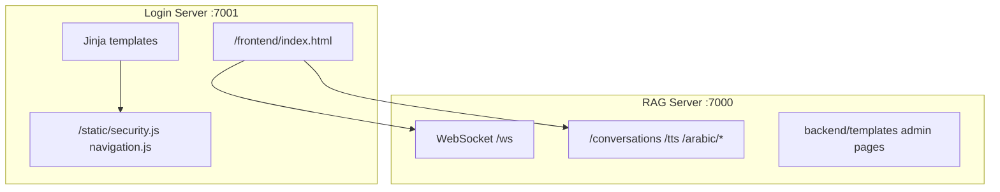
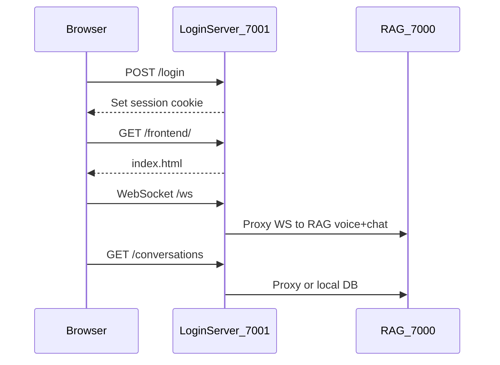

# Assistify Frontend Technical Specification

**Production UI (2026):** Static React export in [`assistify-ui-design/`](../assistify-ui-design/) served at `/frontend/*` on login server `:7001`. Legacy Jinja templates and [`frontend/index.html`](../frontend/index.html) are deprecated; GET routes redirect to React pages.

Document for API contracts and migration reference. **React app:** Next.js `output: "export"`, `basePath: "/frontend"`.

---

## 1. File Structure

### 1.1 HTML files (35 total)

| Layer | Path | Count | Rendering |
|-------|------|-------|-----------|
| Auth & dashboards | [`Login_system/templates/*.html`](../Login_system/templates/) | 27 | Jinja2 `TemplateResponse` |
| RAG chat | [`frontend/index.html`](../frontend/index.html) | 1 | Static `FileResponse` |
| Dev/test harnesses | [`frontend/Website_ChatGpt/*.html`](../frontend/Website_ChatGpt/) | 2 | Static |
| RAG admin (duplicate host) | [`backend/templates/*.html`](../backend/templates/) | 5 | Static `HTMLResponse` on :7000 |

**No `public/` folder.** No standalone `.css` or `.js` in `frontend/` except shared login static files.

### 1.2 CSS files

| File | Purpose |
|------|---------|
| [`Login_system/static/navigation.css`](../Login_system/static/navigation.css) | Shared top + side nav (all authenticated Jinja pages via `_nav_shell.html`) |
| Inline `<style>` in each template | Per-page layout (auth forms, tickets, admin) |
| Inline `<style>` in `frontend/index.html` | ~930 lines — full chat + voice UI |

**Frameworks:** None (no Bootstrap, Tailwind, or Material). Custom flexbox layouts only.

### 1.3 JavaScript files

| File | Lines | Role |
|------|-------|------|
| [`Login_system/static/security.js`](../Login_system/static/security.js) | ~437 | CSRF fetch wrapper, XSS helpers, inactivity logout, validation |
| [`Login_system/static/navigation.js`](../Login_system/static/navigation.js) | ~230 | Role-based nav, mobile drawer |
| Inline in `frontend/index.html` | ~3,600 | WebSocket chat, voice mode, conversations, TTS |
| Inline in admin/ticket templates | varies | `fetch()` per feature (KB, tickets, analytics) |
| `frontend/Website_ChatGpt/*.html` | legacy | Direct RAG/LLM test pages |

### 1.4 Assets

- **Images/icons:** None on disk. Emoji (flags, mic), inline SVG (Google login logo in `Login.html`).
- **Fonts:** System stack `'Segoe UI', Arial, sans-serif`; Arabic `'Tahoma', 'Arial Unicode MS'`; CDN Google Fonts in some `backend/templates/`.
- **Favicon:** Not present in repo.

---

## 2. Page Components and Layout

### 2.1 Architecture overview



### 2.2 Auth pages (Jinja, port 7001)

| Route | Template | Sections |
|-------|----------|----------|
| `GET /login` | `Login.html` | Logo, username/password form, Google OAuth link, MFA error slots, CSRF hidden field |
| `GET /register` | `register.html` | Full name, email, username, password, confirm; dev banner if `skip_email_otp` |
| `GET /verify-otp` | `verify_otp.html` | 6-digit OTP input, email display, resend link |
| `GET /forgot-password` | `forgot_password.html` | Email form |
| `GET /reset-password` | `reset_password.html` | OTP + new password |
| `GET /change-username` | `change_username.html` | One-time username change |
| `GET /profile` | `profile.html` | Account info, email/password change, delete modal |

**Forms:** Server-side POST with redirect-on-error pattern. Client validation via HTML5 (`required`, `pattern`, `minlength`) + `security.js` helpers + inline `validateForm()` on register.

### 2.3 Role dashboards (Jinja)

| Route | Template | Layout |
|-------|----------|--------|
| `GET /main` | `main.html` | Customer hub: tenant selector, link to `/frontend/` chat |
| `GET /admin` | `admin.html` | Admin dashboard cards |
| `GET /employee` | `employee.html` | Employee dashboard + PDF viewer hooks |
| `GET /master_admin` | `master_admin.html` | Master admin hub |
| `GET /superadmin` | `superadmin.html` | Tenant CRUD table |
| `GET /select-business` | `select_business.html` | Business picker |

All include [`_nav_shell.html`](../Login_system/templates/_nav_shell.html): `<meta name="assistify-role">`, `navigation.css`, `navigation.js`.

### 2.4 Admin tool pages (Jinja)

| Route | Template | Key UI |
|-------|----------|--------|
| `/admin/users`, `/master_admin/users` | `admin_users.html` | User table, create/edit modals |
| `/admin/knowledge`, `/master_admin/knowledge` | `admin_knowledge.html` | File upload, PDF preview (pdf.js), reindex/delete |
| `/admin/analytics`, `/master_admin/analytics` | `admin_analytics.html` | Chart.js dashboards (calls RAG :7000) |
| `/admin/access-requests` | `admin_access_requests.html` | Approve/reject table |
| `/admin/tickets`, `/master_admin/tickets` | `admin_tickets.html` | Ticket list + detail modal |
| `/admin/audit-logs` | `admin_audit_logs.html` | Audit log table |
| `/employee/tickets` | `employee_tickets.html` | Employee ticket view |
| `/employee/customers` | `employee_customers.html` | Customer list |
| `/my-tickets` | `customer_tickets.html` | Customer ticket create/view |
| `/notifications` | `notifications.html` | Notification list |

### 2.5 Main chat UI — `frontend/index.html` (`GET /frontend/`)

**Header:** Menu button, title "Assistify", exit-to-dashboard button.

**Left sidebar (`conversation-sidebar`):** New chat, clear all, scrollable conversation list (rename/delete per item).

**Main column:**

- Language bar (EN / AR flags)
- KB update banner (dismissible)
- `#chatLog` message area (user/assistant bubbles)
- Thinking indicator
- Form: text input + send + voice mic button

**Overlays/modals:**

- Nav drawer (`nav-menu` + overlay)
- Voice overlay (`#voiceOverlay`, `role="dialog"`, state machine: idle/listening/processing/transcribing/speaking/error)
- Arabic model download modal

**Footer:** None.

### 2.6 RAG server admin (static, port 7000)

Duplicate paths: `/admin/analytics`, `/admin/knowledge`, `/admin/errors`, `/admin/kb-monitor` — serve [`backend/templates/`](../backend/templates/) without Jinja.

---

## 3. Styling Details

### 3.1 Design tokens (primary dark theme)

| Token | Hex | Usage |
|-------|-----|-------|
| Primary accent | `#10a37f` | Buttons, brand, EN user bubbles |
| Accent hover | `#0d8658`, `#0e8e6c` | Button hover |
| Page background | `#232323` | `body` |
| Panel/sidebar | `#2b2b2b`, `#171717` | Cards, nav |
| Text primary | `#fafaff`, `#fff` | Headings, chat |
| Text muted | `#9ca3af`, `#d9d9e3` | Subtitles, metadata |
| Assistant bubble | `#f6c33c` | AI messages |
| Arabic accent | `#2563eb`, `#60a5fa` | AR mode UI + bubbles |
| Danger | `#ef4444`, `#ff7979` | Errors, clear chats |
| Warning | `#f59e0b`, `#ffe9a0` | KB banner |
| Voice purple | `#6c63ff` | Voice UI accents |
| Border | `#333`, `#444`, `#343541` | Inputs, dividers |

**Ticket pages (secondary theme):** gradient `#667eea` → `#764ba2`, Bootstrap-like semantic colors.

### 3.2 Typography

- **Base:** `Segoe UI`, Arial, sans-serif — 1rem body, 1.8rem header title
- **Arabic content:** Tahoma, Arial Unicode MS
- **Weights:** 600–700 for headings/buttons

### 3.3 Spacing

Ad-hoc rem/px (no design-system scale). Common: `8px`, `12px`, `16px`, `24px`, `48px` padding; `border-radius: 8px`–`16px`.

### 3.4 Breakpoints

| Breakpoint | File | Behavior |
|------------|------|----------|
| `max-width: 980px` | `navigation.css` | Side nav → off-canvas drawer |
| `max-width: 820px` | `index.html` | Chat layout stacks; sidebar full-width capped height |
| `max-width: 640px` | `navigation.css` | Smaller nav link text |

### 3.5 Key CSS classes (`index.html`)

| Class | Purpose |
|-------|---------|
| `.conversation-sidebar`, `.conversation-item` | Chat history list |
| `.user-msg`, `.assistant-msg` | Message bubbles (EN/AR variants) |
| `.thinking-indicator` | LLM processing dots |
| `.voice-overlay`, `.voice-state-*` | Full-screen voice UI states |
| `.voice-circle` | Animated status orb |
| `.kb-update-banner` | Reindex notification |
| `.chat-voice-btn` | Inline mic launcher |
| `.exit-chat-btn` | Return to role dashboard |

---

## 4. JavaScript Functionality

### 4.1 State management

**No Redux/Vue/Pinia.** Patterns:

- **Module-level `let`/`const`** in `index.html` (WebSocket ref, conversation ID, TTS queue, voice state)
- **`localStorage`:** `assistify_lang` (EN/AR preference)
- **`sessionStorage`:** greeting-once flag per session
- **`window.voiceMode`:** IIFE exposing voice overlay API
- **Server as source of truth:** conversations persisted via REST; page reload refetches list

### 4.2 `security.js` — shared auth layer

```javascript
// Key exports on window.Security
secureFetch(url, options)  // adds x-csrf-token, credentials, 401→/login
escapeHTML / safeSetText / safeSetHTML
isValidEmail, isValidUsername, isStrongPassword
initInactivityMonitor()    // 30 min → redirect /login
```

### 4.3 `navigation.js` — role nav

- Reads `<meta name="assistify-role">` or `GET /api/my-profile`
- Renders fixed top bar + left drawer with role-specific links
- Skips init on public paths: `/login`, `/register`, `/verify-otp`, etc.

### 4.4 Chat WebSocket (`index.html`)

**URL:** `ws(s)://{host}/ws` (proxied through login server to RAG)

**Outbound JSON examples:**

```json
{ "text": "...", "language": "en", "conversation_id": "...", "tts_enabled": true }
{ "type": "control", "action": "interrupt" | "clear_audio_buffer" | "set_language", "language": "en" }
```

**Inbound message types:** `thinking`, `aiResponseChunk`, `aiResponseDone`, `aiResponse`, `transcript`, `stt_failed`, `system_busy`, `ttsAudioStart`, `ttsAudioEnd`, `ttsFallback`, `ttsComplete`, `kb_updated`, `error`

**Core functions:** `connectWebSocket`, `appendMsg`, `finalizeWsResponse`, `chatForm.onsubmit`, `bargeIn`, `_playStreamingTTS`, `addToTTSQueue`

### 4.5 REST APIs used by chat UI (login :7001)

| Endpoint | Method | Purpose |
|----------|--------|---------|
| `/api/my-profile` | GET | Role for exit button |
| `/conversations` | GET, POST, DELETE | List/create/clear all |
| `/conversations/{id}` | GET, PATCH, DELETE | Load/rename/delete |
| `/conversations/{id}/message` | POST | Persist message |
| `/arabic/download` | POST | Trigger AR model download |
| `/arabic/status` | GET | Poll download progress |
| `/tts` | POST | `{ text, language }` streaming TTS fallback |

### 4.6 Voice mode state machine

States: `idle` → `listening` → `processing` → `transcribing` → `speaking` → (back to `listening` or `error`)

Key: `window.voiceMode.openVoiceMode()`, `startVoiceListening()`, `stopVoiceListening()`, `setVoiceState()`, `STT_PENDING_WATCHDOG_MS = 3000`

Uses: `getUserMedia`, PCM16 resampling, Web Audio API, binary WebSocket frames for TTS chunks.

### 4.7 Admin template JS patterns

- `DOMContentLoaded` → `fetch('/api/...')` → render tables with `innerHTML` or `createElement`
- Modals: show/hide via CSS class + backdrop click
- File upload: `<input type="file">` + `FormData` → `/api/knowledge/upload` (admin_knowledge)
- Chart.js 4.4.0 CDN for analytics charts

---

## 5. User Interface Elements

### 5.1 Buttons

| Style | Colors | States |
|-------|--------|--------|
| Primary | `#10a37f` bg, white text | hover darker green, `:disabled` grayed |
| Danger | `#ef4444` / red borders | clear-all-chats |
| Ghost/icon | transparent + emoji | rename/delete on conversation rows |
| Voice circle | gradient animation | per voice-state CSS |

### 5.2 Inputs

- Text, email, password, textarea (chat), file (KB upload), OTP (6-digit pattern)
- Hidden `csrf_token` on forms
- Language toggle buttons (not radio — `onclick` handlers)

### 5.3 Tables

- Admin users, tickets, audit logs, superadmin tenants
- Client-side render from JSON; no server-side pagination component
- Sorting: minimal (mostly static order from API)

### 5.4 Alerts/notifications

- Jinja `error` query-param banners (login, register)
- `showKbUpdateBanner()` in chat
- `stt_failed` / voice overlay error text
- Toast-style: mostly inline divs, not a toast library

### 5.5 Loading states

- Thinking indicator (animated dots)
- Voice overlay subtext ("Processing speech...", etc.)
- Button `disabled` during fetch
- Arabic download progress bar (polled)

---

## 6. Data Display

| Feature | Approach |
|---------|----------|
| Chat messages | DOM append to `#chatLog`; streaming chunks concatenated then finalized |
| Conversations | REST list → sidebar DOM rebuild via `renderConversationList()` |
| Analytics | Chart.js line/bar from RAG `/analytics/comprehensive` |
| KB files | Table + pdf.js canvas preview |
| Tickets | Master-detail: list + modal thread |
| Superadmin tenants | Table with inline action buttons |

**No React/Vue binding.** String templates and `innerHTML` (mitigated by `escapeHtml` in chat).

---

## 7. Responsive Behavior

| Viewport | Chat (`index.html`) | Nav (`navigation.css`) |
|----------|---------------------|------------------------|
| Desktop | Sidebar + chat side-by-side | Fixed left nav + top bar |
| Tablet (≤820px) | Sidebar above chat, max-height 40vh | Drawer mode at ≤980px |
| Mobile | Same stack; touch-friendly button sizes | Hamburger toggles `body.side-drawer-open` |

No separate mobile app or PWA manifest.

---

## 8. Accessibility

**Present:**

- `aria-label` on exit chat, clear chats, voice buttons, conversation actions
- `aria-modal`, `aria-hidden`, `role="dialog"` on voice overlay
- `escapeHtml` / `safeSetText` for XSS-safe text (screen readers get clean text)
- `lang` on `<html>`; Arabic content detection switches bubble styling
- `Escape` closes voice overlay

**Gaps (React migration opportunities):**

- Incomplete focus trap in modals
- No skip links
- Color-only state in voice circle (supplemented by text sublabels)
- Dynamic chat updates lack `aria-live` regions
- Keyboard nav for conversation list limited

---

## 9. Performance

| Technique | Status |
|-----------|--------|
| Image optimization | N/A (no image assets) |
| Code splitting | None — monolithic `index.html` |
| Lazy loading | Conversations loaded on demand; PDF pages rendered on preview open |
| Caching | `localStorage` lang; server-side conversation persistence |
| TTS prefetch | `prefetchTTS()` queues next chunk while playing |
| WebSocket binary | TTS audio as `arraybuffer` chunks |

---

## 10. Integrations

### 10.1 Authentication flow



- Session cookie + CSRF token (`csrf_token` cookie/meta)
- Google OAuth: `GET /auth/google/login` → callback
- Role-based redirect after login (`admin`, `customer` → `/main`, etc.)
- `ALLOW_DEV_LOGIN_FALLBACK` / `SKIP_EMAIL_OTP` dev flags in [`config.py`](../config.py)

### 10.2 Third-party services

| Service | Usage |
|---------|-------|
| EmailJS | OTP emails (server-side from `login_server.py`) |
| Google OAuth | Social login |
| Chart.js (CDN) | Analytics dashboards |
| pdf.js (CDN) | KB PDF preview |
| Ollama/RAG/Piper | Backend only; frontend talks via WS/REST |

### 10.3 File upload

- **Admin KB:** `FormData` multipart → `/api/knowledge/upload` (login proxies to RAG)
- **Legacy test:** `rag_test.html` → `POST :7000/upload_rag`

---

## React Migration Mapping (recommended)

| Current | Suggested React structure |
|---------|---------------------------|
| `frontend/index.html` monolith | `src/features/chat/` — `ChatPage`, `ConversationSidebar`, `VoiceOverlay`, `useWebSocket`, `useVoiceMode` |
| `security.js` | `src/lib/apiClient.ts` + `useCsrf` + `useInactivityLogout` |
| `navigation.js` + `navigation.css` | `src/components/AppShell/NavBar`, `SideNav`, `useRole` |
| Jinja templates | Route-based pages in React Router; server becomes API-only |
| Inline CSS variables | `src/styles/tokens.css` or Tailwind theme extension |
| Global `let` state | Zustand or React Context per feature |

### Critical business logic to preserve

1. **Voice state machine** + 3s STT watchdog (`STT_PENDING_WATCHDOG_MS`)
2. **TTS queue** with barge-in / interrupt control messages
3. **CSRF** on all mutating requests
4. **Role-based nav** and exit-chat dashboard URLs
5. **Arabic mode** — language flag, blue styling, model download gate, RTL-friendly fonts
6. **`escapeHtml`** on all user/AI content before render
