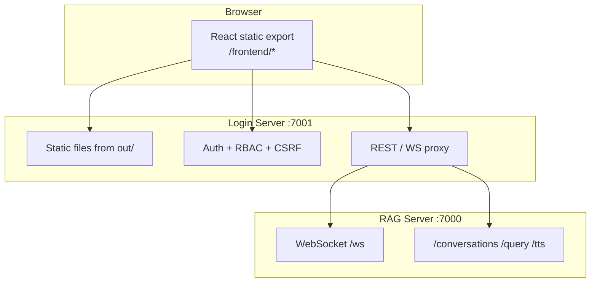

# Assistify Frontend Technical Specification

**Production UI:** Static React export in [`assistify-ui-design/`](../assistify-ui-design/) served at `/frontend/*` on the Login server (`:7001`).

Legacy Jinja/HTML templates and standalone `frontend/index.html` have been removed. The Login server builds and serves the Next.js static export only.

---

## 1. Stack

| Package | Version (approx.) |
|---------|-------------------|
| Next.js | 16.x |
| React | 19.x |
| TypeScript | 5.7.x |
| Tailwind CSS | 4.x |

Build: `npm run build` → static export to `assistify-ui-design/out/` with `basePath: "/frontend"`.

---

## 2. Directory layout

```
assistify-ui-design/
├── app/
│   ├── (auth)/          # Public auth pages (login, register, OTP, password reset)
│   ├── (app)/           # Authenticated dashboards (AuthGuard + RoleGuard)
│   ├── (guest)/         # Public guest chat
│   └── page.tsx         # Authenticated chat shell (/)
├── components/          # Chat shell, voice overlay, tenant selector, UI primitives
├── src/
│   ├── hooks/           # useChatWebSocket, useVoiceMode, useProfile, etc.
│   ├── features/        # Page-level feature modules (analytics, KB, tickets, …)
│   ├── components/      # AppShell, AuthGuard, RoleGuard
│   └── lib/             # apiClient, navigation, types, audioUtils
├── public/              # Icons and static assets
└── out/                 # Production static export (served by Login server)
```

---

## 3. Route map

Route groups `(auth)`, `(app)`, and `(guest)` do not appear in URLs.

### Public auth — `(auth)/`

| URL | Page | Purpose |
|-----|------|---------|
| `/frontend/login/` | login | Login form + Google OAuth |
| `/frontend/register/` | register | Registration |
| `/frontend/verify-otp/` | verify-otp | OTP verification |
| `/frontend/forgot-password/` | forgot-password | Password reset request |
| `/frontend/reset-password/` | reset-password | OTP + new password |
| `/frontend/change-username/` | change-username | One-time username change |

### Chat

| URL | Purpose |
|-----|---------|
| `/frontend/` | Authenticated chat (`Assistify` component) |
| `/frontend/guest/` | Public guest chat (no login) |

### Authenticated dashboards — `(app)/`

| URL | Roles | Purpose |
|-----|-------|---------|
| `/frontend/main/` | customer | Customer hub |
| `/frontend/select-business/` | customer | Business picker |
| `/frontend/my-tickets/` | customer | Support tickets |
| `/frontend/profile/` | all | Profile management |
| `/frontend/notifications/` | all | Notifications |
| `/frontend/superadmin/` | superadmin | Platform tenant management |
| `/frontend/admin/*` | admin | Tenant admin tools |
| `/frontend/master_admin/*` | master_admin | Master admin tools |
| `/frontend/employee/*` | employee | Employee CRM and tickets |

**Bootstrap login:** `superadmin` / `superadmin` (see [SETUP_WINDOWS.md](SETUP_WINDOWS.md)).

---

## 4. Architecture overview



---

## 5. Key components

| Component | Location | Purpose |
|-----------|----------|---------|
| `Assistify` | `components/assistify.tsx` | Authenticated chat shell |
| `GuestAssistify` | `components/guest-assistify.tsx` | Guest chat shell |
| `ChatArea` | `components/chat-area.tsx` | Messages, input, voice, tenant selector |
| `TenantSelector` | `components/tenant-selector.tsx` | Active tenant dropdown |
| `VoiceOverlay` | `components/voice-overlay.tsx` | Full-screen voice UI |
| `AppShell` | `src/components/AppShell.tsx` | Dashboard layout wrapper |
| `AuthGuard` | `src/components/AuthGuard.tsx` | Redirect if unauthenticated |
| `RoleGuard` | `src/components/RoleGuard.tsx` | Enforce role-based routes |

---

## 6. Custom hooks (selected)

| Hook | Purpose |
|------|---------|
| `useChatWebSocket` | WebSocket connection, streaming, reconnect |
| `useConversations` | Auth conversation CRUD |
| `useGuestConversations` | Guest conversation CRUD |
| `useChatTenants` / `useActiveTenant` | Tenant selector + PATCH active-tenant |
| `useVoiceMode` | Mic capture, PCM resampling, TTS playback |
| `useKnowledge` | KB upload, delete, reindex, pipeline status |
| `useProfile` / `useRoleNav` | Profile and role-derived navigation |
| `useTenants` | Superadmin tenant CRUD |
| `useInactivityLogout` | Idle timeout → logout |

Full hook list: see [README.md](../README.md) § Frontend Documentation.

---

## 7. API integration

- **Base URL:** Same origin (`http://127.0.0.1:7001` in development).
- **Auth:** HttpOnly session cookie; mutating requests include `X-CSRF-Token`.
- **WebSocket:** `ws://127.0.0.1:7001/ws` (proxied to RAG `:7000`).
- **Guest chat:** Guest cookie + `X-Guest-Owner` header on guest endpoints.

Client helpers live in `src/lib/apiClient.ts`.

---

## 8. Styling

- **Framework:** Tailwind CSS 4 with custom design tokens in `app/globals.css`.
- **Theme:** Dark-first UI aligned with chat and dashboard surfaces.
- **Markdown:** `react-markdown` + GFM for assistant message rendering.

---

## 9. Build and deploy

```powershell
cd assistify-ui-design
npm install
npm run build
```

The launcher (`python start_main_servers.py`) runs `scripts/react_ui_build.py` automatically when `out/` is missing or stale.

After frontend changes, hard refresh the browser (**Ctrl+F5**).

---

## 10. Security notes

- React escapes rendered text by default; avoid `dangerouslySetInnerHTML` except for trusted Markdown paths.
- CSRF and session handling are enforced server-side on the Login server.
- Role-based routes use `RoleGuard` client-side; server RBAC remains authoritative.

See [SECURITY_IMPLEMENTATION.md](SECURITY_IMPLEMENTATION.md) for the full control set.
