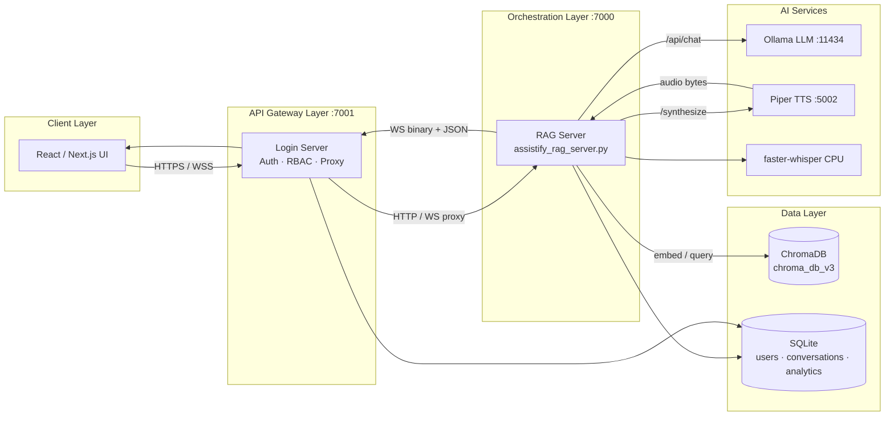
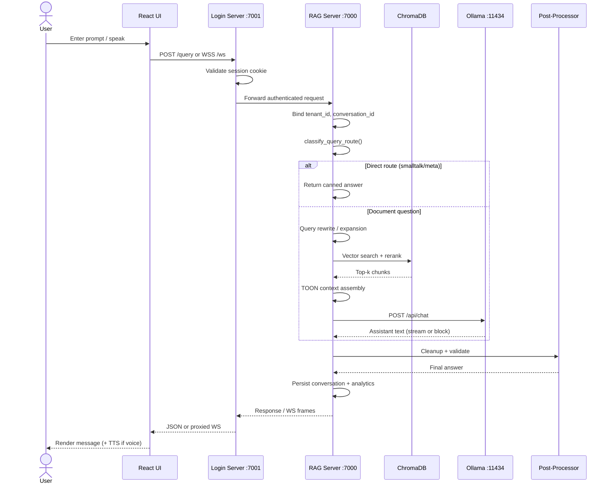
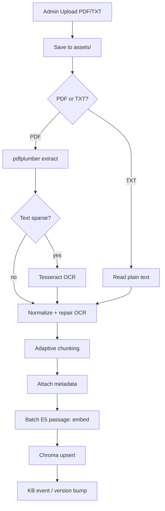
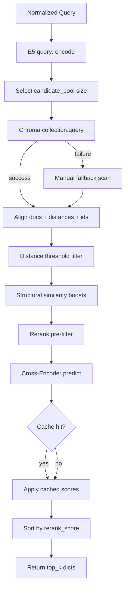
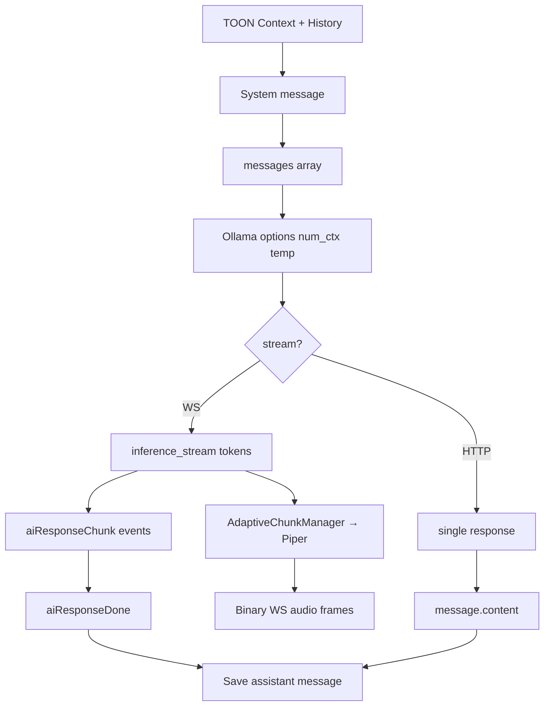
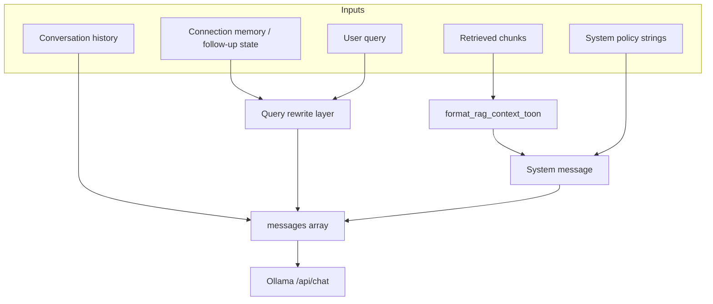
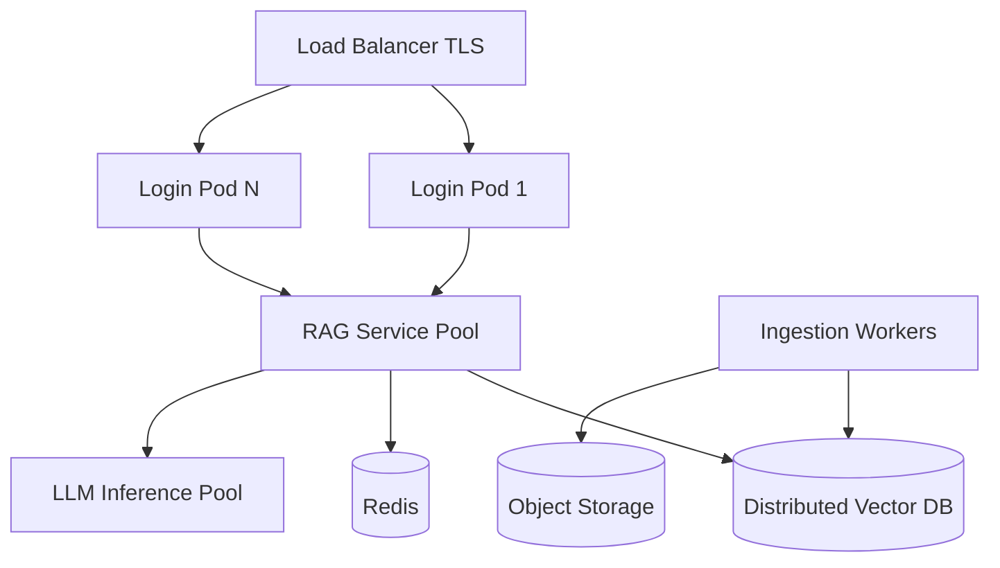
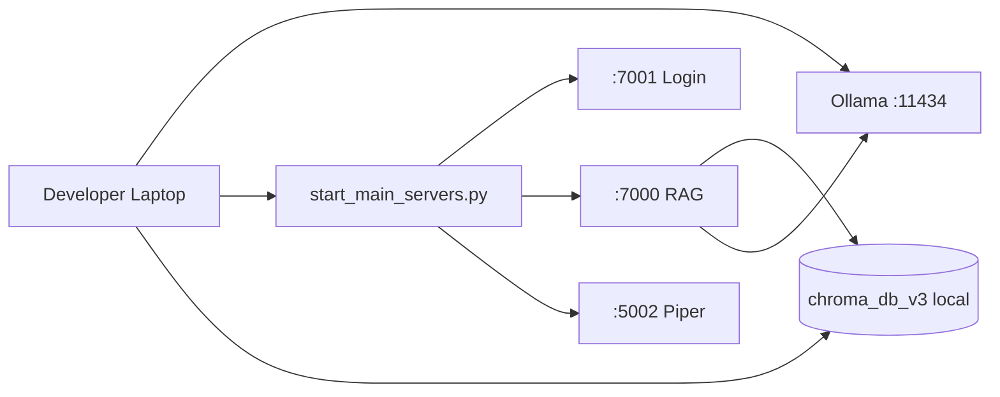
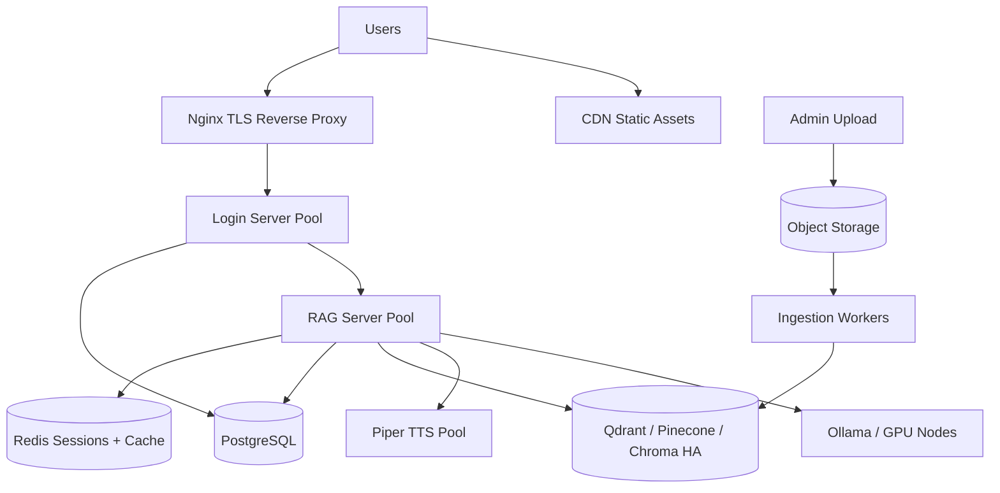

# Assistify v1.0 — Technical Architecture Document

**Version:** 1.0  
**Audience:** Developers, solution architects, platform engineers  
**Scope:** End-to-end request lifecycle from user prompt to rendered response  
**Codebase:** `assistify-rag-project-main` (Assistify v1.0 help-desk stack)

---

## 1. Executive Overview

### 1.1 Purpose

Assistify is an enterprise-oriented **AI help-desk platform** that combines **Retrieval-Augmented Generation (RAG)**, **local LLM inference**, and **multimodal interaction** (text + voice) to answer customer and employee support questions from an organization’s knowledge base.

The system is designed for **tenant-isolated businesses** (multi-tenant SaaS shape), **role-based access control**, and **auditable** support workflows — not generic open-domain chat.

### 1.2 Main Business Goals

| Goal | How the architecture supports it |
|------|----------------------------------|
| Accurate, grounded answers | RAG pipeline retrieves tenant-scoped document chunks before LLM generation |
| Low operational cost | Local Ollama LLM + CPU voice services; TOON context format reduces token spend 40–60% |
| Trust & compliance | Session auth, RBAC, tenant isolation, response validation, security event logging |
| Admin control | Knowledge-base upload, reindexing, analytics, audit logs via admin UI |
| Multimodal UX | WebSocket voice (STT → RAG → LLM → TTS) and REST text chat |

### Multi-tenant chat (tenant selector)

Users select an **active tenant per conversation** via the chat header dropdown. Messages store `tenant_id`; switching tenants mid-thread does not create a new conversation. See [`docs/TENANT_SELECTOR_ARCHITECTURE.md`](docs/TENANT_SELECTOR_ARCHITECTURE.md).

**Chat APIs:** `GET /api/chat-tenants`, `PATCH /conversations/{id}/active-tenant`, per-message `tenant_id` on `POST /conversations/{id}/message` and WebSocket `set_active_tenant`.

**Storage:** Normalized SQLite tables `chat_conversations`, `chat_conversation_state`, `chat_messages` in [`backend/chat_store.py`](backend/chat_store.py).

```
┌──────────────────────────────────────────────────────────────────────────┐
│  React / Next.js UI (assistify-ui-design) — static export at /frontend/  │
└───────────────────────────────┬──────────────────────────────────────────┘
                                │ HTTPS / WSS (same origin)
┌───────────────────────────────▼──────────────────────────────────────────┐
│  Login Server (FastAPI, :7001) — login_server.py                          │
│  Auth · Sessions · RBAC · REST proxy · WebSocket proxy                    │
└───────────────────────────────┬──────────────────────────────────────────┘
                                │ HTTP + WS (internal)
┌───────────────────────────────▼──────────────────────────────────────────┐
│  RAG Server (FastAPI, :7000) — assistify_rag_server.py                     │
│  Orchestration · RAG · Conversations · Analytics · Voice (STT/TTS client) │
└───────┬───────────────────────────────┬──────────────────────────────────┘
        │                               │
        ▼                               ▼
┌───────────────┐               ┌───────────────────┐
│ Ollama :11434 │               │ Piper TTS :5002   │
│ qwen2.5:3b    │               │ CPU ONNX voices   │
│ GPU inference │               └───────────────────┘
└───────────────┘
        ▲
        │ optional
┌───────┴───────────────┐
│ LLM Shim :8010/:8000  │  main_llm_server.py (OpenAI-compatible proxy)
└───────────────────────┘

Persistent stores:
  • ChromaDB  → backend/chroma_db_v3 (per-tenant collections)
  • SQLite    → users.db, conversations, analytics.db
```

### 1.4 High-Level Architecture

At runtime, **all user-facing traffic enters through the Login Server** (`:7001`). The Login Server serves the React UI, validates sessions, enforces RBAC, and **proxies** authenticated API and WebSocket traffic to the RAG Server (`:7000`). The RAG Server owns query orchestration, retrieval, LLM calls, conversation persistence, and voice pipelines.

**GPU policy:** Ollama (LLM) and RAG embeddings/reranker may use GPU (`RAG_USE_GPU=1`). Speech recognition (faster-whisper) and Piper TTS are **CPU-only** to preserve VRAM for inference and retrieval.

---

## 2. End-to-End Request Flow

The following describes a **text chat** request over HTTP `POST /query`. Voice WebSocket flow is covered in Layer 9 and Section 5.

| Step | Component | Responsibility | Inputs | Outputs | Transformations | Error Handling | Security |
|------|-----------|----------------|--------|---------|-----------------|----------------|----------|
| 1 | React Chat UI | Capture user message | Keystroke / send action | `POST /query` JSON body | UI state → API payload | Show network error toast | Session cookie attached automatically |
| 2 | Login Server | Route & authenticate | HTTP request + `session` cookie | Forwarded request or 401 | Cookie → deserialized user | 401 if session invalid/expired | `require_login()` dependency |
| 3 | Login Server proxy | Tenant-scoped forward | Authenticated request | RAG `POST /query` | Inject proxy headers / cookie | 502 if RAG down | Forwards session cookie to RAG |
| 4 | RAG Server gateway | Parse & bind tenant | `QueryRequest{text, conversation_id}` | `tenant_id`, `connection_id` | Resolve owner, conversation | 400 on malformed body | `require_request_tenant(user)` |
| 5 | Conversation store | Persist user turn | Message text | `conversation_id` | Append to SQLite/JSON store | Log + continue if write fails | Tenant + owner scoped writes |
| 6 | Query router | Classify intent | Raw query string | Route label | `classify_query_route()` | Fallback to `document_question` | No external data leak |
| 7 | Pre-retrieval rewrite | Normalize query | Query + connection memory | Rewritten query | About-entity rewrite, follow-up detection | Skip rewrite on memory queries | Uses per-connection state only |
| 8 | Retrieval orchestrator | Fetch context | Query | `List[dict]` chunks | `get_tenant_rag(tenant_id).search()` | Empty list on VectorStore failure | Tenant-scoped Chroma collection |
| 9 | Relevance gate | Accept/reject docs | Query + docs | Boolean + metrics | Hybrid semantic + lexical gate | Proceed with empty context → no-match path | Prevents hallucination-prone answers |
| 10 | Prompt builder | Assemble LLM input | System rules + TOON context + history + query | `messages[]` | TOON encoding, token budgeting | Truncate history/context | System prompt constrains behavior |
| 11 | Ollama LLM | Generate answer | `POST /api/chat` payload | Assistant text | Token sampling on GPU | Timeout → user-friendly error | Model runs locally; no third-party API |
| 12 | Post-processor | Clean & validate | Raw LLM text | Final answer | Definition cleanup, `response_validator` | Replace with safe fallback message | PII/profanity filters |
| 13 | Conversation store | Persist assistant turn | Final answer | Updated thread | Append message | Best-effort | Tenant scoped |
| 14 | Login proxy + UI | Deliver response | JSON `{"answer": "..."}` | Rendered chat bubble | JSON parse | Retry on transient errors | Same-origin; no credential exposure |

---

## 3. Complete Architecture Layers

### Layer 1: Client Layer

**Technologies:** Next.js / React (`assistify-ui-design/`), TypeScript, static export served at `/frontend/*` from Login Server.

#### User Interaction

- **Login / registration / OTP / OAuth** — auth routes under `(auth)/`
- **Chat** — `useChatWebSocket` hook for real-time voice; REST for text queries
- **Admin** — knowledge base, users, analytics, audit logs (role-gated pages)

#### Request Generation

Text chat sends authenticated requests to RAG-backed endpoints (directly or via Login proxy). Voice chat opens:

```typescript
// assistify-ui-design/src/hooks/useChatWebSocket.ts
const ws = new WebSocket(`${proto}://${window.location.host}/ws`);
ws.send(JSON.stringify({ type: "control", action: "set_language", language }));
ws.send(JSON.stringify({ type: "control", action: "set_conversation_id", conversation_id }));
```

Binary frames carry **PCM16 audio** (16 kHz, mono) upstream; downstream binary frames carry **TTS audio**.

#### Authentication

Browser holds an **HttpOnly session cookie** (`session`) set by Login Server after login/OTP/OAuth. All API calls are same-origin to `:7001`, so cookies attach automatically.

#### Session Handling

- Signed payload via `itsdangerous.URLSafeSerializer` + `SESSION_SECRET`
- Absolute timeout (24h) and idle timeout (2h) validated server-side
- Session invalidation list persisted in SQLite (`Login_system/persistent_state.py`)
- WebSocket connections rejected with close code `1008` if cookie missing/invalid

---

### Layer 2: API Gateway Layer

In this deployment, the **Login Server acts as the application gateway** (not a separate Kong/Nginx tier in dev; Nginx recommended in production).

| Concern | Implementation |
|---------|----------------|
| Request validation | Pydantic models on FastAPI routes; username/password/email regex |
| Authentication | `require_login()` → deserialize + validate session token |
| Authorization | `Login_system/rbac.py` — role hierarchy: `customer` < `employee` < `admin` < `master_admin` < `superadmin` |
| Rate limiting | Login/register/OTP per-IP buckets; `WebSocketRateLimiter` (20 msg/min) |
| Logging | `logs/security.log` (rotating), per-service logs under `logs/` |
| Routing | REST proxies to RAG (`/conversations/*`, etc.); `WebSocket /ws` → `ws://127.0.0.1:7000/ws` |

**RAG Server** additionally enforces:

- `TrustedHostMiddleware` / CORS (config-driven)
- CSRF verification (`verify_csrf`) on state-changing admin endpoints
- `require_tenant_staff()` for KB admin APIs

---

### Layer 3: Orchestration Layer

**Primary module:** `backend/assistify_rag_server.py`

#### Workflow Controller

`call_llm_with_rag()` (HTTP) and `call_llm_streaming()` (WebSocket) are the top-level orchestrators. They coordinate:

1. Query routing (`classify_query_route`)
2. Direct-route short-circuit (greetings, meta, smalltalk)
3. Follow-up / memory binding (`connection_id` ↔ `conversation_id`)
4. Retrieval (`_search_with_query_expansion`, `_active_rag_search_async`)
5. Answer permission checks (`_should_allow_generic_answer`)
6. LLM invocation (Ollama HTTP)
7. Post-processing and analytics logging

#### Agent Routing

`classify_query_route()` returns one of:

| Route | Behavior |
|-------|----------|
| `conversational_ack` | Direct canned redirect — **no RAG** |
| `assistant_meta` | Capability/meta answers — **no RAG** |
| `smalltalk` | Smalltalk response — **no RAG** |
| `unsupported_unclear` | Clarification prompt — **no RAG** |
| `document_question` | Full RAG + LLM path |

#### Context Management

- **Per-connection runtime memory** for follow-ups and entity tracking
- **Persistent conversations** in SQLite/JSON with `tenant_id` + `owner`
- **Active KB source filtering** — queries scoped to tenant’s active document set

#### Prompt Construction

Retrieved chunks → `format_rag_context_toon()` → appended to minimal system prompt. History trimmed (often last turn only for latency).

#### Tool Invocation

No external agent tool loop in production chat. Optional internal “tools” are **pipeline stages** (list extraction, structured answer builders, Arabic native retrieval probes).

#### Error Recovery

- Chroma query retries with shrinking `n_results`
- Manual vector fallback if Chroma HNSW errors
- Ollama connection errors → user-visible apology + analytics `error_message`
- Empty retrieval → `RAG_NO_MATCH_RESPONSE` sentinel → friendly support message

---

### Layer 4: Retrieval Layer (RAG)

**Authoritative path** (see `docs/RAG_RETRIEVAL.md`):

```
User query
  → call_llm_with_rag()
  → get_tenant_rag(tenant_id).search()
  → LiveRAGManager.search()
  → VectorStore.search()
```

#### Query Preprocessing

- Whitespace normalization
- Language detection (English / Arabic branches)
- About-entity rewrite for follow-up shapes (“What about X?”)
- Definition-query normalization before retrieval

#### Query Rewriting / Expansion

`_expand_query()` generates alternate phrasings; results merged and deduplicated by `(source, page, text fingerprint)`.

#### Embedding Generation

- Model: **`intfloat/multilingual-e5-base`** (configurable via `EMBEDDING_MODEL`)
- E5 prefixes: `query: {text}` for queries, `passage: {text}` for indexed chunks
- Device: CUDA when `RAG_USE_GPU=1` and available, else CPU

#### Hybrid Search

Production retrieval is **dense vector search** (Chroma cosine distance) plus:

- **Structural boosting** — chapter/section/numeric token boosts from query profile
- **Hybrid relevance gate** (`_passes_hybrid_relevance_gate`) — semantic similarity OR English keyword overlap
- **Cross-encoder reranking** — not BM25, but serves a similar “second stage precision” role

Keyword/BM25-style signals appear in lexical overlap checks, not a separate inverted index.

#### Vector Search

```python
# backend/pdf_ingestion_rag.py — VectorStore.search()
query_embedding = self.embedding_model.encode([query_for_embedding])[0]
results = self.collection.query(
    query_embeddings=[query_embedding.tolist()],
    n_results=candidate_pool,  # max(24, min(240, top_k * 4))
    where=filter_meta,
)
```

Distance threshold: `RAG_STRICT_DISTANCE_THRESHOLD` (default **1.0**) from `backend/config_head.py`.

#### Metadata Filtering

Chroma `where` filters on chunk metadata (`source`, `page`, `chapter`, `tenant`, etc.). Active-source filter applied post-search.

#### Ranking & Re-ranking

1. **Initial rank:** cosine similarity `1 - distance` + structural boosts
2. **Pre-filter:** drop empty/OCR-garbage chunks before reranker
3. **Rerank:** `cross-encoder/ms-marco-MiniLM-L-6-v2` on `[query, chunk_text]` pairs
4. **Cache:** LRU rerank score cache (128 entries) keyed by collection + query + candidate IDs
5. **Final sort:** by `rerank_score` when present, else `similarity`

#### Document Selection

Top-`k` chunks after rerank pass semantic filter and answer-permission gates. `top_k` varies by query family (e.g., fact-entity queries capped by `FACT_MAX_TOP_K`).

---

### Layer 5: Vector Database Layer

**Production engine:** **ChromaDB** (persistent client at `config.CHROMA_DB_PATH`, default `backend/chroma_db_v3`).

#### Indexing Process

1. `AdaptiveRAGPipeline.ingest_pdf()` or `knowledge_base.add_document()`
2. Parse PDF (pdfplumber → OCR fallback via Tesseract)
3. Adaptive chunking with metadata (`page`, `section`, `chapter`, `chunk_role`)
4. Batch embedding (`EMBEDDING_BATCH_SIZE`)
5. Upsert into tenant collection (`support_docs_v3_latest` or `t{N}_support_docs_v3_latest`)

#### Embedding Storage

Vectors stored in Chroma with:

- `embeddings[]` — float vectors (768-dim for e5-base)
- `documents[]` — chunk text
- `metadatas[]` — structural + provenance fields
- `ids[]` — stable chunk IDs

#### Search Process

HNSW approximate nearest neighbor (Chroma default) → distance threshold filter → reranker.

#### Similarity Scoring

- **Vector stage:** `similarity = 1.0 - distance` (cosine space)
- **Rerank stage:** cross-encoder logit as `rerank_score`

#### Enterprise Vector DB Comparison (conceptual mapping)

| Capability | Chroma (Assistify) | Pinecone | Weaviate | Qdrant |
|------------|-------------------|----------|----------|--------|
| Hosting | Embedded persistent | Managed cloud | Self-host / cloud | Self-host / cloud |
| Metadata filters | `where` dict | namespace + metadata | GraphQL / hybrid | payload filters |
| Multi-tenant | Collection per tenant | Namespace per tenant | Class per tenant | Collection per tenant |
| Hybrid search | App-layer + reranker | Sparse-dense native | Native hybrid | Sparse vectors |
| Ops model | Single-node SQLite backend | Fully managed | Flexible | Horizontal shards |

Assistify’s architecture **maps cleanly** to managed vector DBs by swapping `VectorStore`’s Chroma client for Pinecone/Qdrant SDK calls while keeping the same embedding + rerank pipeline.

---

### Layer 6: Knowledge Base Layer

**Modules:** `backend/pdf_ingestion_rag.py`, `backend/knowledge_base.py`, `backend/load_documents.py`

| Stage | Detail |
|-------|--------|
| File upload | Admin UI → Login proxy → RAG `POST /upload` (admin role) |
| Parsing | TXT direct read; PDF via pdfplumber; sparse pages → OCR (pytesseract + pdf2image) |
| Cleaning | Whitespace normalize, OCR garbage detection, split-word repair |
| Chunking | `AdaptiveRAGPipeline` — role-aware chunks (`content`, structural markers) |
| Metadata extraction | Page, section, chapter, entity hints, `document_type`, `source` |
| Embedding | Batched E5 `passage:` embeddings |
| Storage | Chroma upsert + asset files under `backend/assets/` (tenant subdirs) |
| Versioning | Collection naming `*_v3_*`; hot-swap via `ASSISTIFY_COLLECTION_NAME`; KB version counter for admin WS |

---

### Layer 7: LLM Layer

**Runtime:** Ollama (`OLLAMA_MODEL`, default `qwen2.5:3b`) at `http://127.0.0.1:11434/api/chat`

#### Prompt Assembly

```text
[System]
Assistify assistant.{TOON context block — if retrieval succeeded}

[History]
{last N turns — typically 1 for latency}

[User]
{normalized user query}
```

#### Context Injection

Retrieved documents encoded via **TOON** (`format_rag_context_toon`) — 40–60% fewer tokens than JSON.

#### Generation

```python
payload = {
    "model": OLLAMA_MODEL,
    "messages": messages,
    "stream": True | False,
    "options": {"num_ctx": ..., "temperature": 0.7, ...}
}
```

WebSocket path uses **streaming** (`aiResponseChunk` / `aiResponseDone` events); HTTP path typically blocks until complete.

#### Token Flow (approximate)

| Segment | Typical budget |
|---------|----------------|
| System prefix | ~5–50 tokens |
| TOON context (1–3 chunks) | 200–800 tokens |
| History | 50–200 tokens |
| User query | 10–100 tokens |
| Generation cap | Tuned per route (often 80–256 tokens) |

**Optional shim:** `backend/main_llm_server.py` exposes OpenAI-compatible `POST /v1/chat/completions` forwarding to Ollama — useful for external clients, not required for Assistify UI.

---

### Layer 8: Post-Processing Layer

**Module:** `backend/response_validator.py` + inline cleaners in `assistify_rag_server.py`

| Step | Function |
|------|----------|
| Definition cleanup | `_force_clean_definition_sentence` for entity/fact queries |
| Text cleanup | `_cleanup_final_answer_text` |
| User-visible finalization | `_finalize_user_visible_answer` — maps “not found” sentinel to support-friendly text |
| Validation | Profanity blocklist, PII patterns (SSN, credit card), uncertainty detection |
| Hallucination mitigation | Retrieval gates + answer permission + no-match sentinel |
| Citations | Source metadata available in `retrieved_docs`; UI citation depth varies by route |

---

### Layer 9: Response Delivery Layer

#### REST Flow (text)

```
Browser → POST /query → Login (auth) → RAG call_llm_with_rag → JSON {"answer": "..."}
```

#### WebSocket Flow (voice + streaming)

```
Browser ──WSS──► Login :7001/ws ──WSS──► RAG :7000/ws
                      │                        │
                      │    auth cookie fwd     │
                      │                        ├─ binary audio in
                      │                        ├─ STT transcript out
                      │                        ├─ aiResponseChunk (stream)
                      │                        ├─ aiResponseDone
                      │                        └─ binary TTS audio out
                      └──── bidirectional proxy ────┘
```

**Server message types (inbound to client):**

| Type | Meaning |
|------|---------|
| `thinking` | Pipeline started |
| `transcript` | STT result (`final: true` triggers RAG) |
| `aiResponseChunk` | Partial LLM text |
| `aiResponseDone` | Final text in `fullText` |
| `kb_updated` | Knowledge base mutation notice |
| binary | TTS PCM/audio bytes |

**TTS:** Piper microservice (`tts_service/piper_server.py`, `:5002`). `AdaptiveChunkManager` batches LLM tokens into speakable chunks for low time-to-first-audio.

#### Final Rendering

React chat components append assistant messages on `aiResponseDone` or REST response; audio played via Web Audio from binary WS frames.

---

## 4. Data Flow Diagrams

### 4.1 High-Level Architecture



### 4.2 Request Lifecycle (Sequence)



### 4.3 RAG Pipeline

```mermaid
flowchart TD
    Q[User Query] --> RWR[Rewrite / Expand]
    RWR --> ROUTE{classify_query_route}
    ROUTE -->|non-document| DIRECT[Direct Response]
    ROUTE -->|document_question| EMB[E5 query: embedding]
    EMB --> VS[Chroma ANN Search]
    VS --> THR{distance ≤ threshold?}
    THR -->|no| EMPTY[Empty candidates]
    THR -->|yes| BOOST[Structural + numeric boosts]
    BOOST --> RF[Reranker Cross-Encoder]
    RF --> GATE[Hybrid Relevance Gate]
    GATE -->|fail| NOMATCH[No-match path]
    GATE -->|pass| TOON[format_rag_context_toon]
    TOON --> PROMPT[Build messages[]]
    PROMPT --> LLM[Ollama Inference]
    LLM --> POST[Post-process + Validate]
    DIRECT --> OUT[User Response]
    NOMATCH --> OUT
    POST --> OUT
    EMPTY --> NOMATCH
```

### 4.4 Document Ingestion Pipeline



### 4.5 Vector Search Workflow



### 4.6 LLM Generation Workflow



---

## 5. Detailed Request Lifecycle (14 Steps)

### Step 1 — User Submits Prompt

- **Internal:** Chat component captures text or voice final transcript.
- **Services:** React UI (`useChatWebSocket` or REST client).
- **I/O:** `string` user text → outbound HTTP/WS payload.

### Step 2 — Gateway Receives Request

- **Internal:** Login Server FastAPI route or `@app.websocket("/ws")`.
- **Services:** `login_server.py`.
- **I/O:** Raw HTTP/WS → parsed `Request` / `WebSocket`.

### Step 3 — Authentication Validation

- **Internal:** `serializer.loads(session_cookie)` + `validate_session()`; RBAC for admin routes.
- **Services:** Login Server; RAG re-validates cookie on proxied calls.
- **I/O:** Cookie → `user{username, role, tenant_id}` or 401/1008 close.

### Step 4 — Prompt Preprocessing

- **Internal:** Trim, length checks, conversation binding, `append_conversation_message(user)`.
- **Services:** RAG `query_rag()` / WS handler.
- **I/O:** `QueryRequest` → `connection_id`, `persistent_conversation_id`.

### Step 5 — Query Transformation

- **Internal:** `_maybe_rewrite_about_entity_question`, `_expand_query`, language-specific branches.
- **Services:** `assistify_rag_server.py`.
- **I/O:** `str` → `List[str]` query variants.

### Step 6 — Embedding Creation

- **Internal:** `SentenceTransformer.encode("query: ...")` on GPU/CPU.
- **Services:** `VectorStore` in `pdf_ingestion_rag.py`.
- **I/O:** `str` → `float[]` vector (768-d).

### Step 7 — Vector Retrieval

- **Internal:** Chroma `query` + distance filter + structural boosts.
- **Services:** ChromaDB persistent client.
- **I/O:** Embedding → `List[{text, metadata, distance, similarity}]`.

### Step 8 — Re-ranking

- **Internal:** Cross-encoder pairwise scoring + LRU cache.
- **Services:** `ms-marco-MiniLM-L-6-v2`.
- **I/O:** Candidates → scored + sorted list.

### Step 9 — Context Assembly

- **Internal:** Merge expanded queries, dedupe, active-source filter, relevance gate.
- **Services:** RAG orchestrator.
- **I/O:** Chunks → `retrieved_docs: List[dict]`.

### Step 10 — Prompt Construction

- **Internal:** `format_rag_context_toon(retrieved_docs)` + system string + history slice.
- **Services:** `backend/toon.py`.
- **I/O:** Docs → `messages: [{role, content}]`.

### Step 11 — LLM Inference

- **Internal:** aiohttp/httpx POST to Ollama; optional streaming token iterator.
- **Services:** Ollama `qwen2.5:3b`.
- **I/O:** `messages[]` → assistant `content` string.

### Step 12 — Post-Processing

- **Internal:** Definition cleaners, validator, finalize user-visible answer.
- **Services:** `response_validator.py`, RAG helpers.
- **I/O:** Raw LLM text → sanitized `answer`.

### Step 13 — Response Streaming

- **Internal:** WS: chunk events + Piper TTS binary; HTTP: single JSON body.
- **Services:** RAG + Piper + `AdaptiveChunkManager`.
- **I/O:** Final text (+ audio) → transport frames.

### Step 14 — User Receives Response

- **Internal:** React updates message list; audio playback if enabled.
- **Services:** Browser UI.
- **I/O:** Frames → rendered chat bubble + optional speech.

---

## 6. Prompt Engineering Flow

### Message Roles

| Role | Source | Purpose |
|------|--------|---------|
| System | Server template + TOON context | Grounding rules + retrieved knowledge |
| Developer | N/A (inline in system helpers) | Routing/cleanup logic is code-side, not OpenAI developer role |
| User | Transcript or typed input | Current question |
| Assistant | Prior turns | Conversation continuity (trimmed) |

### Assembly Order

```text
1. System: "Assistify assistant." + TOON block (if docs found)
2. Assistant/User pairs from history (last 1–N turns)
3. User: current query (post-rewrite)
```

### Diagram



### Memory

- **Short-term:** `connection_id` runtime dict (follow-up entities, Arabic resolution flags)
- **Long-term:** `conversations` table / JSON store keyed by `conversation_id`, scoped by `tenant_id` + `owner`

### Tool Outputs

Internal retrieval probes (e.g., Arabic native retrieval) inject additional chunks into the merge step before TOON formatting — not exposed as OpenAI function calls.

---

## 7. Document Ingestion Architecture

See Section 4.4 diagram. Operational entry points:

| Entry | Command / Route |
|-------|-----------------|
| Sample KB bootstrap | `python -m backend.load_documents` |
| Admin PDF upload | UI → `POST /upload` |
| Programmatic | `AdaptiveRAGPipeline.ingest_pdf(path)` |

**Chunking strategies:**

- Size-aware splits with overlap for long passages
- Structural respect for chapters/sections/units
- OCR merge heuristics for broken words
- Batch embedding (configurable `EMBEDDING_BATCH_SIZE`) for large files

**Hot-swap:** New collections can be built as `{base}_v3_{timestamp}` with `_latest` pointer pattern; admin WS `/ws/kb-events` broadcasts mutations.

---

## 8. Security Architecture

| Domain | Implementation |
|--------|----------------|
| Authentication | bcrypt_sha256 passwords; Google OAuth; OTP via EmailJS |
| Authorization | RBAC hierarchy; tenant-scoped data access |
| Encryption in transit | HTTP in dev; **TLS required in production** (`ENFORCE_HTTPS`) |
| Encryption at rest | OS/filesystem level; SQLite files on disk — use encrypted volumes in prod |
| Secrets | `.env` / environment variables (`SESSION_SECRET` 64+ bytes in prod) |
| Audit logs | `logs/security.log` — login, lockout, WS connect, etc. |
| Data isolation | `tenant_id` on relational rows; **separate Chroma collection per tenant** |
| Multi-tenancy | `get_tenant_rag(tenant_id)`; `require_request_tenant(user)` on every RAG request |
| CSRF | Double-submit cookie on selected mutating endpoints |
| Rate limiting | Per-IP login/register; per-connection WS message limits |
| Input validation | Pydantic + regex; max query length guards |
| Output safety | `response_validator` profanity/PII filters |

**Production gaps to close:** full CSRF coverage, CSP headers, Redis-backed rate limits, file upload AV scanning, per-user API quotas.

---

## 9. Scalability Architecture

### Current Shape (single-node)

`python start_main_servers.py` launches coordinated processes on one host. Suitable for demo, dev, and single-tenant pilots.

### Production-Scale Target

| Concern | Recommendation |
|---------|----------------|
| Load balancing | Nginx/ALB → N Login Server replicas (sticky sessions for WS) |
| Horizontal scaling | Stateless Login replicas; **RAG replicas** with shared Chroma or managed vector DB |
| Caching | Redis for sessions, rate limits, rerank cache, hot query cache |
| Distributed vector DB | Migrate Chroma → Qdrant/Pinecone/Weaviate cluster |
| Queue systems | Celery/RQ/Kafka for PDF ingestion workers |
| Async workers | Background embedding jobs decoupled from upload API |
| LLM scaling | Ollama on GPU nodes or switch to vLLM/TGI cluster |



---

## 10. Observability

| Pillar | Implementation |
|--------|----------------|
| Logging | Python `logging` per service; files `logs/rag.log`, `logs/login.log`, `logs/security.log` |
| Metrics | `analytics.db` — `usage_stats`, response times, `rag_docs_found`, error messages |
| Tracing | Extensive `[FLOW]`, `[RETRIEVAL TIMING]`, `[TOPK TRACE]` log markers (OpenTelemetry-ready) |
| Monitoring | `/health` on RAG; `/internal/gpu-status` on LLM shim; admin analytics dashboards |
| Alerting | Recommended: Prometheus + Grafana on error rate, p95 latency, Ollama health, Chroma disk |

**Example log lines:**

```text
[FLOW] entering call_llm_with_rag
[RETRIEVAL TIMING] query_embedding=42 ms
[RETRIEVAL TIMING] chroma_query=118 ms
[RETRIEVAL TIMING] reranker=203 ms (ran=True candidates=28)
[HTTP FINAL ANSWER BEFORE RETURN] To reset your password...
```

**Example analytics query:**

```sql
SELECT AVG(response_time_ms), COUNT(*)
FROM usage_stats
WHERE tenant_id = 1 AND response_status = 'success'
  AND timestamp > datetime('now', '-7 days');
```

---

## 11. Failure Scenarios

| Scenario | Detection | Recovery | Fallback |
|----------|-----------|----------|----------|
| LLM failure | Ollama connection error / timeout | Log to analytics; return apology string | Direct-route answers still work without LLM for canned paths |
| Retrieval failure | VectorStore exception; empty candidates | Retry smaller `n_results`; manual fallback scan | `RAG_NO_MATCH_RESPONSE` → friendly “contact support” message |
| Vector DB failure | Chroma lock / dimension mismatch | Runtime model dimension swap; collection rebind | Degraded mode: LLM without context (blocked by answer permission for most routes) |
| Timeout | `LLM_REQUEST_TIMEOUT` exceeded | Abort generation; notify user | Shorter context / lower `top_k` on retry |
| Empty retrieval | Zero candidates after threshold | Skip context injection | No-match sentinel; no hallucinated policy answers |
| Piper TTS down | Health check on :5002 fails | Text-only response | Browser speech synthesis optional |
| WS proxy failure | Login cannot reach RAG WS | Retry backoff (5 attempts) | User sees disconnect; auto-reconnect in UI |

---

## 12. Technology Stack Mapping

| Layer | Technology | Responsibility |
|-------|------------|----------------|
| Client | React / Next.js (`assistify-ui-design`) | UI, chat, admin pages |
| Client | TypeScript + WebSocket API | Real-time voice/text |
| API Gateway | FastAPI (`login_server.py`) | Auth, RBAC, proxy, static UI |
| Orchestration | FastAPI (`assistify_rag_server.py`) | RAG workflow, routing, conversations |
| Orchestration | Custom Python routers | Query classification, follow-ups — not LangGraph |
| Retrieval | `LiveRAGManager` + `VectorStore` | Tenant-scoped search orchestration |
| Embeddings | sentence-transformers `multilingual-e5-base` | Query/document vectors |
| Reranking | cross-encoder `ms-marco-MiniLM-L-6-v2` | Precision ranking |
| Vector DB | ChromaDB (persistent) | ANN search + metadata |
| Knowledge | `pdf_ingestion_rag.AdaptiveRAGPipeline` | PDF/TXT ingestion |
| LLM | Ollama + `qwen2.5:3b` | Local GPU inference |
| LLM (optional) | `main_llm_server.py` | OpenAI-compatible proxy |
| STT | faster-whisper (CPU) | Speech-to-text |
| TTS | Piper ONNX (`tts_service/piper_server.py`) | Speech synthesis |
| Context format | TOON (`backend/toon.py`) | Token-efficient RAG context |
| Validation | `response_validator.py` | Output safety |
| Auth | Passlib bcrypt, itsdangerous, authlib | Passwords, sessions, OAuth |
| RBAC | `Login_system/rbac.py` | Role hierarchy |
| Relational DB | SQLite (users, conversations, analytics) | Persistence |
| Config | `config.py`, `.env` | Centralized settings |
| Launcher | `start_main_servers.py` | Multi-process dev/prod bootstrap |
| Testing | `tests/test_*.py` | Integrity, security, TOON tests |

---

## 13. Production Deployment Architecture

### 13.1 Environments

| Environment | Characteristics |
|-------------|-----------------|
| Development | `ENVIRONMENT=development`, HTTP localhost, auto session secret, `SKIP_EMAIL_OTP` optional |
| Staging | Production-like TLS, test tenants, mirrored KB, integration tests |
| Production | `ENVIRONMENT=production`, `ENFORCE_HTTPS=true`, secrets from vault, Redis, managed DB |

### 13.2 Development Deployment



### 13.3 Production Deployment



### 13.4 Network Ports (default)

| Service | Port |
|---------|------|
| Login / UI | 7001 |
| RAG | 7000 |
| Piper TTS | 5002 |
| Ollama | 11434 |
| LLM shim (optional) | 8010 |

---

## 14. Final Architecture Summary

### 14.1 End-to-End Workflow Summary

Users interact with a **React UI** served by the **Login Server**, which authenticates every request and proxies traffic to the **RAG Server**. The RAG Server classifies the query, retrieves **tenant-isolated** chunks from **ChromaDB** using **E5 embeddings** and a **cross-encoder reranker**, formats context as **TOON**, and calls **Ollama** for generation. Responses are validated, logged to **analytics**, persisted per conversation, and returned over **REST** or **WebSocket** (with optional **Piper TTS** audio).

### 14.2 Key Architectural Decisions

1. **Split Login vs RAG servers** — security boundary + single-origin WS proxy pattern  
2. **Local Ollama LLM** — data residency, predictable cost, GPU control  
3. **Collection-per-tenant Chroma** — hard isolation without commingled vectors  
4. **TOON context encoding** — latency and token cost reduction  
5. **CPU voice / GPU LLM+embeddings** — VRAM budgeting on consumer GPUs  
6. **Query router before RAG** — skip retrieval for non-document intents  

### 14.3 Performance Considerations

- Dominant latency: **LLM inference** (seconds) > **reranker** (~200ms) > **Chroma query** (~100ms) > **embedding** (~50ms)  
- `top_k`, context size, and history depth directly affect time-to-first-token  
- Rerank cache hits avoid repeat cross-encoder cost for identical candidate sets  
- Adaptive TTS chunking optimizes **perceived** voice latency  

### 14.4 Best Practices

- Always bind `tenant_id` before retrieval and persistence  
- Keep `OLLAMA_MODEL`, pulled tags, and `config.py` in sync  
- Run `python scripts/preflight_check.py` before demos  
- Monitor `RAG_STRICT_DISTANCE_THRESHOLD` when tuning precision/recall  
- Use `+ New Chat` when testing router changes (connection memory persists)  

### 14.5 Common Bottlenecks

| Bottleneck | Symptom | Mitigation |
|------------|---------|------------|
| Single GPU Ollama | Queue under concurrent users | LLM pool, smaller model, request queue |
| Cross-encoder rerank | +200–500ms per query | Cache, reduce candidate_pool |
| Large PDF ingestion | Upload timeout | Async workers + progress WS |
| Chroma SQLite lock | Concurrent admin uploads | Serialized ingest queue |
| Cold-start whisper | First voice query slow | Preload at RAG startup (already done) |

### 14.6 Optimization Recommendations

1. Move sessions + rate limits to **Redis** for multi-instance Login/RAG  
2. Replace embedded Chroma with **Qdrant/Pinecone** for horizontal shard growth  
3. Add **query result cache** (normalized query hash → answer) for FAQ-heavy tenants  
4. Introduce **OpenTelemetry** tracing across Login → RAG → Ollama  
5. Deploy **vLLM** or Ollama load balancer when concurrent chat exceeds single-GPU capacity  
6. Enable **HTTPS + WSS** everywhere via Nginx with `proxy_read_timeout` ≥ 86400 for WS  

---

## Related Documentation

| Document | Topic |
|----------|-------|
| `README.md` | Local setup and run guide |
| `docs/RAG_RETRIEVAL.md` | Authoritative retrieval path |
| `docs/ACTUAL_SYSTEM_IMPLEMENTATION.md` | Code-grounded implementation notes |
| `docs/PROJECT_BRIEFING.md` | Extended project briefing |
| `docs/TOON_IMPLEMENTATION.md` | TOON format specification |
| `docs/SECURITY_IMPLEMENTATION.md` | OWASP controls |

---

*This document reflects the Assistify codebase as implemented. Enterprise patterns (Kafka, Pinecone, LangGraph) are noted where they represent recommended scale-out paths rather than current mandatory components.*
