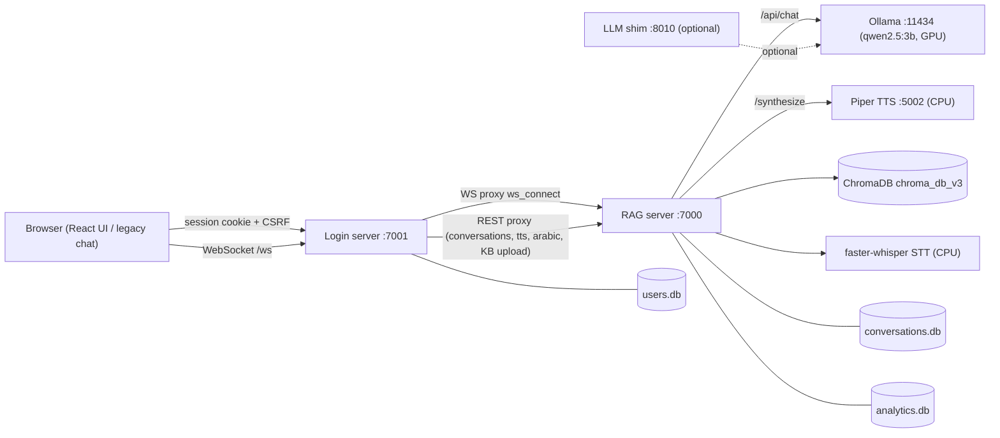

# Assistify System Check Report

Full verification of all system components and the integrations between them: static code audit, offline test suite execution, and live end-to-end smoke tests against the running stack.

- Date: 2026-06-22
- Environment: Windows, conda env `assistify_main`, NVIDIA GTX 1660 Ti (CUDA)
- Method: static audit + `tests/` suite + live E2E (all five services started)
- Verification scripts created: [`scratch/system_check_smoke.py`](../scratch/system_check_smoke.py), [`scratch/kb_index_latency.py`](../scratch/kb_index_latency.py)

## 1. Architecture and integration map

## 2. Live stack status

`scripts/verify_stack.py` against the running stack:

| Service | Port | Result |
|---------|------|--------|
| Ollama | 11434 | OK (HTTP 200, model `qwen2.5:3b` loadable) |
| LLM shim | 8010 | OK (HTTP 200) |
| Piper TTS | 5002 | OK (HTTP 200) |
| RAG | 7000 | OK (`/health`: asr=true, tts=true, llm=connected, db=true, kb=true) |
| Login | 7001 | OK (HTTP 200) |
| React UI artifacts | - | OK (`out/index.html` + `_next/static`) |
| React `/frontend/login/` | 7001 | OK (HTTP 200) |
| React `/frontend/admin/` | 7001 | OK (HTTP 200) |

Result: stack verification passed.

## 3. Component status

| Component | File | Status | Notes |
|-----------|------|--------|-------|
| Login server | [`Login_system/login_server.py`](../Login_system/login_server.py) | Works | ~120 routes (auth, RBAC, multi-tenant, tickets, notifications, KB proxy, WS proxy). Login returns session + CSRF cookies, role redirect to `/frontend/admin/`. |
| RAG server | [`backend/assistify_rag_server.py`](../backend/assistify_rag_server.py) | Works | `/health`, `/query`, `/ws`, analytics, KB endpoints all live. Grounded answers returned. |
| Auth / sessions | [`Login_system/login_server.py`](../Login_system/login_server.py) | Works | bcrypt_sha256, rate limit, lockout, signed sessions, CSRF. Ephemeral security state (invalidated sessions, concurrent sessions, rate limits, lockouts) persisted in SQLite via [`Login_system/persistent_state.py`](../Login_system/persistent_state.py). |
| RBAC | [`Login_system/rbac.py`](../Login_system/rbac.py) | Works | `require_login`/`require_role`/`require_tenant_staff` guards enforced server-side; `test_multitenant` passes. |
| Multi-tenant | [`Login_system/memberships.py`](../Login_system/memberships.py) | Works | Per-tenant Chroma collections (`t<id>_support_docs_v3_latest`); WS bound to `tenant=1`. |
| RAG pipeline / retrieval | [`backend/knowledge_base.py`](../backend/knowledge_base.py) | Works | `/rag/retrieve-debug` returns ranked sources; reranker active; CUDA embeddings (`multilingual-e5-base`). |
| TOON | [`backend/toon.py`](../backend/toon.py) | Works | All TOON unit + integration tests pass. |
| Analytics | [`backend/analytics.py`](../backend/analytics.py) | Works | Schema validated by `test_system_integrity`; `/analytics/*` endpoints present. |
| Response validator | [`backend/response_validator.py`](../backend/response_validator.py) | Works | Profanity/PII blocking validated. |
| Voice STT | [`backend/voice_audio/stt/`](../backend/voice_audio/) | Works | `asr=true`; model loads from HF cache `models--Systran--faster-whisper-small` (see Issue I2). |
| Voice TTS (Piper) | [`tts_service/piper_server.py`](../tts_service/piper_server.py) | Works | `/tts` proxy returned a 77 KB `audio/wav`. EN + AR voices present. |
| LLM (Ollama) | external :11434 | Works | `qwen2.5:3b` answers via RAG `/query` and WS chat. |
| LLM shim | [`backend/main_llm_server.py`](../backend/main_llm_server.py) | Works | Optional; `/internal/gpu-status` OK. |
| React UI | [`assistify-ui-design/`](../assistify-ui-design/) | Works (after fix) | Static export served at `/frontend/*`; chat WS reconnect loop fixed (Issue I1). |
| Legacy chat UI | [`frontend/index.html`](../frontend/index.html) | Works (hardened) | Backoff fix applied (Issue I1). |
| Data stores | `users.db`, `conversations.db`, `analytics.db`, `chroma_db_v3` | Works | `support_docs_v3_latest` = 357 chunks; per-tenant collections present. |

## 4. Integration status (live smoke tests)

From [`scratch/system_check_smoke.py`](../scratch/system_check_smoke.py): 11/12 pass; the one miss is an indexing-latency observation, not a broken path.

| Integration | Check | Result |
|-------------|-------|--------|
| Browser -> Login (auth) | `POST /login` -> session+csrf, role redirect | PASS |
| Browser -> Login (profile) | `GET /api/my-profile` | PASS |
| Login -> RAG (conversation REST proxy) | create / list / delete `/conversations` | PASS (all three) |
| RAG -> Chroma + Ollama (text) | `POST /query` "reset password" | PASS (grounded answer) |
| RAG -> Chroma (retrieval only) | `GET /rag/retrieve-debug` | PASS (ranked sources) |
| Login -> RAG -> Piper (TTS) | `POST /tts` | PASS (77 KB audio/wav) |
| Browser -> Login -> RAG (WebSocket) | `/ws` text chat -> thinking/chunk/done | PASS (grounded answer streamed) |
| Login -> RAG -> Chroma (KB upload) | `POST /proxy/upload_rag` -> accepted | PASS (HTTP 200, background index) |
| KB upload -> indexed | poll for indexed chunks | PASS (after I3 fix) |
| KB upload -> delete | `DELETE /api/knowledge/files/{name}` | PASS |

End-to-end voice/chat path proven: Browser -> Login `/ws` proxy -> RAG `/ws` -> Chroma retrieval -> Ollama generation -> streamed `aiResponseChunk`/`aiResponseDone` back through the proxy.

## 5. Test suite results

Run in `assistify_main` with `PYTHONUTF8=1`:

| Test file | Result |
|-----------|--------|
| `tests/test_system_integrity.py` | PASS (10/10) |
| `tests/test_edge_cases.py` | PASS (10/10) |
| `tests/test_toon.py` | PASS (9/9) |
| `tests/test_toon_integration.py` | PASS (6/6) |
| `tests/test_validation.py` | PASS |
| `tests/test_multitenant.py` | PASS |
| `tests/test_owasp_security.py` | PASS (audit: 0 critical, 11 warnings) |
| `tests/test_owasp_final.py` | PASS (12 residual template issues) |
| `backend/tests/test_list_extractor.py` | PASS (import-path fixed in I4) |
| `backend/tests/list_priority_self_test.py` | PASS (import-path fixed in I4; heavy RAG startup when run as script) |
| `tests/test_short_txt_chunking.py` | PASS (I3 regression) |

Deferred: `tests/test_arabic_tts.py` (needs AR TTS exercise); `test_voice_audio_imports.py` / `test_conversational_router.py` import RAG modules with heavy startup side effects - covered instead by the live `/ws` and `/query` checks.

## 6. Issues found

### I1 - WebSocket reconnect storm (FIXED)
The RAG log showed a continuous `accepted -> bound tenant=1 -> Language set to: en -> disconnected` loop. Root cause: in [`assistify-ui-design/src/hooks/useChatWebSocket.ts`](../assistify-ui-design/src/hooks/useChatWebSocket.ts) the `connect` callback depended on inline callback props passed unmemoized from [`assistify-ui-design/components/chat-area.tsx`](../assistify-ui-design/components/chat-area.tsx). Every parent render changed `connect`'s identity, so the `useEffect([connect])` cleanup closed and reopened the socket in a tight loop, so the chat socket never stayed connected.

Fix applied:
- Hook now stores callbacks and `language`/`conversationId`/`ttsEnabled` in refs; `connect` has a stable identity (`useCallback([])`), reconnects only on unexpected close with capped backoff, and suppresses reconnect on unmount.
- Legacy [`frontend/index.html`](../frontend/index.html): `reconnectAttempts` is reset only after the socket stays open >=5s (was reset immediately on open, defeating backoff for a flapping socket).
- React `out/` rebuilt successfully; lint clean. (A browser hard refresh is needed to pick up the new bundle.)

### I2 - Whisper model path mismatch (FIXED)
`config.py` `WHISPER_MODEL_PATH` pointed at `backend/Models/faster-whisper-small`, which does not exist as a plain dir, so `scripts/preflight_check.py` printed `MISSING` even though the model loaded from the HuggingFace cache `backend/Models/models--Systran--faster-whisper-small`.

Fix applied:
- Added `resolve_whisper_model_path()` in [`config.py`](../config.py) to detect HF cache snapshots under `models--Systran--faster-whisper-*/snapshots/*`.
- Updated [`scripts/preflight_check.py`](../scripts/preflight_check.py) to report `OK (HF cache: …)` when a snapshot exists.

### I3 - Short .txt upload not indexed (FIXED)
A small `.txt` uploaded via `POST /proxy/upload_rag` returned HTTP 200 ("processing") but produced zero chunks because `chunk_and_add_document` required at least 60 words before emitting a final chunk — short documents never crossed that threshold. The smoke harness also polled `kb_status.status` instead of `state`.

Fix applied:
- Lowered the final emit threshold for `.txt` files and documents under `TARGET_MIN_WORDS` (minimum 3 words) in [`backend/knowledge_base.py`](../backend/knowledge_base.py).
- Lowered the flat-text fallback threshold for micro-documents.
- Added regression test [`tests/test_short_txt_chunking.py`](../tests/test_short_txt_chunking.py).

### I4 - backend/tests import path (FIXED)
`backend/tests/test_list_extractor.py` and `backend/tests/list_priority_self_test.py` failed with `ModuleNotFoundError: No module named 'backend'` when run directly.

Fix applied:
- Added repo-root [`conftest.py`](../conftest.py) for pytest discovery.
- Added `sys.path` shims to both backend test files for direct script execution.

### I5 - Security hardening (PARTIALLY ADDRESSED)
Previously documented gaps and current status:

- **Session/rate-limit persistence (resolved):** Invalidated sessions, concurrent session tracking, rate limits, and account lockouts are SQLite-backed via [`Login_system/persistent_state.py`](../Login_system/persistent_state.py) (WAL mode). Signed session cookies remain stateless; ephemeral revocation state survives restarts.
- **CSP (resolved for HTML responses):** `Content-Security-Policy` and related security headers are set by middleware in [`Login_system/login_server.py`](../Login_system/login_server.py) for HTML responses.
- **CSRF (expanded):** `verify_csrf` now also accepts the `csrf_token` form field (for `CsrfForm` HTML posts) and was added to previously unprotected authenticated mutations: `/conversations*` (POST/PATCH/DELETE/message), `/change-username`, and `/profile/*` change endpoints.
- **Deferred:** Legacy Jinja template OWASP residuals (`innerHTML`, missing CSP meta) flagged by `test_owasp_final`; single-GPU concurrency queue for multi-user voice/LLM inference.

## 7. Recommendations (prioritized)

1. Ship the WS reconnect fix (I1): redeploy the rebuilt `out/` bundle and hard-refresh clients; consider memoizing the callbacks in `chat-area.tsx` as defense-in-depth.
2. ~~Resolve the whisper path (I2)~~ — done.
3. ~~Investigate short `.txt` indexing (I3)~~ — done; regression test added.
4. ~~Fix `backend/tests` import path (I4)~~ — done.
5. Address residual OWASP template findings (`innerHTML`, CSP meta) from `test_owasp_final` (deferred from I5).
6. For production: HTTPS enforcement and an inference queue for multi-user voice (single-GPU concurrency deferred).

## 8. Summary

All five services start and pass health checks; every integration in scope was exercised live and works (auth, conversation REST proxy, text RAG `/query`, Chroma retrieval, Piper TTS, and the full WebSocket voice/chat path through the Login->RAG proxy). Issues I2–I4 are fixed; I5 CSRF/session/CSP gaps are addressed with legacy-template and GPU-queue items deferred. One critical defect was found and fixed earlier (the React/legacy WebSocket reconnect loop, I1).
