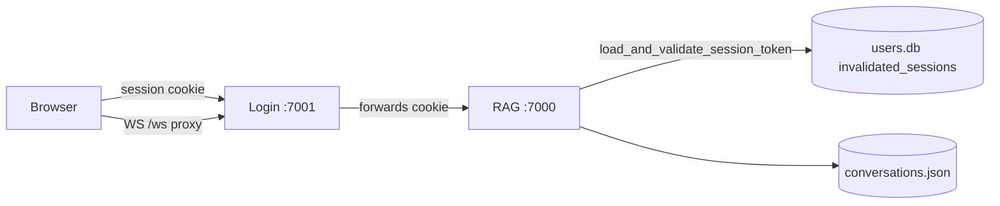

# Assistify RAG — System Health & Integrity Report

**Date:** 2026-06-22  
**Scope:** Backend servers, SQLite/JSON state, WebSocket/voice pipeline, RAG/Chroma integration, security/auth  
**Method:** Static code audit + applied hardening patches + CLI health script  
**Note:** There is no `security.js`; CSRF lives in [`assistify-ui-design/src/components/CsrfForm.tsx`](../assistify-ui-design/src/components/CsrfForm.tsx) and [`assistify-ui-design/src/lib/apiClient.ts`](../assistify-ui-design/src/lib/apiClient.ts). Inactivity logout is in [`assistify-ui-design/src/hooks/useInactivityLogout.ts`](../assistify-ui-design/src/hooks/useInactivityLogout.ts).

---

## Executive Summary

| Area | Rating | Headline |
|------|--------|----------|
| 1. Server & Concurrency | **RED** | Sync Chroma/embeddings and blocking I/O on the single event loop |
| 2. Database & State | **RED** | `conversations.json` RMW race (fixed); missing WAL/indexes on analytics DB |
| 3. WebSocket & Voice | **RED** | Orphaned TTS on disconnect (fixed); stub memory guard; client `ttsAudioEnd` bug |
| 4. RAG & Vector | **YELLOW/RED** | Duplicate embedding models; no Chroma timeouts; watcher reindex gaps |
| 5. Security & Auth | **RED** | RAG session gap (fixed); idle timeout cookie not refreshed; CSRF gaps on auth forms |

**Applied in this pass (4 critical fixes):**
- Shared session validation on RAG `:7000` ([`Login_system/session_validation.py`](../Login_system/session_validation.py))
- Atomic `conversations.json` mutations under one lock ([`backend/assistify_rag_server.py`](../backend/assistify_rag_server.py))
- WebSocket disconnect cancels TTS + clears per-connection state ([`backend/voice_audio/ws/handler.py`](../backend/voice_audio/ws/handler.py))
- Async retrieval via `asyncio.to_thread` on `/query` and `/ws` hot paths

**CLI health script:** [`scripts/system_health_check.py`](../scripts/system_health_check.py)

```bash
python scripts/system_health_check.py
python scripts/system_health_check.py --no-piper --no-ollama --json
```

---

## 1. Server & Concurrency Health — **RED**

### Findings

#### RED — Synchronous RAG retrieval blocks the event loop
`call_llm_with_rag` and `call_llm_streaming` previously called `_search_fast_minimal()` inline, blocking all concurrent HTTP/WS traffic during embed + Chroma + rerank (hundreds of ms to seconds).

**Mitigation applied:** `asyncio.to_thread` wrappers `_search_fast_minimal_async`, `_search_fast_definition_minimal_async`, `_active_rag_search_async` on `/query` and `/ws` paths.

#### RED — Blocking login routes
[`Login_system/login_server.py`](../Login_system/login_server.py) uses sync `requests.post`, `sqlite3.connect`, and bcrypt in `async def` handlers (e.g. register ~1428, login ~1814).

```python
response = requests.post(url, json=payload, headers={...}, timeout=10)  # login_server.py ~1214
```

#### YELLOW — New `aiohttp.ClientSession` per proxy request
Login server opens a fresh session for each REST/WS proxy to RAG `:7000` — connection churn under load.

#### YELLOW — Single uvicorn worker
No `--workers` or `--limit-concurrency`; one process owns GPU models and the event loop.

### Good practices
- Background KB indexing with `_pdf_indexing_tasks` tracking and `finally` cleanup
- `asyncio.to_thread` on default-tenant upload indexing path
- Persistent `llm_session` / `tts_session` on RAG with connector limits
- TTS `remember_ws_tts_task` done-callback exception logging

---

## 2. Database & State Integrity — **RED** (partially fixed)

### Findings

#### RED — `conversations.json` read-modify-write race (FIXED)
Lock previously wrapped only individual load/save, not the full mutation:

```python
# Before: race between concurrent append_conversation_message calls
data = _load_conversation_store()   # lock released
# ... mutate ...
_save_conversation_store(data)      # last writer wins → lost messages
```

**Fix applied:** `_mutating_conversation_store()` holds `RLock` across load → mutate → atomic `tmp.replace()`.

#### RED — Missing indexes on `analytics.usage_stats`
Dashboard queries filter `WHERE tenant_id=? AND timestamp > ?` with no composite index — full table scans as data grows.

#### YELLOW — No WAL on `conversations.db` / `analytics.db`
Only [`Login_system/persistent_state.py`](../Login_system/persistent_state.py) enables WAL on `users.db`. Health script flags `journal_mode=delete` on the other DBs.

#### YELLOW — Split brain: JSON (live) vs SQLite `ui_conversations` (unused)
REST `/conversations*` uses JSON; `database.py` `ui_*` API is test-only.

#### RED — `sessions.connection_id UNIQUE` without tenant
Multi-tenant WebSocket sessions can collide (`backend/database.py` ~67).

### Good practices
- Atomic JSON writes via temp file + `Path.replace()`
- `persistent_state._conn()` context manager with WAL + 10s timeout
- Tenant-scoped conversation access via `_conversation_in_scope`

---

## 3. WebSocket & Voice/Audio Pipeline — **RED** (partially fixed)

### Findings

#### RED — Disconnect did not cancel TTS (FIXED)
Handler `finally` deleted `interrupt_events` without setting them or calling `cancel_active_ws_tts`, so progressive TTS kept writing to dead sockets.

**Fix applied:** set interrupt → `cancel_active_ws_tts(conn_id, "ws_disconnect")` → cancel `ws_tts_active_tasks` → `on_ws_disconnect` pops `last_answer_state` / `recent_grounded_definition_concepts`.

#### RED — Memory guard uses stub snapshots
[`backend/assistify_rag_server.py`](../backend/assistify_rag_server.py) `_get_memory_snapshot()` returns zeros — leak detection never triggers.

#### RED — Client completes turn on every `ttsAudioEnd`
[`assistify-ui-design/src/hooks/useVoiceMode.ts`](../assistify-ui-design/src/hooks/useVoiceMode.ts) ignores `ttsComplete`; progressive TTS can overlap with new capture.

#### YELLOW — `STT_PENDING_WATCHDOG_MS` is client-only (3s)
No server-side STT watchdog; orphaned server work after client watchdog fires.

#### YELLOW — `MAX_CONVERSATIONS = 1000` never enforced
Only hourly time-based cleanup runs.

### Good practices
- `VOICE_MAX_BUFFER_BYTES` cap on PCM capture
- `voice_inference_slot` semaphore with `finally: release`
- Bounded TTS LRU cache (`XTTS_CACHE_MAX_ENTRIES = 64`)
- `STREAM_TOTAL_TIMEOUT_S = 30` on LLM/TTS pipeline gather

---

## 4. RAG Pipeline & Vector Integration — **YELLOW / RED**

### Findings

#### RED — Duplicate SentenceTransformer instances
Ingest (`knowledge_base.embedder`) and query (`VectorStore.embedding_model`) each load the same model — ~2× RAM/VRAM.

#### RED — No ChromaDB operation timeouts
`collection.query` / `upsert` / `get` are sync with no timeout wrapper — can block indefinitely.

#### YELLOW — Watcher reindex without KB ready gate
`_reindex_file_auto` runs sync `chunk_and_add_document` on the event loop while user queries continue.

#### YELLOW — `/rag/reindex-all` lacks `_collection_mutation_lock`
Can race with upload/watcher paths.

### Good practices (retained)
- Chunk embeddings stored at ingest; query embeds only the query string
- Blue/green collection swap on default-tenant upload
- `_kb_is_ready_for_queries()` gate on `/query` and `/ws` during upload
- Ollama timeouts + streaming first-token fallback
- Rerank LRU cache keyed by `(collection, query, candidate_ids)`

---

## 5. Security, Auth & Edge Cases — **RED** (partially fixed)

### Findings

#### RED — RAG server ignored session invalidation/timeouts (FIXED)
`require_login()` only called `serializer.loads(token)` — logged-out cookies still worked on `:7000`.

**Fix applied:** [`Login_system/session_validation.py`](../Login_system/session_validation.py) shared by `require_login`, `require_roles`, KB-events WS, and voice WS handler.

```python
def validate_session_payload(session_data: dict, *, update_activity: bool = True) -> tuple[bool, str]:
    if session_id and is_session_invalidated(session_id):
        return False, "Session invalidated"
    if now - created_at > SESSION_ABSOLUTE_TIMEOUT:
        return False, "Session expired (absolute timeout)"
    if now - last_activity > SESSION_IDLE_TIMEOUT:
        return False, "Session expired (idle timeout)"
```

#### RED — Idle timeout broken on login server (not fixed here)
`validate_session` updates `last_activity` in memory but never re-signs the cookie — active users can hit idle expiry after 30 min from login.

#### RED — Role change / account delete do not invalidate sessions
Stale role persists in signed cookie; RAG would have trusted it before this fix.

#### YELLOW — CSRF missing on register/verify-otp/forgot/reset POST routes
Frontend sends tokens via `CsrfForm`; backend does not call `verify_csrf` on those routes.

#### YELLOW — Rate limits never return HTTP 429
Login rate limit returns 303 redirect, not `429 Too Many Requests`.

#### YELLOW — RAG `HTTPException(detail=str(e))` on some admin routes
Internal exception strings can leak to authenticated callers.

### Good practices
- Signed session cookies with `session_id` + `created_at`
- Logout calls `invalidate_session` in SQLite
- Login rotates session (fixation mitigation)
- `apiClient` sends `X-CSRF-Token` on mutations
- Production global exception handler suppresses stack traces on login server

---

## Critical Fixes Applied (Code)

### Fix A — RAG session validation
**Files:** [`Login_system/session_validation.py`](../Login_system/session_validation.py), [`backend/assistify_rag_server.py`](../backend/assistify_rag_server.py), [`backend/voice_audio/ws/handler.py`](../backend/voice_audio/ws/handler.py)

### Fix B — Conversation store atomicity
**File:** [`backend/assistify_rag_server.py`](../backend/assistify_rag_server.py) — `_mutating_conversation_store()` + refactored mutators

### Fix C — WebSocket disconnect cleanup
**Files:** [`backend/voice_audio/ws/handler.py`](../backend/voice_audio/ws/handler.py), [`backend/voice_audio/deps.py`](../backend/voice_audio/deps.py)

### Fix D — Non-blocking retrieval
**File:** [`backend/assistify_rag_server.py`](../backend/assistify_rag_server.py) — `_search_fast_minimal_async` family used in `call_llm_with_rag` / `call_llm_streaming`

---

## Remediation Backlog (Prioritized)

| Priority | Item | Area |
|----------|------|------|
| P0 | Re-sign session cookie when `last_activity` updates | Auth |
| P0 | `invalidate_session` on role change, account delete, tenant switch | Auth |
| P0 | `verify_csrf` on register/verify-otp/forgot/reset + direct RAG mutations | Security |
| P1 | Share single SentenceTransformer between ingest and query | RAG |
| P1 | `PRAGMA journal_mode=WAL` + `(tenant_id, timestamp)` index on `analytics.usage_stats` | DB |
| P1 | Fix `useVoiceMode.ts` to wait for `ttsComplete` not `ttsAudioEnd` | Voice |
| P1 | Real `_get_memory_snapshot()` using psutil/torch | Voice |
| P2 | `asyncio.to_thread` for login bcrypt/sqlite/requests | Concurrency |
| P2 | Shared `aiohttp.ClientSession` for login→RAG proxy | Concurrency |
| P2 | Chroma operation timeouts + `reindex-all` mutation lock | RAG |
| P2 | Return HTTP 429 for rate-limited API requests | Security |
| P3 | Migrate live chat from JSON to SQLite `ui_conversations` | DB |
| P3 | `POST /logout` with CSRF (replace GET logout) | Security |

---

## Architecture (Post-Fix Auth Flow)



---

## Automated Health Check

[`scripts/system_health_check.py`](../scripts/system_health_check.py) verifies:

| Check | What it does |
|-------|----------------|
| HTTP services | RAG `/health`, Login `/login`, Ollama, Piper, LLM shim |
| TCP ports | `:7000`, `:7001` |
| WebSocket | Stdlib upgrade probe to `/ws` on RAG and Login |
| SQLite | `quick_check`, `journal_mode`, lock probe (`BEGIN IMMEDIATE`) |
| State files | `conversations.json` parse, `chroma_db_v3` presence |
| RAG latency | Timed `/health` round-trip |

Exit code `0` = no FAIL checks; servers may be down (expected in CI without stack running).

---

## Related Documents

- Prior stack verification: [`docs/SYSTEM_CHECK_REPORT.md`](SYSTEM_CHECK_REPORT.md)
- Frontend spec: [`docs/FRONTEND_TECHNICAL_SPEC.md`](FRONTEND_TECHNICAL_SPEC.md)
