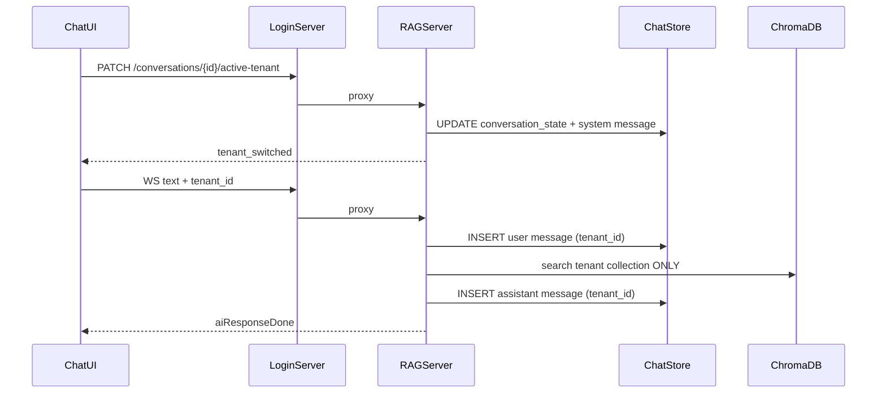

# Tenant Selector Architecture

## Overview

Chat tenant selection is **per-conversation**, not session-scoped. Users pick an active tenant from an open directory (all active tenants). Each message stores `tenant_id`; RAG retrieval uses **only** the active tenant for the current turn.

## Data Model

| Table | Purpose |
|-------|---------|
| `chat_conversations` | Owner-scoped threads (not tenant-scoped) |
| `chat_conversation_state` | `active_tenant_id` per conversation |
| `chat_messages` | `tenant_id` on every message (`user`, `assistant`, `system`) |

Module: [`backend/chat_store.py`](../backend/chat_store.py)

## Request Flow



## APIs

| Endpoint | Role |
|----------|------|
| `GET /api/chat-tenants` | Login — list active tenants (no membership filter) |
| `POST /conversations` | Create thread + `active_tenant_id` |
| `PATCH /conversations/{id}/active-tenant` | Switch tenant mid-thread |
| `POST /conversations/{id}/message` | Append with `tenant_id` |
| WS `set_active_tenant` | Real-time tenant switch without reconnect |

## Security

- **Retrieval:** `_TenantScope(active_tenant_id)` before `get_tenant_rag()`
- **Conversations:** owner-only access (`conversation.owner == username`)
- **Admin KB/analytics:** unchanged — still `require_request_tenant(user)` + RBAC
- **Chat directory:** any authenticated user may select any active tenant for RAG chat only

## Scalability

- Tenant list cached 60s server-side (`tenant_access.py`)
- Client caches tenant list in `useChatTenants`
- SQLite → PostgreSQL: swap `chat_store` connection; schema portable
- Horizontal RAG replicas: shared DB + distributed Chroma/Qdrant

## Frontend

- [`TenantSelector`](../assistify-ui-design/components/tenant-selector.tsx) in chat header
- [`useActiveTenant`](../assistify-ui-design/src/hooks/useActiveTenant.ts) — per-conversation state + `localStorage` last-used
- Tenant badges on message segments when `tenant_id` changes

## Migration

```powershell
python scripts/migrate_conversations_to_normalized.py
```

RAG server auto-migrates from `backend/conversations.json` on startup when SQLite tables are empty.
